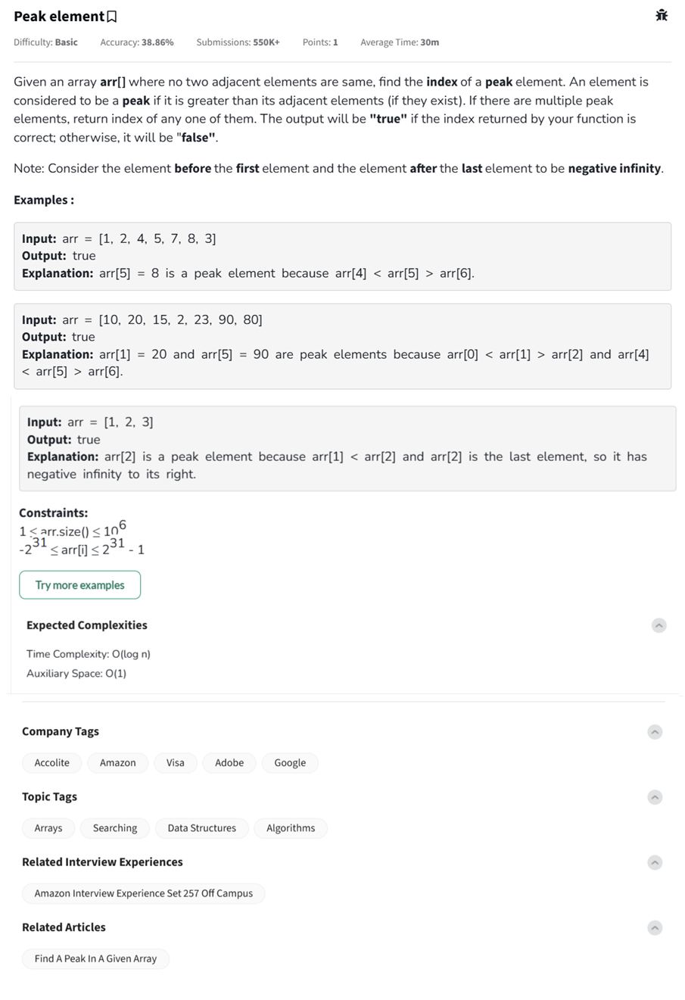

Question



---

This is the **Peak Element** problem — a very popular question!

---

### 🧠 Problem Summary:
Given an array `arr[]` where **no two adjacent elements are the same**, find the **index** of a **peak element**.

A **peak** is an element that is:
- Greater than its neighbors.
- For the **first** and **last** element, treat the out-of-bound neighbor as `-∞` (negative infinity).

You must **return the index** of any one peak.

---
  
### ✅ Python Code (Binary Search Approach):
```python
def findPeak(arr):
    low = 0
    high = len(arr) - 1

    while low <= high:
        mid = (low + high) // 2
        
        left = arr[mid - 1] if mid > 0 else float('-inf')
        right = arr[mid + 1] if mid < len(arr) - 1 else float('-inf')
        
        if arr[mid] >= left and arr[mid] >= right:
            return mid  # Peak found
        elif left > arr[mid]:
            high = mid - 1
        else:
            low = mid + 1

    return -1  # Should never happen if input is valid
```

---

### 🧪 Example Usage:
```python
print(findPeak([1, 2, 4, 5, 7, 8, 3]))  # Output: 5
print(findPeak([10, 20, 15, 2, 23, 90, 80]))  # Output: 1 or 5
print(findPeak([1, 2, 3]))  # Output: 2
```

---

### ⏱ Time & Space Complexity:
- **Time Complexity:** `O(log n)` (because of binary search)
- **Space Complexity:** `O(1)` (constant extra space)

---

Awesome! Here's the **C++** and **JavaScript** versions for the **Peak Element** problem:

---

### ✅ C++ Code (Binary Search):
```cpp
#include <vector>
#include <iostream>
using namespace std;

int findPeak(const vector<int>& arr) {
    int low = 0, high = arr.size() - 1;

    while (low <= high) {
        int mid = (low + high) / 2;

        int left = (mid > 0) ? arr[mid - 1] : INT_MIN;
        int right = (mid < arr.size() - 1) ? arr[mid + 1] : INT_MIN;

        if (arr[mid] >= left && arr[mid] >= right) {
            return mid;  // Found a peak
        } else if (left > arr[mid]) {
            high = mid - 1;
        } else {
            low = mid + 1;
        }
    }

    return -1;  // Shouldn't happen if input is valid
}
```

### 🧪 Example Usage in C++:
```cpp
int main() {
    vector<int> arr = {1, 2, 4, 5, 7, 8, 3};
    cout << findPeak(arr) << endl;  // Output: 5 (arr[5] = 8)
}
```

---

### ✅ JavaScript Code (Binary Search):
```javascript
function findPeak(arr) {
    let low = 0, high = arr.length - 1;

    while (low <= high) {
        let mid = Math.floor((low + high) / 2);

        let left = (mid > 0) ? arr[mid - 1] : -Infinity;
        let right = (mid < arr.length - 1) ? arr[mid + 1] : -Infinity;

        if (arr[mid] >= left && arr[mid] >= right) {
            return mid;  // Found a peak
        } else if (left > arr[mid]) {
            high = mid - 1;
        } else {
            low = mid + 1;
        }
    }

    return -1;
}
```

### 🧪 Example Usage in JavaScript:
```javascript
console.log(findPeak([1, 2, 4, 5, 7, 8, 3]));  // Output: 5
```

---

### 🔥 Quick Summary:
- **Binary search** guarantees `O(log n)` time.
- **First or last element** can also be a peak (compare to `-∞`).
- Multiple peaks may exist — returning **any** one is acceptable!

---

