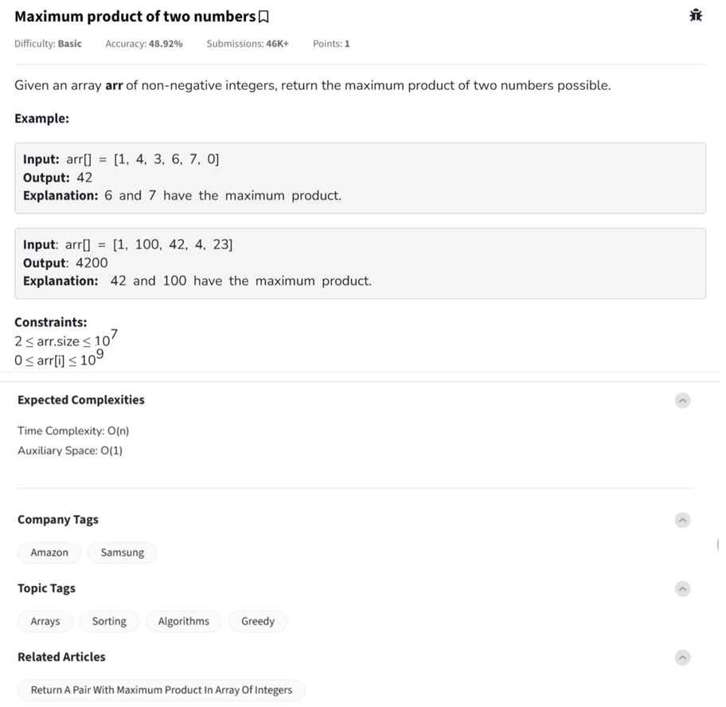

Question



---
Alright!  
This is the **Maximum Product of Two Numbers** problem.

---

### 🧠 Problem Understanding:

Given an array `arr[]` of non-negative integers:
- Find **two numbers** whose **product is maximum**.
- Return that maximum product value.

⚡ Array is **unsorted**.

---

### 🔥 Key Insight:
- You just need the **largest** and **second largest** elements!
- Their product will be the maximum possible.

---

### ✅ Python Code:
```python
def maxProduct(arr):
    first = second = -1

    for num in arr:
        if num > first:
            second = first
            first = num
        elif num > second:
            second = num

    return first * second
```

---

### 🧪 Example Usage:
```python
print(maxProduct([1, 4, 3, 6, 7, 0]))     # Output: 42
print(maxProduct([1, 100, 42, 4, 23]))     # Output: 4200
```

---

### ⏱ Time & Space Complexity:
- **Time Complexity:** `O(n)` — one pass through array
- **Space Complexity:** `O(1)` — constant space

---

### ✅ C++ Code:
```cpp
#include <vector>
using namespace std;

int maxProduct(const vector<int>& arr) {
    int first = -1, second = -1;

    for (int num : arr) {
        if (num > first) {
            second = first;
            first = num;
        } else if (num > second) {
            second = num;
        }
    }

    return first * second;
}
```

### 🧪 Example Usage in C++:
```cpp
#include <iostream>

int main() {
    vector<int> arr = {1, 4, 3, 6, 7, 0};
    cout << maxProduct(arr) << endl;  // Output: 42
    return 0;
}
```

---

### ✅ JavaScript Code:
```javascript
function maxProduct(arr) {
    let first = -1, second = -1;

    for (let num of arr) {
        if (num > first) {
            second = first;
            first = num;
        } else if (num > second) {
            second = num;
        }
    }

    return first * second;
}
```

### 🧪 Example Usage in JavaScript:
```javascript
console.log(maxProduct([1, 4, 3, 6, 7, 0]));  // Output: 42
console.log(maxProduct([1, 100, 42, 4, 23])); // Output: 4200
```

---

### 🚀 Summary:
- **Find two maximums** in a single pass.
- Multiply them for the final answer.

---

Would you also like a **flowchart** that shows how first and second maximums are updated dynamically? 🎯 (It’s a super clear visual that makes it easier to remember!)