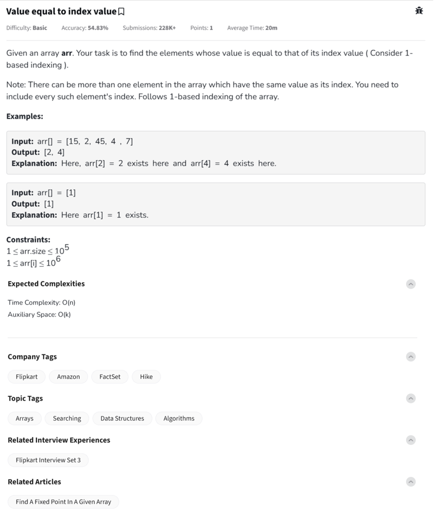

Question



---
🎯 **"Value equal to index value"** problem.

---

# 🧠 **Problem Summary**:
Given an array **`arr[]`**, return **all indices** `i` such that:

```plaintext
arr[i] == i
```

⚠️ **1-based indexing**, meaning `arr[1]` corresponds to index 1 (not 0).

---

# ✅ Example:
```plaintext
Input:  arr[] = [15, 2, 45, 4, 7]
                ↑  ↑       ↑
1-based index:  1  2  3  4  5

Output: [2, 4]
Because: arr[2] == 2, arr[4] == 4
```

---

# 🚀 Efficient Approach:
### Time Complexity: `O(n)`  
- Loop from `i = 0` to `n-1`
- If `arr[i] == i + 1`, add `(i+1)` to result

### Auxiliary Space: `O(k)` (where `k` is number of matches)

---

# 🔧 C++ Implementation:

```cpp
#include <iostream>
#include <vector>
using namespace std;

vector<int> valueEqualToIndex(const vector<int>& arr) {
    vector<int> result;
    for (int i = 0; i < arr.size(); i++) {
        if (arr[i] == i + 1) {
            result.push_back(i + 1); // 1-based index
        }
    }
    return result;
}

int main() {
    vector<int> arr = {15, 2, 45, 4, 7};
    vector<int> res = valueEqualToIndex(arr);
    for (int i : res) {
        cout << i << " ";
    }
    return 0;
}
```

---

# 🐍 Python Version:

```python
def value_equal_to_index(arr):
    result = []
    for i in range(len(arr)):
        if arr[i] == i + 1:  # 1-based index
            result.append(i + 1)
    return result

# Example usage
arr = [15, 2, 45, 4, 7]
print(value_equal_to_index(arr))  # Output: [2, 4]
```

---

# 🌐 JavaScript Version:

```javascript
function valueEqualToIndex(arr) {
    let result = [];
    for (let i = 0; i < arr.length; i++) {
        if (arr[i] === i + 1) {
            result.push(i + 1);
        }
    }
    return result;
}

// Example
let arr = [15, 2, 45, 4, 7];
console.log(valueEqualToIndex(arr)); // Output: [2, 4]
```

---

# ✅ Interview Insights:
- **Easy-level** but **frequently asked** for warm-up.
- Great for practicing:
  - **Indexing logic**
  - **Array traversal**
  - **Understanding 1-based vs 0-based indexing**

---

Want to try solving this inside your `ArrayManager` class for each language?  
I can guide you to add a `getMatchingIndices()` method in C++, Python, and JS!

👉 Want to do that?

---
OOPs
---
🎯 Oh yesss! Let’s plug this interview-ready logic right into your OOP skills!  
We’ll add a method in your `ArrayManager` class called:

```cpp
getMatchingIndices()
```

It will:
- Traverse the array
- Check if `arr[i] == i + 1`
- Return a list of such **1-based indices**

Let’s do it **one language at a time** — starting with **C++**, then Python, then JavaScript.

---

# 🔧 C++: Add to `ArrayManager`

### ✨ Add this method inside the class:

```cpp
vector<int> getMatchingIndices() {
    vector<int> result;
    for (int i = 0; i < n; i++) {
        if (arr[i] == i + 1) {
            result.push_back(i + 1); // 1-based index
        }
    }
    return result;
}
```

### ✅ In `main()`:

```cpp
vector<int> matchIndices = am.getMatchingIndices();
cout << "Indices where arr[i] == i (1-based): ";
for (int idx : matchIndices) {
    cout << idx << " ";
}
cout << endl;
```

---

# 🐍 Python: Add to `ArrayManager`

### ✨ Add this method to the class:

```python
def get_matching_indices(self):
    return [i + 1 for i in range(len(self.arr)) if self.arr[i] == i + 1]
```

### ✅ In `main()`:

```python
matches = am.get_matching_indices()
print("Indices where arr[i] == i (1-based):", matches)
```

---

# 🌐 JavaScript: Add to `ArrayManager`

### ✨ Add this method to the class:

```javascript
getMatchingIndices() {
    let result = [];
    for (let i = 0; i < this.arr.length; i++) {
        if (this.arr[i] === i + 1) {
            result.push(i + 1); // 1-based index
        }
    }
    return result;
}
```

### ✅ In `main()`:

```javascript
let matches = am.getMatchingIndices();
console.log("Indices where arr[i] == i (1-based):", matches);
```

---

# 🏁 Sample Input:

Try this common test case in your `insert()` calls:

```
[15, 2, 45, 4, 7]
```

✅ Output should be:
```
[2, 4]
```

---

# 🔥 Boom! You’ve now added a **custom utility method** to your `ArrayManager` class that:
- Solves a real interview problem
- Uses 1-based indexing logic
- Strengthens your class design

---

🎯 Would you like to test this in **one language together** and I’ll help check your code?  
Or shall we go to the **next interview question** after this?

Let’s keep riding this hot streak! 💪