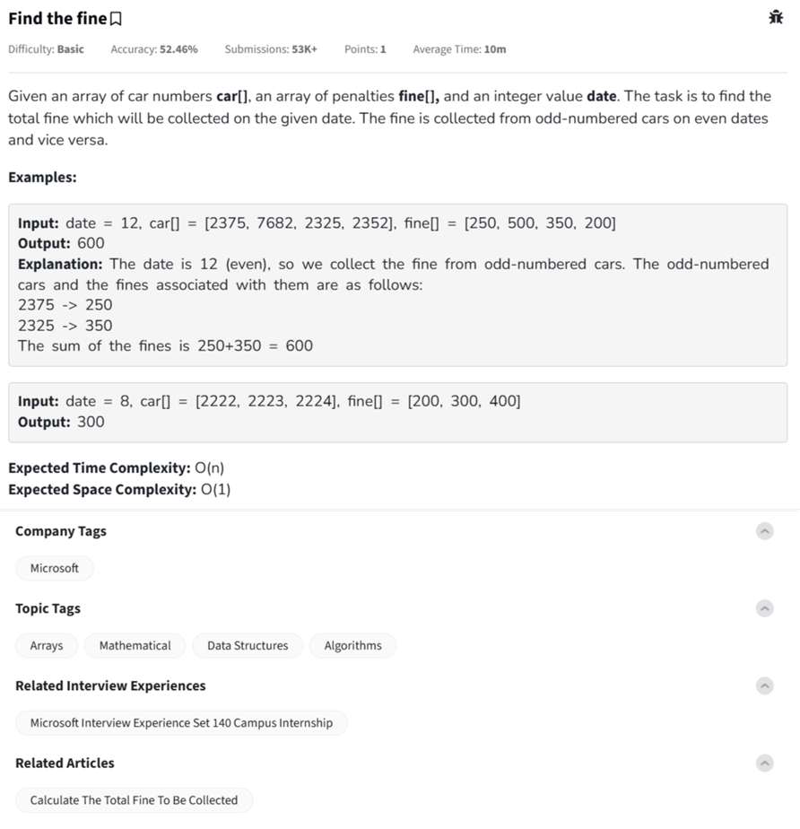

Question



---
Thanks! This is the **"Find the fine"** problem.

---

### 🧠 Problem Summary:

You're given:
- `date`: an integer
- `car[]`: list of car numbers
- `fine[]`: list of fines associated with each car

**Rule:**
- If the `date` is even, collect fines from **odd-numbered cars**.
- If the `date` is odd, collect fines from **even-numbered cars**.

Return the **total fine** collected.

---

### ✅ Python Code:
```python
def findTheFine(date, car, fine):
    total = 0
    for i in range(len(car)):
        if (date % 2 == 0 and car[i] % 2 != 0) or (date % 2 != 0 and car[i] % 2 == 0):
            total += fine[i]
    return total
```

### 🧪 Example:
```python
print(findTheFine(12, [2375, 7682, 2325, 2352], [250, 500, 350, 200]))  # Output: 600
print(findTheFine(8, [2222, 2223, 2224], [200, 300, 400]))             # Output: 300
```

---

### ✅ C++ Code:
```cpp
#include <vector>
using namespace std;

int findTheFine(int date, const vector<int>& car, const vector<int>& fine) {
    int total = 0;
    for (int i = 0; i < car.size(); ++i) {
        if ((date % 2 == 0 && car[i] % 2 != 0) || (date % 2 != 0 && car[i] % 2 == 0)) {
            total += fine[i];
        }
    }
    return total;
}
```

---

### ✅ JavaScript Code:
```javascript
function findTheFine(date, car, fine) {
    let total = 0;
    for (let i = 0; i < car.length; i++) {
        if ((date % 2 === 0 && car[i] % 2 !== 0) || (date % 2 !== 0 && car[i] % 2 === 0)) {
            total += fine[i];
        }
    }
    return total;
}
```

---

### ⏱ Time & Space Complexity:
- **Time:** `O(n)` — one pass
- **Space:** `O(1)` — constant extra space

---

Would you like a visual walkthrough of this with a car/fine table for clarity? 🧾📊