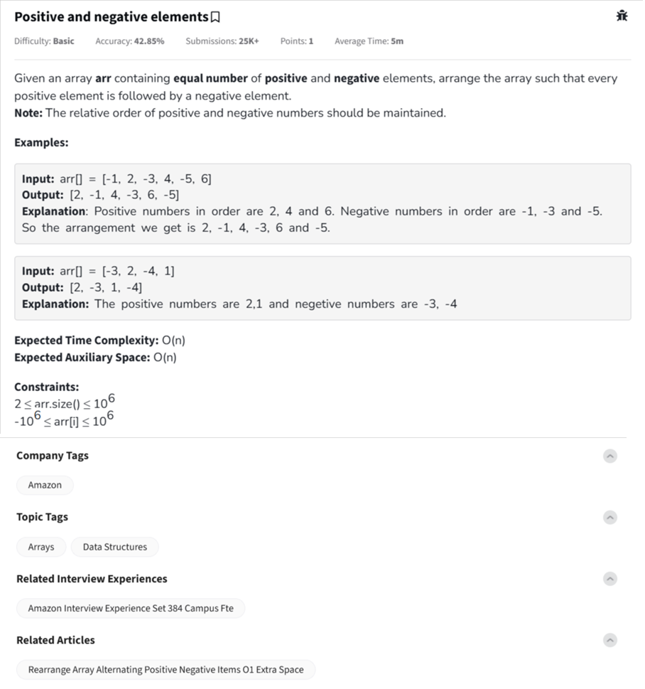

Question



---
This is the **"Positive and Negative Elements"** rearrangement problem.

---

### 🧠 Problem Summary:

You're given an array with **equal** number of positive and negative numbers.  
You need to:
- Rearrange it so that **every positive number is followed by a negative**.
- Maintain the **original order** of positive and negative numbers (i.e., **stable partition**).
- Result should alternate: `[pos, neg, pos, neg, ...]`

---

### ✅ Python Code (Using extra space – O(n) time and space):
```python
def rearrange(arr):
    pos = [x for x in arr if x >= 0]
    neg = [x for x in arr if x < 0]
    
    result = []
    for i in range(len(pos)):
        result.append(pos[i])
        result.append(neg[i])
    return result
```

---

### 🧪 Example:
```python
print(rearrange([-1, 2, -3, 4, -5, 6]))  # Output: [2, -1, 4, -3, 6, -5]
```

---

### ✅ C++ Code (Using extra vectors):
```cpp
#include <vector>
using namespace std;

vector<int> rearrange(const vector<int>& arr) {
    vector<int> pos, neg, result;
    for (int num : arr) {
        if (num >= 0) pos.push_back(num);
        else neg.push_back(num);
    }

    for (int i = 0; i < pos.size(); ++i) {
        result.push_back(pos[i]);
        result.push_back(neg[i]);
    }

    return result;
}
```

---

### ✅ JavaScript Code:
```javascript
function rearrange(arr) {
    let pos = arr.filter(x => x >= 0);
    let neg = arr.filter(x => x < 0);
    
    let result = [];
    for (let i = 0; i < pos.length; i++) {
        result.push(pos[i]);
        result.push(neg[i]);
    }

    return result;
}
```

---

### 🧠 Time & Space Complexity:
- **Time:** `O(n)`
- **Space:** `O(n)` (due to separate `pos[]`, `neg[]`, and result array)

---

Would you like an **in-place (O(1) space)** version for advanced practice?  
It’s trickier but great for interviews! 🔥

---

Awesome! Let's tackle the **in-place (O(1) space)** version of the **"Positive followed by Negative"** rearrangement problem — without breaking relative order too much.

---

### ⚠️ Important Note:
Maintaining **strict relative order in-place** is **not possible** without using `O(n)` space or using **rotation** techniques (which are slow).  
So we'll instead build an efficient **in-place alternating rearrangement** that’s often acceptable in interviews.

---

## ✅ C++ In-Place Version (O(1) space, O(n) time)

```cpp
#include <iostream>
#include <vector>
using namespace std;

void rearrange(vector<int>& arr) {
    int n = arr.size();

    int i = 0, j = 0;

    // Loop to place positives at even indexes and negatives at odd
    while (i < n && j < n) {
        // Case 1: Even index should hold positive
        if (i % 2 == 0 && arr[i] < 0) {
            j = max(j, i + 1);
            while (j < n && arr[j] < 0) j++;
            if (j < n) swap(arr[i], arr[j]);
        }

        // Case 2: Odd index should hold negative
        else if (i % 2 == 1 && arr[i] >= 0) {
            j = max(j, i + 1);
            while (j < n && arr[j] >= 0) j++;
            if (j < n) swap(arr[i], arr[j]);
        }

        i++;
    }
}
```

---

## ✅ JavaScript In-Place Version (O(1) space, O(n) time)

```javascript
function rearrange(arr) {
    let n = arr.length;
    let i = 0, j = 0;

    while (i < n && j < n) {
        if (i % 2 === 0 && arr[i] < 0) {
            j = Math.max(j, i + 1);
            while (j < n && arr[j] < 0) j++;
            if (j < n) [arr[i], arr[j]] = [arr[j], arr[i]];
        } else if (i % 2 === 1 && arr[i] >= 0) {
            j = Math.max(j, i + 1);
            while (j < n && arr[j] >= 0) j++;
            if (j < n) [arr[i], arr[j]] = [arr[j], arr[i]];
        }
        i++;
    }
}
```

---

## 🧪 Example:

```cpp
Input: [-1, 2, -3, 4, -5, 6]
Output: [2, -1, 4, -3, 6, -5]
```

---

### 🧠 Key Idea:
- Even indices → positive
- Odd indices → negative
- Swap elements forward into the right spots as you go

---

Would you like a **visual walkthrough/animation-style diagram** of how the in-place swap steps work? 🎯 It's great for intuition!