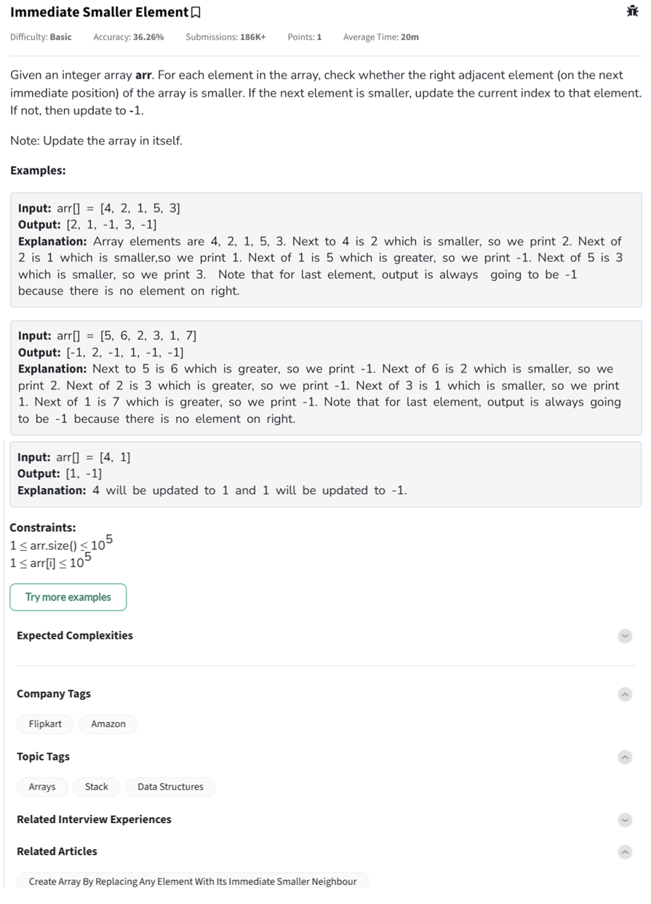

---

Awesome! Let’s walk through a **visual dry-run** example for the array:

---

### Array:
```
arr = [4, 2, 1, 5, 3]
```

---

### Step-by-Step Dry Run:

| Index | Current Value | Next Value | Action                      | Updated Array              |
|:-----:|:--------------:|:----------:|:----------------------------|:---------------------------:|
|   0   | 4              | 2          | 2 < 4 → replace 4 with 2     | [2, 2, 1, 5, 3]             |
|   1   | 2 (originally 2) | 1         | 1 < 2 → replace 2 with 1     | [2, 1, 1, 5, 3]             |
|   2   | 1              | 5          | 5 > 1 → replace 1 with -1    | [2, 1, -1, 5, 3]            |
|   3   | 5              | 3          | 3 < 5 → replace 5 with 3     | [2, 1, -1, 3, 3]            |
|   4   | 3              | No next    | Always replace last with -1  | [2, 1, -1, 3, -1]           |

---

### ✅ Final Result:
```
[2, 1, -1, 3, -1]
```

---

### 🔥 Main Idea:
- Compare each element with its immediate right neighbor.
- If the right neighbor is **smaller**, replace.
- Otherwise, set it to **-1**.
- Last element is **always** `-1` because it has no neighbor.

---

Perfect! Let’s go step-by-step:

---

### ✅ C++ Code:
```cpp
#include <vector>
using namespace std;

void immediateSmaller(vector<int>& arr) {
    int n = arr.size();
    for (int i = 0; i < n - 1; ++i) {
        if (arr[i + 1] < arr[i]) {
            arr[i] = arr[i + 1];
        } else {
            arr[i] = -1;
        }
    }
    arr[n - 1] = -1;
}
```

### 🧪 Example Usage in C++:
```cpp
#include <iostream>

int main() {
    vector<int> arr = {4, 2, 1, 5, 3};
    immediateSmaller(arr);
    for (int num : arr) {
        cout << num << " ";
    }
    // Output: 2 1 -1 3 -1
    return 0;
}
```

---

### ✅ JavaScript Code:
```javascript
function immediateSmaller(arr) {
    let n = arr.length;
    for (let i = 0; i < n - 1; i++) {
        if (arr[i + 1] < arr[i]) {
            arr[i] = arr[i + 1];
        } else {
            arr[i] = -1;
        }
    }
    arr[n - 1] = -1;
    return arr;
}
```

### 🧪 Example Usage in JavaScript:
```javascript
console.log(immediateSmaller([4, 2, 1, 5, 3])); 
// Output: [2, 1, -1, 3, -1]
```

---
Got it — this is the **Immediate Smaller Element** problem!

---

### 🧠 Problem Summary:
- You are given an array `arr[]`.
- For each element, **check the next element**:
  - If the next element is **smaller**, **update** the current element to the next one.
  - Otherwise, **update** the current element to `-1`.
- For the **last element**, always update to `-1` (because it has no next).

---

### ✅ Python Code:
```python
def immediateSmaller(arr):
    n = len(arr)
    for i in range(n - 1):
        if arr[i + 1] < arr[i]:
            arr[i] = arr[i + 1]
        else:
            arr[i] = -1
    arr[-1] = -1
    return arr
```

---

### 🧪 Example Usage:
```python
print(immediateSmaller([4, 2, 1, 5, 3]))  # Output: [2, 1, -1, 3, -1]
print(immediateSmaller([5, 6, 2, 3, 1, 7]))  # Output: [-1, 2, -1, 1, -1, -1]
print(immediateSmaller([4, 1]))  # Output: [1, -1]
```

---

### ⏱ Time & Space Complexity:
- **Time Complexity:** `O(n)` — single pass through the array.
- **Space Complexity:** `O(1)` — in-place update.

---

