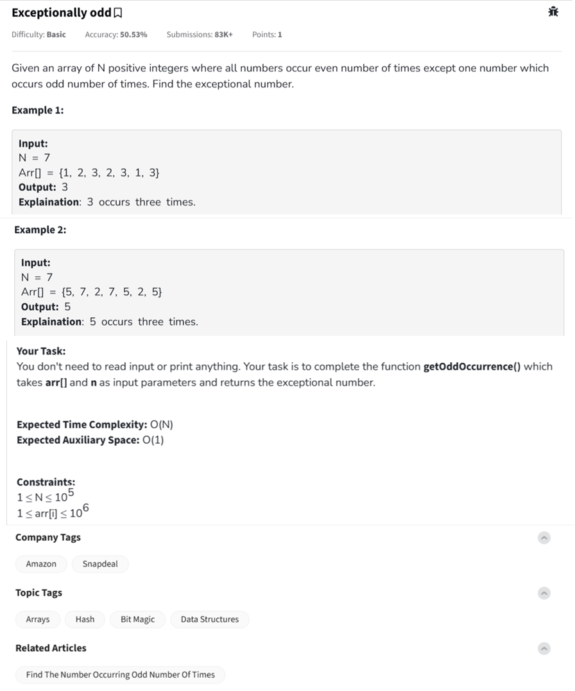

Question



---
Alright! Let's **visually understand** the **XOR trick** 🔥:

---

### ⚡ XOR properties:
- `a ^ a = 0` → A number XOR itself cancels out.
- `a ^ 0 = a` → A number XOR 0 remains the same.
- XOR is **commutative and associative** (order doesn't matter).

---

### 🎯 Example:

Suppose we have the array:
```
arr = [1, 2, 3, 2, 3, 1, 3]
```

#### Step-by-step XOR:

| Step | Operation           | Result |
|-----|----------------------|--------|
| 1   | 0 ^ 1                | 1      |
| 2   | 1 ^ 2                | 3      |
| 3   | 3 ^ 3                | 0      |
| 4   | 0 ^ 2                | 2      |
| 5   | 2 ^ 3                | 1      |
| 6   | 1 ^ 1                | 0      |
| 7   | 0 ^ 3                | 3      |

✅ Final result = **3**

---

### 📈 Visual Flow:

```
Start: 0

0 ^ 1 = 1
1 ^ 2 = 3
3 ^ 3 = 0 (pair 3 cancels)
0 ^ 2 = 2
2 ^ 3 = 1
1 ^ 1 = 0 (pair 1 cancels)
0 ^ 3 = 3 (leftover 3)

Result: 3
```

✅ 3 appears **odd** number of times → Correct!

---

### 🔥 Why XOR works perfectly here?
Because:
- **Even number of same elements cancel** each other (`num ^ num = 0`).
- Only the **odd frequency number remains**!

---

Got it!  
This is the **Exceptionally Odd** problem.

---

### 🧠 Problem Understanding:

Given an array where:
- Every number appears **even** number of times,
- Except **one number** that appears **odd** number of times.

You must **find that exceptional number**.

---

### 🔥 Key Insight (Optimal Trick):
- If you XOR all elements together, **pairs cancel out** because:
  ```
  a ^ a = 0
  0 ^ b = b
  ```
- So at the end, **the leftover** will be the number that appeared odd times!

---

### ✅ Python Code:
```python
def getOddOccurrence(arr, n):
    result = 0
    for num in arr:
        result ^= num
    return result
```

---

### 🧪 Example Usage:
```python
print(getOddOccurrence([1, 2, 3, 2, 3, 1, 3], 7))  # Output: 3
print(getOddOccurrence([5, 7, 2, 7, 5, 2, 5], 7))  # Output: 5
```

---

### ⏱ Time & Space Complexity:
- **Time Complexity:** `O(n)`
- **Space Complexity:** `O(1)`

---

Perfect!  
You want the **twist version** where **TWO numbers** occur odd number of times — and the code for **C++** and **JavaScript**.

Let's do it 🔥:

---

## 🧠 Problem: Two Numbers Occur Odd Number of Times

Given an array where:
- Exactly **two numbers occur odd number of times**.
- All other numbers occur even times.

**Find both numbers.**

---

### 🔥 Key Idea:
- XOR of the entire array gives `xor = num1 ^ num2`.
- Now, find any **set bit** in `xor` (means `num1` and `num2` differ at that bit).
- Divide elements into **two groups** based on that bit and XOR separately.

---

### ✅ C++ Code:
```cpp
#include <vector>
using namespace std;

vector<int> twoOddNumbers(const vector<int>& arr) {
    int xor_all = 0;
    for (int num : arr) {
        xor_all ^= num;
    }

    int set_bit = xor_all & ~(xor_all - 1);  // Find rightmost set bit

    int num1 = 0, num2 = 0;
    for (int num : arr) {
        if (num & set_bit)
            num1 ^= num;
        else
            num2 ^= num;
    }

    return {max(num1, num2), min(num1, num2)};  // Larger first
}
```

### 🧪 Example Usage in C++:
```cpp
#include <iostream>

int main() {
    vector<int> arr = {4, 2, 4, 5, 2, 3, 3, 1};
    vector<int> res = twoOddNumbers(arr);
    cout << res[0] << " " << res[1] << endl;  // Output: 5 1
}
```

---

### ✅ JavaScript Code:
```javascript
function twoOddNumbers(arr) {
    let xor_all = 0;
    for (let num of arr) {
        xor_all ^= num;
    }

    let set_bit = xor_all & ~(xor_all - 1);

    let num1 = 0, num2 = 0;
    for (let num of arr) {
        if (num & set_bit) {
            num1 ^= num;
        } else {
            num2 ^= num;
        }
    }

    return [Math.max(num1, num2), Math.min(num1, num2)];
}
```

### 🧪 Example Usage in JavaScript:
```javascript
console.log(twoOddNumbers([4, 2, 4, 5, 2, 3, 3, 1]));
// Output: [5, 1]
```

---

### 📈 Quick Recap of Steps:
1. XOR all elements → gives `num1 ^ num2`.
2. Find a **set bit** where `num1` and `num2` differ.
3. Separate numbers into **two groups** based on the set bit.
4. XOR inside each group to find `num1` and `num2`.

✅ Final answer!

---

Would you like a **diagram** showing how this division happens between two groups visually? 📊 (makes it super intuitive!) 🚀