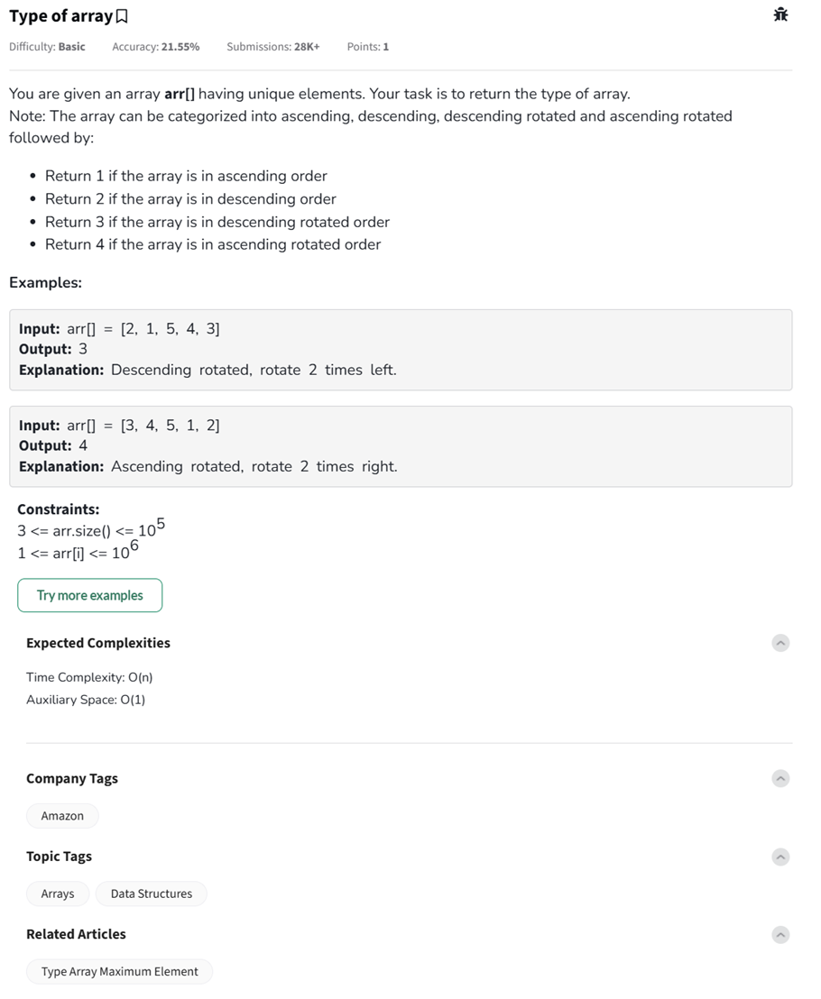

Question



---
Thanks! This is the **"Type of Array"** classification problem.

---
Here's a Python function that implements the logic described for identifying the type of array:

```python
def type_of_array(arr):
    n = len(arr)
    count_increases = 0
    count_decreases = 0

    for i in range(n - 1):
        if arr[i] < arr[i + 1]:
            count_increases += 1
        elif arr[i] > arr[i + 1]:
            count_decreases += 1

    if count_decreases == 0:
        return 1  # Ascending
    elif count_increases == 0:
        return 2  # Descending
    elif count_decreases == 1 and arr[-1] < arr[0]:
        return 4  # Ascending Rotated
    elif count_increases == 1 and arr[-1] > arr[0]:
        return 3  # Descending Rotated
    else:
        return -1  # Not a valid input for the defined categories (just in case)
```

### Example usage:
```python
print(type_of_array([2, 1, 5, 4, 3]))  # Output: 3 (Descending Rotated)
print(type_of_array([3, 4, 5, 1, 2]))  # Output: 4 (Ascending Rotated)
print(type_of_array([1, 2, 3, 4]))     # Output: 1 (Ascending)
print(type_of_array([9, 7, 3, 1]))     # Output: 2 (Descending)
```

Would you like a version with inline comments to explain each step?

---

Certainly! Below are the **Python**, **JavaScript**, and **C++** implementations of the solution, each with inline comments to explain the logic clearly.

---

### ✅ Python Code (with comments):
```python
def type_of_array(arr):
    n = len(arr)
    count_increases = 0
    count_decreases = 0

    # Count increases and decreases between adjacent elements
    for i in range(n - 1):
        if arr[i] < arr[i + 1]:
            count_increases += 1
        elif arr[i] > arr[i + 1]:
            count_decreases += 1

    # Check for ascending
    if count_decreases == 0:
        return 1
    # Check for descending
    elif count_increases == 0:
        return 2
    # Check for ascending rotated: one drop and last element < first
    elif count_decreases == 1 and arr[-1] < arr[0]:
        return 4
    # Check for descending rotated: one rise and last element > first
    elif count_increases == 1 and arr[-1] > arr[0]:
        return 3
    else:
        return -1  # Not matching any defined type
```

---

### ✅ JavaScript Code (with comments):
```javascript
function typeOfArray(arr) {
    const n = arr.length;
    let countIncreases = 0;
    let countDecreases = 0;

    // Count increasing and decreasing pairs
    for (let i = 0; i < n - 1; i++) {
        if (arr[i] < arr[i + 1]) {
            countIncreases++;
        } else if (arr[i] > arr[i + 1]) {
            countDecreases++;
        }
    }

    // Classify based on the counts
    if (countDecreases === 0) {
        return 1; // Ascending
    } else if (countIncreases === 0) {
        return 2; // Descending
    } else if (countDecreases === 1 && arr[n - 1] < arr[0]) {
        return 4; // Ascending Rotated
    } else if (countIncreases === 1 && arr[n - 1] > arr[0]) {
        return 3; // Descending Rotated
    } else {
        return -1; // Undefined type
    }
}
```

---

### ✅ C++ Code (with comments):
```cpp
#include <iostream>
#include <vector>
using namespace std;

int typeOfArray(vector<int>& arr) {
    int n = arr.size();
    int countIncreases = 0, countDecreases = 0;

    // Count increasing and decreasing adjacent elements
    for (int i = 0; i < n - 1; ++i) {
        if (arr[i] < arr[i + 1])
            countIncreases++;
        else if (arr[i] > arr[i + 1])
            countDecreases++;
    }

    // Check types
    if (countDecreases == 0)
        return 1; // Ascending
    else if (countIncreases == 0)
        return 2; // Descending
    else if (countDecreases == 1 && arr[n - 1] < arr[0])
        return 4; // Ascending Rotated
    else if (countIncreases == 1 && arr[n - 1] > arr[0])
        return 3; // Descending Rotated
    else
        return -1; // Invalid input
}

int main() {
    vector<int> arr = {3, 4, 5, 1, 2};  // Example
    cout << typeOfArray(arr) << endl;   // Output: 4
    return 0;
}
```

---