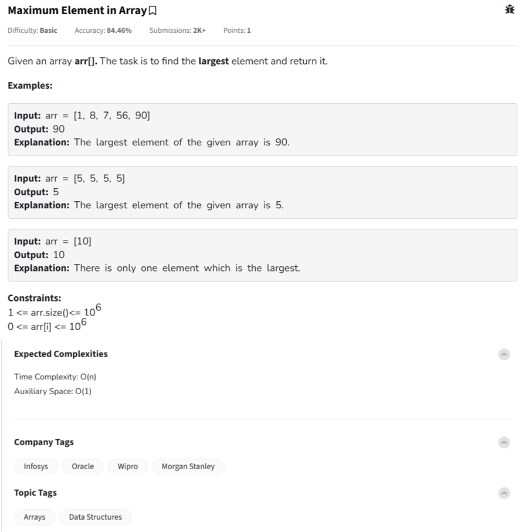

Question



---

You're now working on the **“Maximum Element in Array”** problem — one of the simplest but foundational DSA problems!

---

## ✅ Problem Summary

You're given an array `arr[]`. Your task is to **return the largest element** in the array.

### 🧪 Examples

- **Input**: `[1, 8, 7, 56, 90]` → **Output**: `90`
- **Input**: `[5, 5, 5, 5]` → **Output**: `5`
- **Input**: `[10]` → **Output**: `10`

---

### ✅ Constraints

- `1 <= arr.size() <= 10^6`
- `0 <= arr[i] <= 10^6`
- Expected Time: `O(n)`  
- Expected Space: `O(1)`

---

## 🧑‍💻 Solutions in Multiple Languages

### 🐍 Python
```python
def find_max_element(arr):
    max_element = arr[0]
    for num in arr:
        if num > max_element:
            max_element = num
    return max_element

# Example usage
print(find_max_element([1, 8, 7, 56, 90]))  # Output: 90
```

---

### 🧑‍💻 C++
```cpp
#include <iostream>
#include <vector>
using namespace std;

int findMaxElement(const vector<int>& arr) {
    int maxElement = arr[0];
    for (int num : arr) {
        if (num > maxElement)
            maxElement = num;
    }
    return maxElement;
}

int main() {
    vector<int> arr = {1, 8, 7, 56, 90};
    cout << findMaxElement(arr) << endl; // Output: 90
    return 0;
}
```

---

### 🌐 JavaScript
```javascript
function findMaxElement(arr) {
    let max = arr[0];
    for (let num of arr) {
        if (num > max) {
            max = num;
        }
    }
    return max;
}

// Example usage
console.log(findMaxElement([1, 8, 7, 56, 90])); // Output: 90
```

---

## 🧠 Time & Space Complexity

| Metric           | Value  |
|------------------|--------|
| Time Complexity  | O(n)   |
| Space Complexity | O(1)   |

---

 **solve it recursively**?

 Ah, a challenge for the recursion enthusiast! 🔁 Let's solve **“Maximum Element in an Array”** recursively — a neat way to sharpen your understanding of recursive thinking!

---

## 🧠 **Recursive Strategy**

1. Base case:
   - If the array has only one element, that is the maximum.
2. Recursive case:
   - Compare the first element with the max of the rest of the array.

---

## 🐍 Python: Recursive Maximum

```python
def find_max_recursive(arr, n):
    # Base case: if only one element
    if n == 1:
        return arr[0]
    
    # Recursive step: get max in rest and compare
    return max(arr[n-1], find_max_recursive(arr, n-1))

# Example usage
arr = [1, 8, 7, 56, 90]
print(find_max_recursive(arr, len(arr)))  # Output: 90
```

---

## 🧑‍💻 C++: Recursive Maximum

```cpp
#include <iostream>
#include <vector>
using namespace std;

int findMaxRecursive(const vector<int>& arr, int n) {
    // Base case
    if (n == 1)
        return arr[0];

    // Recursive case
    return max(arr[n - 1], findMaxRecursive(arr, n - 1));
}

int main() {
    vector<int> arr = {1, 8, 7, 56, 90};
    cout << findMaxRecursive(arr, arr.size()) << endl; // Output: 90
    return 0;
}
```

---

## 🌐 JavaScript: Recursive Maximum

```javascript
function findMaxRecursive(arr, n) {
    if (n === 1) {
        return arr[0];
    }
    return Math.max(arr[n - 1], findMaxRecursive(arr, n - 1));
}

// Example usage
console.log(findMaxRecursive([1, 8, 7, 56, 90], 5)); // Output: 90
```

---

## ⚙️ Complexity Analysis

| Metric           | Value    |
|------------------|----------|
| Time Complexity  | O(n)     |
| Space Complexity | O(n)     | (due to recursive call stack)

---

### visualize the recursion steps?

Perfect! Let’s **visualize how recursion works** step-by-step for finding the **maximum element in an array**.

We'll use this input:
```python
arr = [1, 8, 7, 56, 90]
```

We call:
```python
find_max_recursive(arr, 5)
```

---

## 🔁 **Recursive Breakdown**

We'll show what happens **at each call**, including how the stack unwinds:

### Step 1:  
```text
find_max_recursive([1, 8, 7, 56, 90], 5)
→ compares arr[4] = 90 with result of find_max_recursive(..., 4)
```

### Step 2:  
```text
find_max_recursive([1, 8, 7, 56, 90], 4)
→ compares arr[3] = 56 with result of find_max_recursive(..., 3)
```

### Step 3:  
```text
find_max_recursive([1, 8, 7, 56, 90], 3)
→ compares arr[2] = 7 with result of find_max_recursive(..., 2)
```

### Step 4:  
```text
find_max_recursive([1, 8, 7, 56, 90], 2)
→ compares arr[1] = 8 with result of find_max_recursive(..., 1)
```

### Base Case — Step 5:
```text
find_max_recursive([1, 8, 7, 56, 90], 1)
→ returns arr[0] = 1
```

---

## 🧠 **Stack Unwinding (Comparisons)**

Now it bubbles up:

1. Compare: `8` vs `1` → returns `8`
2. Compare: `7` vs `8` → returns `8`
3. Compare: `56` vs `8` → returns `56`
4. Compare: `90` vs `56` → returns `90`

---

## 🧾 Final Result:
```
90
```

---

### 📈 Recursion Tree (Simplified)

```
f(5)
└── max(90, f(4))
       └── max(56, f(3))
              └── max(7, f(2))
                     └── max(8, f(1))
                            └── 1  ← base case
```

---

Would you like a visual Python plot of this call stack using `graphviz`, or a tail-recursive version to reduce stack space?

Great catch! 🙌 The error is due to this line in your C++ code:

```cpp
for (int num : arr) {
```

This **range-based for loop** works only on containers that support `begin()` and `end()` (like `std::vector` or arrays with known size). But in your function, `arr` is just a **raw pointer**, and C++ can't infer the bounds.

---

## ✅ Fix: Use an index-based loop instead

### 🔧 Corrected Function:
```cpp
class Solution {
  public:
    int largest(int arr[], int n) {
        int maxElement = arr[0];
        for (int i = 1; i < n; ++i) {
            if (arr[i] > maxElement)
                maxElement = arr[i];
        }
        return maxElement;
    }
};
```

---

## 🧠 Why This Works
- `arr[]` is just a pointer in this context.
- Index-based iteration (`for (int i = 0; i < n; ++i)`) is the safest way to loop over it.
- Range-based for works like this:
  ```cpp
  for (auto& num : vector<int>) // okay
  for (auto& num : arr)         // error if arr is raw pointer
  ```

---

Absolutely! Let's turn our **recursive max-finding function** into a **tail-recursive version**, which reduces stack space and is more compiler-friendly for optimization.

---

## 🧠 What is Tail Recursion?

A **tail-recursive function** is one where the recursive call is the **last action** in the function.  
✅ This allows compilers to optimize the recursion into iteration, **reducing stack usage** to `O(1)`.

---

## 🎯 Tail-Recursive Max Element – Strategy

We'll use an accumulator-style helper function:

1. Start with an index (`i = 0`) and current max (`max_so_far = -∞`)
2. In each call, compare `arr[i]` with `max_so_far`
3. Pass the updated max to the next call (`i+1`)
4. When `i == n`, return `max_so_far`

---

## 🐍 Python Tail-Recursive Version

```python
def find_max_tail_recursive(arr, i=0, max_so_far=None):
    if max_so_far is None:
        max_so_far = arr[0]

    # Base case: end of array
    if i == len(arr):
        return max_so_far

    # Recursive call with updated max
    return find_max_tail_recursive(arr, i + 1, max(max_so_far, arr[i]))

# Example usage
arr = [1, 8, 7, 56, 90]
print(find_max_tail_recursive(arr))  # Output: 90
```

---

## 🧑‍💻 C++ Tail-Recursive Version

C++ doesn’t guarantee tail-call optimization in all compilers, but here’s how you'd write it:

```cpp
#include <iostream>
#include <vector>
using namespace std;

int findMaxTailRecursive(int arr[], int n, int i = 0, int maxSoFar = INT_MIN) {
    if (i == n)
        return maxSoFar;
    return findMaxTailRecursive(arr, n, i + 1, max(maxSoFar, arr[i]));
}

int main() {
    int arr[] = {1, 8, 7, 56, 90};
    int n = sizeof(arr) / sizeof(arr[0]);
    cout << findMaxTailRecursive(arr, n) << endl; // Output: 90
    return 0;
}
```

---

## ⚙️ Time and Space Complexity

| Metric           | Value    |
|------------------|----------|
| Time Complexity  | O(n)     |
| Space Complexity | O(n) (without optimization), O(1) if tail-call optimized |

---

