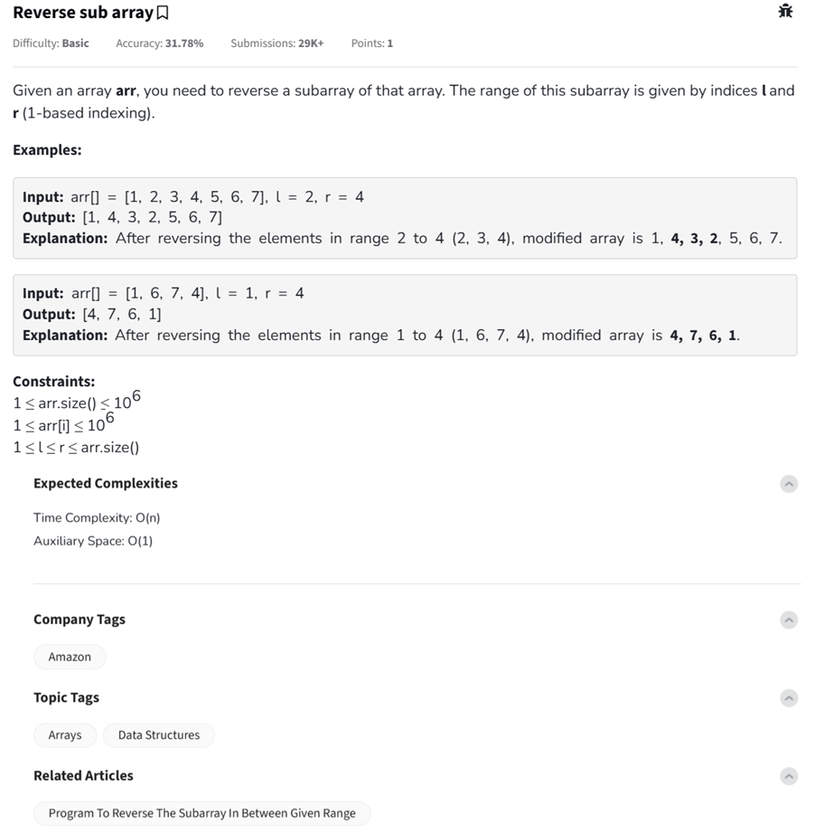

Question



---
You're now working on the problem: **"Reverse sub array"** — a classic that blends array manipulation with range indexing. Let's walk through it like pros! 😎

---

## ✅ **Problem Summary**
You are given:
- An array `arr`
- Two **1-based indices** `l` and `r`

Your task is to **reverse the subarray from `l` to `r`**, *inclusive*, and return the modified array.

---

### 🔁 Example 1
```
Input: arr = [1, 2, 3, 4, 5, 6, 7], l = 2, r = 4
Output:       [1, 4, 3, 2, 5, 6, 7]
```

### 🔁 Example 2
```
Input: arr = [1, 6, 7, 4], l = 1, r = 4
Output:       [4, 7, 6, 1]
```

---

## ⏱️ Time & Space Complexity
- **Time**: O(n) → You reverse only part of the array (linear)
- **Space**: O(1) → Done in-place

---

## 🐍 Python Code

```python
def reverse_subarray(arr, l, r):
    # Convert 1-based to 0-based indexing
    l -= 1
    r -= 1

    # Reverse in-place using two pointers
    while l < r:
        arr[l], arr[r] = arr[r], arr[l]
        l += 1
        r -= 1
    return arr

# Example usage
print(reverse_subarray([1, 2, 3, 4, 5, 6, 7], 2, 4))  # Output: [1, 4, 3, 2, 5, 6, 7]
```

---

## 🧑‍💻 C++ Code

```cpp
#include <iostream>
#include <vector>
using namespace std;

void reverseSubarray(vector<int>& arr, int l, int r) {
    // Convert to 0-based indexing
    l--; r--;

    // Reverse in-place
    while (l < r) {
        swap(arr[l], arr[r]);
        l++;
        r--;
    }
}

int main() {
    vector<int> arr = {1, 2, 3, 4, 5, 6, 7};
    int l = 2, r = 4;

    reverseSubarray(arr, l, r);

    for (int num : arr)
        cout << num << " ";
    cout << endl;
    return 0;
}
```

---

## 🌐 JavaScript Code

```javascript
function reverseSubarray(arr, l, r) {
    // Convert to 0-based index
    l -= 1;
    r -= 1;

    while (l < r) {
        [arr[l], arr[r]] = [arr[r], arr[l]];
        l++;
        r--;
    }
    return arr;
}

// Example usage
console.log(reverseSubarray([1, 2, 3, 4, 5, 6, 7], 2, 4));
// Output: [1, 4, 3, 2, 5, 6, 7]
```

---

Would you like to handle **multiple queries** or **print the steps of the reversal** as a trace?