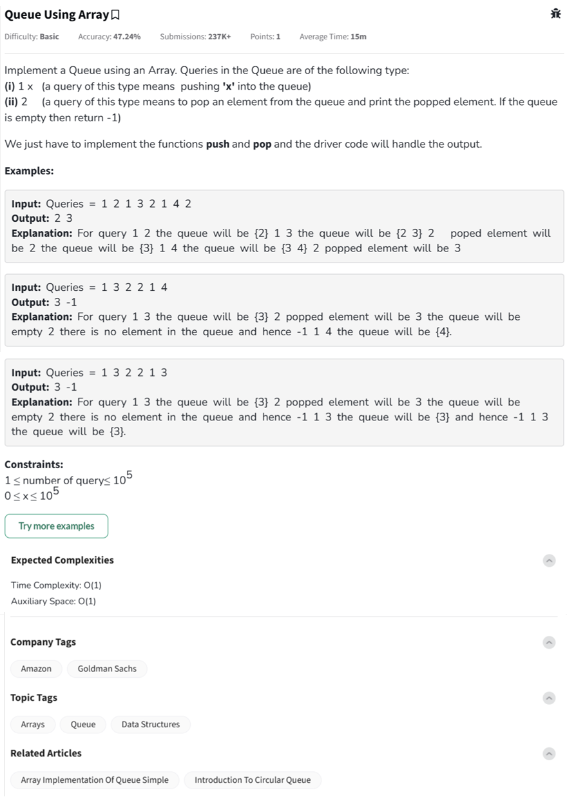

Question



---

## 🎯 **Your Goal**

You need to implement a **queue** using an array where:

### 🔧 Operations:
1. **`1 x`** — Push `x` into the queue.
2. **`2`** — Pop the front element from the queue.
   - If the queue is empty, return `-1`.

You don’t return or print during `push(x)`  
You **return the value** during `pop()`.

---

## 🧪 Let's Walk Through an Example

### ✅ Input:
```plaintext
Queries = [1 2, 1 3, 2, 1 4, 2]
```

We'll simulate each step:

### Initial state:
```
Queue: []
```

---

### 🔹 Step 1: `1 2` → Push 2

```
Queue: [2]
Output: -
```

---

### 🔹 Step 2: `1 3` → Push 3

```
Queue: [2, 3]
Output: -
```

---

### 🔹 Step 3: `2` → Pop
- Front element is `2`, pop it.

```
Queue: [3]
Output: 2 ✅
```

---

### 🔹 Step 4: `1 4` → Push 4

```
Queue: [3, 4]
Output: -
```

---

### 🔹 Step 5: `2` → Pop
- Front element is `3`, pop it.

```
Queue: [4]
Output: 3 ✅
```

---

### Final Output:
```
2 3
```

---

## 🧠 What If Queue Is Empty?

### Input:
```plaintext
1 3, 2, 2
```

Steps:
```
Push 3 → [3]
Pop → 3
Pop → Queue is empty → return -1
```

### Output:
```
3 -1
```

---

## 📌 Visual Simulation (Text-Based)

| Step | Operation | Queue        | Output |
|------|-----------|--------------|--------|
| 1    | 1 2       | [2]          | -      |
| 2    | 1 3       | [2, 3]       | -      |
| 3    | 2         | [3]          | 2      |
| 4    | 1 4       | [3, 4]       | -      |
| 5    | 2         | [4]          | 3      |

---
