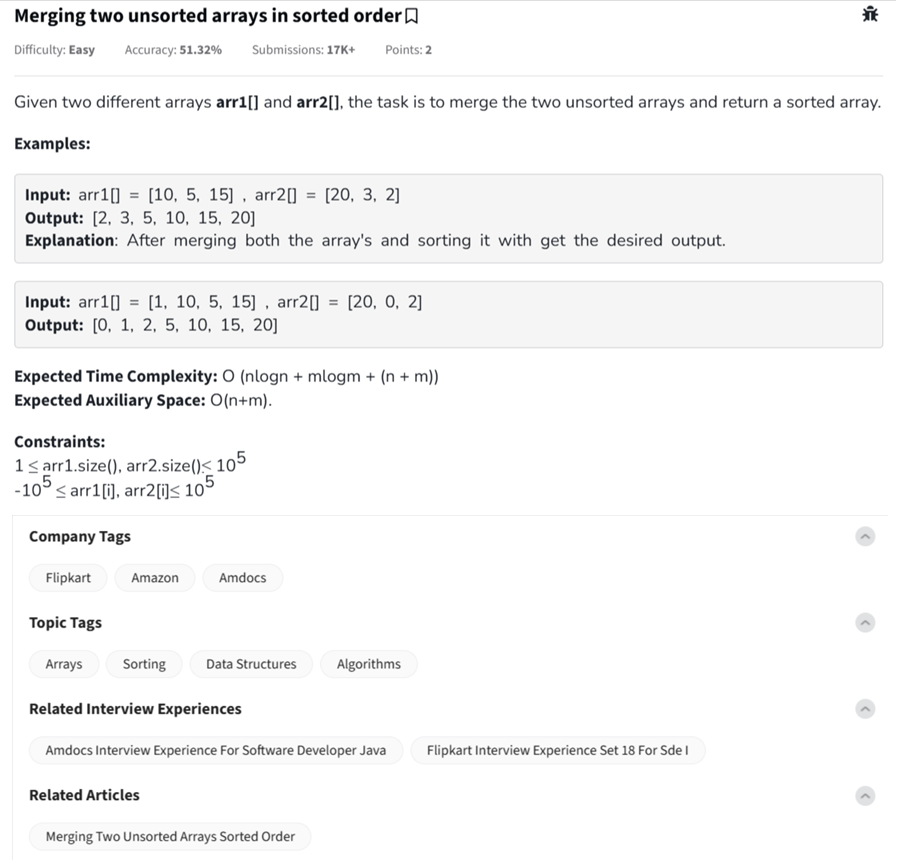

Question



---

You're now solving: **“Merging Two Unsorted Arrays in Sorted Order”**, a fundamental but useful problem that combines merging and sorting. Let's break it down! 🧠

---

## ✅ Problem Summary

You’re given two unsorted arrays: `arr1[]` and `arr2[]`.  
Your task is to:
1. Merge both arrays
2. Return the combined array in **sorted order**

---

## 🧪 Examples

### Example 1:
```
Input:
arr1 = [10, 5, 15]
arr2 = [20, 3, 2]

Output:
[2, 3, 5, 10, 15, 20]
```

### Example 2:
```
Input:
arr1 = [1, 10, 5, 15]
arr2 = [20, 0, 2]

Output:
[0, 1, 2, 5, 10, 15, 20]
```

---

## 🔍 Constraints

- `1 <= arr1.size(), arr2.size() <= 10⁵`
- `-10⁵ <= arr[i] <= 10⁵`
- Must be efficient for large inputs

---

## ⏱️ Expected Time and Space Complexity

- **Time**: `O(n log n + m log m + n + m)`  
  (Or just `O((n+m) log(n+m))` for full merge + sort)
- **Space**: `O(n + m)`

---

## 🐍 Python Solution

```python
def merge_and_sort(arr1, arr2):
    merged = arr1 + arr2        # Merge
    merged.sort()               # Sort
    return merged

# Example usage
arr1 = [10, 5, 15]
arr2 = [20, 3, 2]
print(merge_and_sort(arr1, arr2))  # Output: [2, 3, 5, 10, 15, 20]
```

---

## 🧑‍💻 C++ Version

```cpp
#include <iostream>
#include <vector>
#include <algorithm>
using namespace std;

vector<int> mergeAndSort(vector<int>& arr1, vector<int>& arr2) {
    vector<int> merged = arr1;
    merged.insert(merged.end(), arr2.begin(), arr2.end());
    sort(merged.begin(), merged.end());
    return merged;
}

int main() {
    vector<int> arr1 = {10, 5, 15};
    vector<int> arr2 = {20, 3, 2};
    vector<int> result = mergeAndSort(arr1, arr2);
    for (int x : result) cout << x << " ";
    return 0;
}
```

---

## 🌐 JavaScript Version

```javascript
function mergeAndSort(arr1, arr2) {
    let merged = arr1.concat(arr2);
    merged.sort((a, b) => a - b);
    return merged;
}

// Example
console.log(mergeAndSort([10, 5, 15], [20, 3, 2]));  // [2, 3, 5, 10, 15, 20]
```

---

Would you like a version that **merges two already sorted arrays** in `O(n + m)` time instead (without sorting again)?

Perfect! Let's now look at the **optimized merge** approach for when both arrays are already **sorted**.

This version avoids sorting and merges them in **O(n + m)** time using the **two-pointer technique** — similar to the merge step of merge sort.

---

## 🔍 Scenario:
You’re given:
- `arr1` and `arr2`, **both already sorted**
- Your task: Merge them into one sorted array in **linear time**

---

## 🧠 Time & Space Complexity

| Metric             | Value      |
|--------------------|------------|
| Time Complexity     | O(n + m)   |
| Space Complexity    | O(n + m)   |

---

## 🐍 Python (Sorted Arrays Merge)

```python
def merge_sorted_arrays(arr1, arr2):
    i = j = 0
    merged = []

    # Merge using two-pointer approach
    while i < len(arr1) and j < len(arr2):
        if arr1[i] <= arr2[j]:
            merged.append(arr1[i])
            i += 1
        else:
            merged.append(arr2[j])
            j += 1

    # Add remaining elements
    while i < len(arr1):
        merged.append(arr1[i])
        i += 1
    while j < len(arr2):
        merged.append(arr2[j])
        j += 1

    return merged

# Example
arr1 = [2, 5, 10]
arr2 = [1, 3, 20]
print(merge_sorted_arrays(arr1, arr2))  # Output: [1, 2, 3, 5, 10, 20]
```

---

## 🧑‍💻 C++ Version

```cpp
#include <iostream>
#include <vector>
using namespace std;

vector<int> mergeSortedArrays(const vector<int>& arr1, const vector<int>& arr2) {
    int i = 0, j = 0;
    vector<int> merged;

    // Merge using two pointers
    while (i < arr1.size() && j < arr2.size()) {
        if (arr1[i] <= arr2[j]) {
            merged.push_back(arr1[i++]);
        } else {
            merged.push_back(arr2[j++]);
        }
    }

    // Add remaining elements
    while (i < arr1.size()) merged.push_back(arr1[i++]);
    while (j < arr2.size()) merged.push_back(arr2[j++]);

    return merged;
}

int main() {
    vector<int> arr1 = {2, 5, 10};
    vector<int> arr2 = {1, 3, 20};
    vector<int> result = mergeSortedArrays(arr1, arr2);
    for (int x : result) cout << x << " ";
    return 0;
}
```

---

## 🌐 JavaScript Version

```javascript
function mergeSortedArrays(arr1, arr2) {
    let i = 0, j = 0;
    let merged = [];

    while (i < arr1.length && j < arr2.length) {
        if (arr1[i] <= arr2[j]) {
            merged.push(arr1[i++]);
        } else {
            merged.push(arr2[j++]);
        }
    }

    while (i < arr1.length) merged.push(arr1[i++]);
    while (j < arr2.length) merged.push(arr2[j++]);

    return merged;
}

// Example
console.log(mergeSortedArrays([2, 5, 10], [1, 3, 20]));  // [1, 2, 3, 5, 10, 20]
```

---

Absolutely! Here's a **clean summary** of the corrected solutions in **Python**, **C++**, and **JavaScript**, with:

✅ Full functions/programs  
✅ Inline comments explaining each step  
✅ A **flow trace** of this test case:

```plaintext
Input:
arr1 = [10, 5, 15]
arr2 = [20, 3, 2]

Expected Output:
[2, 3, 5, 10, 15, 20]
```

---

## 🐍 Python – Full Code with Flow

```python
def sorted_merge(arr1, arr2):
    # Step 1: Sort both input arrays
    arr1.sort()
    arr2.sort()

    # Step 2: Merge them using two pointers
    i = j = 0
    merged = []

    while i < len(arr1) and j < len(arr2):
        if arr1[i] <= arr2[j]:
            merged.append(arr1[i])
            i += 1
        else:
            merged.append(arr2[j])
            j += 1

    while i < len(arr1):
        merged.append(arr1[i])
        i += 1

    while j < len(arr2):
        merged.append(arr2[j])
        j += 1

    return merged

# 🔁 Test Case Flow
arr1 = [10, 5, 15]
arr2 = [20, 3, 2]
result = sorted_merge(arr1, arr2)
print(result)  # Output: [2, 3, 5, 10, 15, 20]
```

---

## 🧑‍💻 C++ – Full Program with Flow

```cpp
#include <iostream>
#include <vector>
#include <algorithm>
using namespace std;

vector<int> sortedMerge(vector<int>& arr1, vector<int>& arr2) {
    // Step 1: Sort both arrays
    sort(arr1.begin(), arr1.end());
    sort(arr2.begin(), arr2.end());

    // Step 2: Merge with two pointers
    vector<int> merged;
    int i = 0, j = 0;

    while (i < arr1.size() && j < arr2.size()) {
        if (arr1[i] <= arr2[j])
            merged.push_back(arr1[i++]);
        else
            merged.push_back(arr2[j++]);
    }

    while (i < arr1.size()) merged.push_back(arr1[i++]);
    while (j < arr2.size()) merged.push_back(arr2[j++]);

    return merged;
}

int main() {
    vector<int> arr1 = {10, 5, 15};
    vector<int> arr2 = {20, 3, 2};

    vector<int> result = sortedMerge(arr1, arr2);

    // 🔁 Output Result
    for (int val : result) cout << val << " ";
    cout << endl;

    return 0;
}
```

---

## 🌐 JavaScript – Full Function with Flow

```javascript
function sortedMerge(arr1, arr2) {
    // Step 1: Sort both arrays
    arr1.sort((a, b) => a - b);
    arr2.sort((a, b) => a - b);

    // Step 2: Merge with two pointers
    let i = 0, j = 0;
    let merged = [];

    while (i < arr1.length && j < arr2.length) {
        if (arr1[i] <= arr2[j]) {
            merged.push(arr1[i++]);
        } else {
            merged.push(arr2[j++]);
        }
    }

    while (i < arr1.length) merged.push(arr1[i++]);
    while (j < arr2.length) merged.push(arr2[j++]);

    return merged;
}

// 🔁 Test Case Flow
const arr1 = [10, 5, 15];
const arr2 = [20, 3, 2];
const result = sortedMerge(arr1, arr2);
console.log(result); // Output: [2, 3, 5, 10, 15, 20]
```

---

## 🔄 Test Case Flow Breakdown:

Before sorting:
```
arr1 = [10, 5, 15]
arr2 = [20, 3, 2]
```

After sorting:
```
arr1 = [5, 10, 15]
arr2 = [2, 3, 20]
```

Merge process:
```
Step 1: 2 < 5 → merged = [2]
Step 2: 3 < 5 → merged = [2, 3]
Step 3: 5 < 20 → merged = [2, 3, 5]
Step 4: 10 < 20 → merged = [2, 3, 5, 10]
Step 5: 15 < 20 → merged = [2, 3, 5, 10, 15]
Step 6: 20 (only one left) → merged = [2, 3, 5, 10, 15, 20]
```

---

Would you like to expand this to support:
- Removing duplicates?
- Merging in descending order?
- Handling 3+ arrays instead of 2?