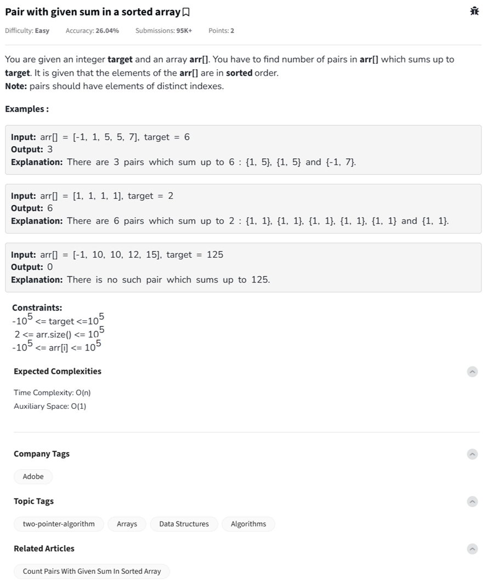

Question



---
Absolutely! Here's a complete summary of the **corrected solutions** for the problem:

> **"Count all unique index pairs in a sorted array such that arr\[i] + arr\[j] = target"**
> (Including handling of duplicate values correctly)

You’ll get it in all three languages:

* ✅ Python
* ✅ C++
* ✅ JavaScript
* With full **inline comments explaining each line**

---

## 🐍 Python – Full Correct Program

```python
def count_pairs_with_sum(arr, target):
    left = 0
    right = len(arr) - 1
    count = 0

    while left < right:
        curr_sum = arr[left] + arr[right]

        if curr_sum == target:
            # Case 1: values are different
            if arr[left] != arr[right]:
                left_count = 1
                right_count = 1

                # Count all duplicates of arr[left]
                while left + 1 < right and arr[left] == arr[left + 1]:
                    left += 1
                    left_count += 1

                # Count all duplicates of arr[right]
                while right - 1 > left and arr[right] == arr[right - 1]:
                    right -= 1
                    right_count += 1

                # Multiply counts: all index pairings
                count += left_count * right_count
                left += 1
                right -= 1

            else:
                # Case 2: same value — count combinations nC2
                n = right - left + 1
                count += (n * (n - 1)) // 2
                break  # all remaining values are same, no more pairs possible

        elif curr_sum < target:
            left += 1  # need larger sum
        else:
            right -= 1  # need smaller sum

    return count

# 🧪 Test
arr = [-1, 1, 5, 5, 7]
target = 6
print("Total pairs:", count_pairs_with_sum(arr, target))  # ✅ Output: 3
```

---

## 🧑‍💻 C++ – Full Correct Program

```cpp
#include <iostream>
#include <vector>
using namespace std;

int countPairsWithSum(vector<int>& arr, int target) {
    int left = 0, right = arr.size() - 1;
    int count = 0;

    while (left < right) {
        int sum = arr[left] + arr[right];

        if (sum == target) {
            // Case 1: values differ
            if (arr[left] != arr[right]) {
                int leftCount = 1, rightCount = 1;

                // Count duplicates on left
                while (left + 1 < right && arr[left] == arr[left + 1]) {
                    left++;
                    leftCount++;
                }

                // Count duplicates on right
                while (right - 1 > left && arr[right] == arr[right - 1]) {
                    right--;
                    rightCount++;
                }

                count += leftCount * rightCount;
                left++;
                right--;
            }
            else {
                // Case 2: same value → nC2
                int n = right - left + 1;
                count += (n * (n - 1)) / 2;
                break;
            }
        }
        else if (sum < target) {
            left++;  // move to larger number
        }
        else {
            right--; // move to smaller number
        }
    }

    return count;
}

int main() {
    vector<int> arr = {-1, 1, 5, 5, 7};
    int target = 6;
    cout << "Total pairs: " << countPairsWithSum(arr, target) << endl;  // ✅ Output: 3
    return 0;
}
```

---

## 🌐 JavaScript – Full Correct Program

```javascript
function countPairsWithSum(arr, target) {
    let left = 0, right = arr.length - 1;
    let count = 0;

    while (left < right) {
        let sum = arr[left] + arr[right];

        if (sum === target) {
            // Case 1: values are different
            if (arr[left] !== arr[right]) {
                let leftCount = 1;
                let rightCount = 1;

                // Count duplicates on left side
                while (left + 1 < right && arr[left + 1] === arr[left]) {
                    left++;
                    leftCount++;
                }

                // Count duplicates on right side
                while (right - 1 > left && arr[right - 1] === arr[right]) {
                    right--;
                    rightCount++;
                }

                // Multiply combinations of indices
                count += leftCount * rightCount;
                left++;
                right--;
            }
            else {
                // Case 2: same value at both ends → nC2
                const n = right - left + 1;
                count += (n * (n - 1)) / 2;
                break;  // no more possible pairs after this
            }
        } else if (sum < target) {
            left++;
        } else {
            right--;
        }
    }

    return count;
}

// 🧪 Test
const arr = [-1, 1, 5, 5, 7];
const target = 6;
console.log("Total pairs:", countPairsWithSum(arr, target));  // ✅ Output: 3
```

---

## ✅ Final Result for All:

Input:

```plaintext
arr = [-1, 1, 5, 5, 7]
target = 6
```

Output:

```plaintext
(-1, 7)
(1, 5)
(1, 5)
Total Pairs = 3
```

---

Great follow-up! Let's break down the **time and space complexity** of the corrected solutions in **all three languages** (Python, C++, JavaScript).
They all use the **two-pointer technique** on a **sorted array** with **duplicate handling**.

---

## ✅ Assumptions:

* `n = len(arr)` (number of elements)
* Array is already sorted. If not, sorting takes **O(n log n)**, which can be added.

---

## 🧠 Time Complexity

### 🔹 Best / Worst / Average: **O(n)**

* Each element is visited **at most once** by `left` or `right`.
* Even if duplicates exist, `while` loops inside the main loop only advance the pointers, so **total steps = O(n)**.

---

## 🧠 Space Complexity

### 🔹 **O(1)**

* No extra space is used other than a few integer variables (`left`, `right`, `count`, etc.).
* The logic works **in-place** on the input array.

---

## 📋 Summary Table

| Language       | Time Complexity | Space Complexity | Notes                                  |
| -------------- | --------------- | ---------------- | -------------------------------------- |
| **Python**     | O(n)            | O(1)             | Two-pointer with duplicate skip        |
| **C++**        | O(n)            | O(1)             | Same logic, in-place                   |
| **JavaScript** | O(n)            | O(1)             | Works efficiently even with duplicates |

> 🔁 If you need to sort first, time becomes **O(n log n)** due to sorting.

---

## ✅ Realistic Complexity Breakdown:

```plaintext
if array is not sorted:
    Time = O(n log n)  for sort
         + O(n)        for two-pointer pass
         = O(n log n)

Space = O(1)
```

---


