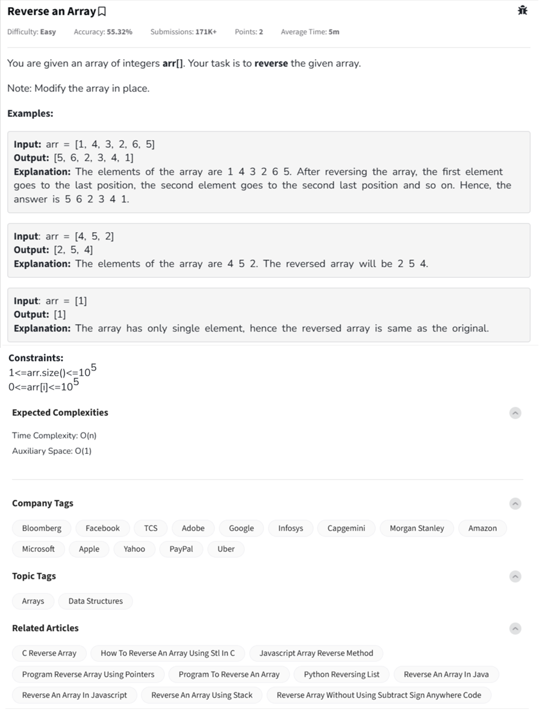

Question



---


You're tackling the classic and foundational problem: **"Reverse an Array"**, with the constraint:

> ✅ You must **modify the array in-place**, using **O(1) space** and **O(n) time**.

Let me now provide the **clean, in-place solutions** in **Python**, **C++**, and **JavaScript** — each with full **inline comments** for clarity.

---

## 🐍 Python – In-Place Reversal

```python
def reverse_array(arr):
    # Initialize two pointers at the start and end
    left = 0
    right = len(arr) - 1

    while left < right:
        # Swap elements at left and right
        arr[left], arr[right] = arr[right], arr[left]
        left += 1  # move left pointer inward
        right -= 1  # move right pointer inward

# 🧪 Test
arr = [1, 4, 3, 2, 6, 5]
reverse_array(arr)
print("Reversed array:", arr)  # ✅ Output: [5, 6, 2, 3, 4, 1]
```

---

## 🧑‍💻 C++ – In-Place Reversal

```cpp
#include <iostream>
#include <vector>
using namespace std;

void reverseArray(vector<int>& arr) {
    int left = 0;
    int right = arr.size() - 1;

    while (left < right) {
        // Swap using std::swap
        swap(arr[left], arr[right]);
        left++;
        right--;
    }
}

int main() {
    vector<int> arr = {1, 4, 3, 2, 6, 5};
    reverseArray(arr);

    cout << "Reversed array: ";
    for (int x : arr) cout << x << " ";
    cout << endl;

    return 0;
}
```

---

## 🌐 JavaScript – In-Place Reversal

```javascript
function reverseArray(arr) {
    let left = 0;
    let right = arr.length - 1;

    while (left < right) {
        // Swap using a temporary variable
        [arr[left], arr[right]] = [arr[right], arr[left]];
        left++;
        right--;
    }
}

// 🧪 Test
let arr = [1, 4, 3, 2, 6, 5];
reverseArray(arr);
console.log("Reversed array:", arr);  // ✅ Output: [5, 6, 2, 3, 4, 1]
```

---

## ✅ Time and Space Complexity

| Metric           | Value |
| ---------------- | ----- |
| Time Complexity  | O(n)  |
| Space Complexity | O(1)  |
| In-place?        | ✅ Yes |

---

Would you like to see this animated step-by-step for better understanding of the two-pointer logic?
