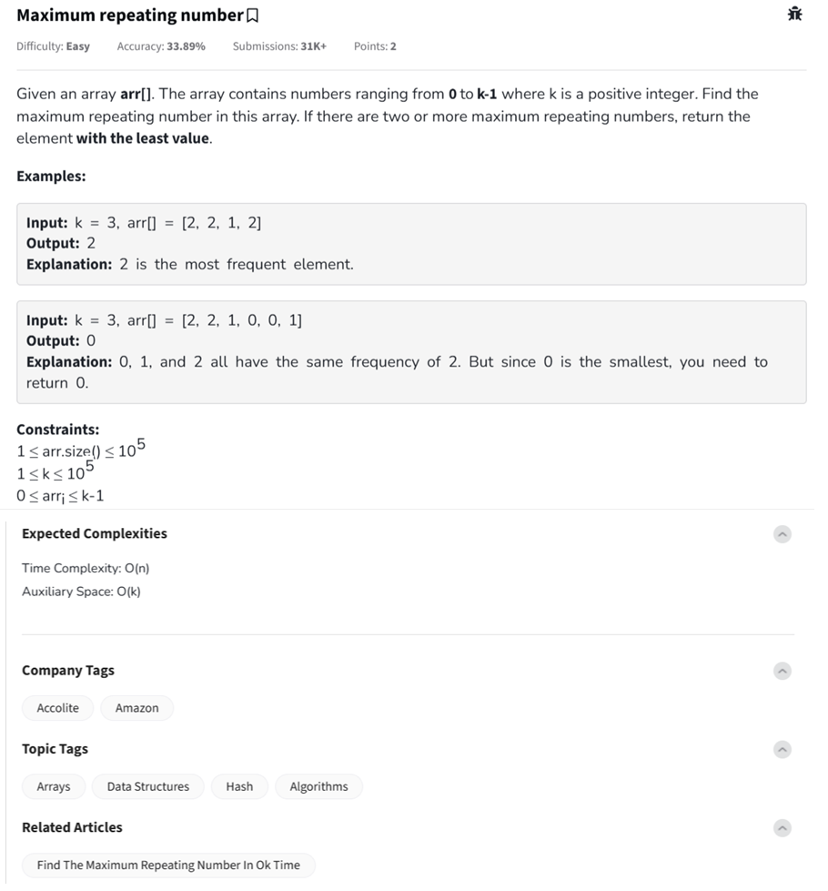

Question



---
### 🧠 Problem Summary: Maximum Repeating Number

You're given:

* An array `arr[]` with integers in the range `[0, k-1]`
* An integer `k` (upper limit of possible values)

---

### 🧾 Task:

Find the **maximum repeating element** in the array.
If there are **multiple elements** with the same highest frequency, return the **smallest** of those.

---

### 🧪 Example 1:

```
k = 3, arr = [2, 2, 1, 2]
Frequency: {2: 3, 1: 1}
Output: 2 ✅
```

---

### 🧪 Example 2:

```
k = 3, arr = [2, 2, 1, 0, 0, 1]
Frequency: {0: 2, 1: 2, 2: 2}
All occur twice → pick the smallest → Output: 0 ✅
```

---

### ✅ Constraints:

* `arr[i]` always lies between `0` and `k-1`
* You are **guaranteed** that no values outside this range exist
* `1 ≤ arr.length ≤ 10^5`
* Time Complexity: **O(n)**
* Space Complexity: **O(k)**

---

### ✅ Plan:

1. Initialize a `freq[]` array of size `k` with zeros.
2. Traverse `arr[]`, and for each `val`, increment `freq[val]`.
3. Track:

   * `maxFreq` (max value seen)
   * `minNum` (minimum number with that frequency)
4. Return `minNum`.

---

Here's the **full implementation** in **Python**, **C++**, and **JavaScript**, including **inline comments** explaining the logic.

---

### ✅ Python

```python
class Solution:
    def maxRepeating(self, arr, n, k):
        freq = [0] * k  # Frequency array for elements 0 to k-1

        # Count frequency of each number in arr
        for val in arr:
            freq[val] += 1

        max_freq = -1
        result = -1

        for i in range(k):
            if freq[i] > max_freq:
                max_freq = freq[i]
                result = i
            elif freq[i] == max_freq and i < result:
                result = i  # Choose smaller number in case of tie

        return result
```

---

### ✅ C++

```cpp
class Solution {
public:
    int maxRepeating(vector<int>& arr, int n, int k) {
        vector<int> freq(k, 0); // Frequency array for elements 0 to k-1

        // Count frequency of each number in arr
        for (int val : arr) {
            freq[val]++;
        }

        int max_freq = -1;
        int result = -1;

        for (int i = 0; i < k; i++) {
            if (freq[i] > max_freq) {
                max_freq = freq[i];
                result = i;
            } else if (freq[i] == max_freq && i < result) {
                result = i; // Choose smaller number in case of tie
            }
        }

        return result;
    }
};
```

---

### ✅ JavaScript

```javascript
class Solution {
    maxRepeating(arr, n, k) {
        let freq = new Array(k).fill(0); // Frequency array

        // Count frequency of each number
        for (let val of arr) {
            freq[val]++;
        }

        let maxFreq = -1;
        let result = -1;

        for (let i = 0; i < k; i++) {
            if (freq[i] > maxFreq) {
                maxFreq = freq[i];
                result = i;
            } else if (freq[i] === maxFreq && i < result) {
                result = i; // Pick smaller number in tie
            }
        }

        return result;
    }
}
```

---

Let me know if you want a **dry-run example** 

Let’s **dry-run** the example from the prompt:

---

### **Input:**

```
k = 3  
arr = [2, 2, 1, 2]
```

---

### **Goal:**

Find the number (from `0` to `k-1`) that occurs **most frequently** in the array.
If there's a tie in frequency, return the **smallest** such number.

---

### **Step-by-Step Dry Run:**

We'll use a frequency array `count` of size `k = 3`, initialized as:

```
count = [0, 0, 0]  # for numbers 0, 1, 2
```

#### Process each element in `arr`:

* `arr[0] = 2` → `count[2]++` → `count = [0, 0, 1]`
* `arr[1] = 2` → `count[2]++` → `count = [0, 0, 2]`
* `arr[2] = 1` → `count[1]++` → `count = [0, 1, 2]`
* `arr[3] = 2` → `count[2]++` → `count = [0, 1, 3]`

---

### **Final Frequency Table:**

```
0 → 0 times  
1 → 1 time  
2 → 3 times
```

---

### **Result:**

* Max frequency is **3**
* Only number with frequency 3 is **2**
  ✅ Return **2**

---

Let me know if you'd like the same dry run for a tie case like:

```
arr = [2, 1, 0, 0, 1], k = 3
```

