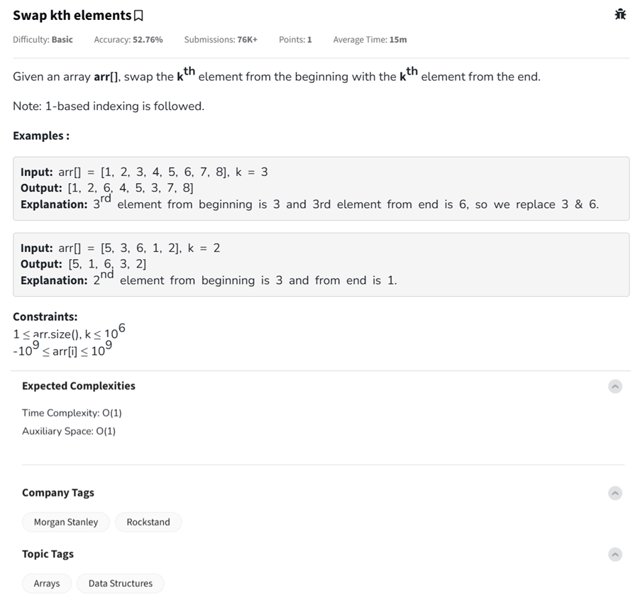

Question



---

### ✅ Python

```python
def swapKth(arr, k):
    n = len(arr)
    # Swap the kth element from the beginning and the kth element from the end
    arr[k - 1], arr[n - k] = arr[n - k], arr[k - 1]

# Example usage
arr = [1, 2, 3, 4, 5, 6, 7, 8]
k = 3
swapKth(arr, k)
print(arr)  # Output: [1, 2, 6, 4, 5, 3, 7, 8]
```

---

### ✅ C++

```cpp
#include <iostream>
#include <vector>
using namespace std;

void swapKth(vector<int>& arr, int k) {
    int n = arr.size();
    // Swap the kth element from start (index k-1) and kth from end (index n-k)
    swap(arr[k - 1], arr[n - k]);
}

int main() {
    vector<int> arr = {1, 2, 3, 4, 5, 6, 7, 8};
    int k = 3;
    swapKth(arr, k);

    for (int val : arr)
        cout << val << " ";  // Output: 1 2 6 4 5 3 7 8
    return 0;
}
```

---

### ✅ JavaScript

```javascript
class Solution {
    swapKth(arr, k) {
        const n = arr.length;
        // Swap k-th element from beginning and end (0-based indexing)
        let temp = arr[k - 1];
        arr[k - 1] = arr[n - k];
        arr[n - k] = temp;
    }
}

// Example usage
const arr = [1, 2, 3, 4, 5, 6, 7, 8];
const k = 3;
const sol = new Solution();
sol.swapKth(arr, k);
console.log(arr);  // Output: [1, 2, 6, 4, 5, 3, 7, 8]
```

Let me know if you want input/output handling for multiple test cases or constraints validation added too.
