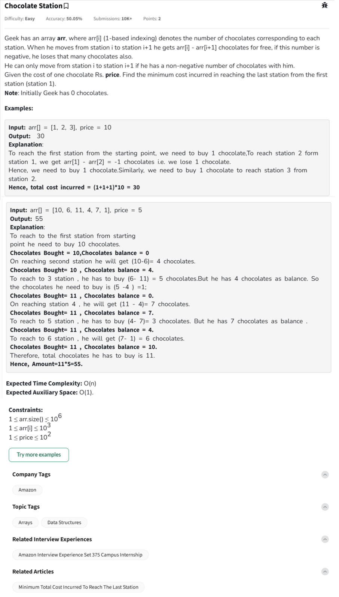

Question



---

### ✅ **Python Code**

```python
class Solution:
    def findCost(self, arr, price):
        total_cost = 0
        balance = 0  # Initial chocolates with Geek

        # Start from station 0 to n-2, and consider movement to i+1
        for i in range(len(arr) - 1):
            diff = arr[i] - arr[i + 1]  # Net chocolates needed or gained

            if diff < 0:
                need = abs(diff)  # Chocolates needed
                if balance >= need:
                    balance -= need
                else:
                    total_cost += (need - balance)  # Buy the difference
                    balance = 0
            else:
                balance += diff  # Gain chocolates

        return total_cost * price
```

---

### ✅ **C++ Code**

```cpp
#include <iostream>
#include <vector>
using namespace std;

class Solution {
public:
    int findCost(vector<int>& arr, int price) {
        int total_cost = 0;
        int balance = 0; // Chocolates Geek has

        for (int i = 0; i < arr.size() - 1; ++i) {
            int diff = arr[i] - arr[i + 1];

            if (diff < 0) {
                int need = -diff;
                if (balance >= need) {
                    balance -= need;
                } else {
                    total_cost += (need - balance);
                    balance = 0;
                }
            } else {
                balance += diff;
            }
        }

        return total_cost * price;
    }
};

int main() {
    vector<int> arr = {10, 6, 11, 4, 7, 1};
    int price = 5;
    Solution sol;
    cout << sol.findCost(arr, price) << endl; // Output: 55
    return 0;
}
```

---

### ✅ **JavaScript Code**

```javascript
class Solution {
    findCost(arr, price) {
        let totalCost = 0;
        let balance = 0;

        for (let i = 0; i < arr.length - 1; i++) {
            let diff = arr[i] - arr[i + 1];

            if (diff < 0) {
                let need = -diff;
                if (balance >= need) {
                    balance -= need;
                } else {
                    totalCost += (need - balance);
                    balance = 0;
                }
            } else {
                balance += diff;
            }
        }

        return totalCost * price;
    }
}

// Example usage:
const arr = [10, 6, 11, 4, 7, 1];
const price = 5;
const sol = new Solution();
console.log(sol.findCost(arr, price)); // Output: 55
```

---

Would you like a dry-run for a sample input as well?

Thanks for pointing that out — and yes, there's a **small oversight** in the code.

### ❌ Issue:

The code **does not account for the initial chocolates needed to reach the first station itself**. Geek starts at station 1 with **0 chocolates**, and if `arr[0]` > 0, he **must buy those chocolates first**.

---

### ✅ Fix:

Add the cost of `arr[0]` at the beginning, because Geek needs to have that many chocolates at the start.

---

### ✅ Corrected Python Code:

```python
class Solution:
    def getChocolateCost(self, arr, price):
        total_cost = arr[0]  # Chocolates to reach station 1 initially
        balance = 0  # Geek starts with 0 chocolates

        # Traverse from station 1 to end
        for i in range(len(arr) - 1):
            diff = arr[i] - arr[i + 1]

            if diff < 0:
                need = -diff
                if balance >= need:
                    balance -= need
                else:
                    total_cost += (need - balance)
                    balance = 0
            else:
                balance += diff

        return total_cost * price
```

### ✅ Dry Run on Your Test Case:

* **Input:** `arr = [1, 2, 3], price = 10`
* Step 1: Buy 1 chocolate to reach station 1 → total\_cost = 1
* Step 2: `1 - 2 = -1` → need 1 more → total\_cost = 2
* Step 3: `2 - 3 = -1` → need 1 more → total\_cost = 3
* Total chocolates bought = 3 ⇒ Cost = 3 × 10 = 30 ✅
