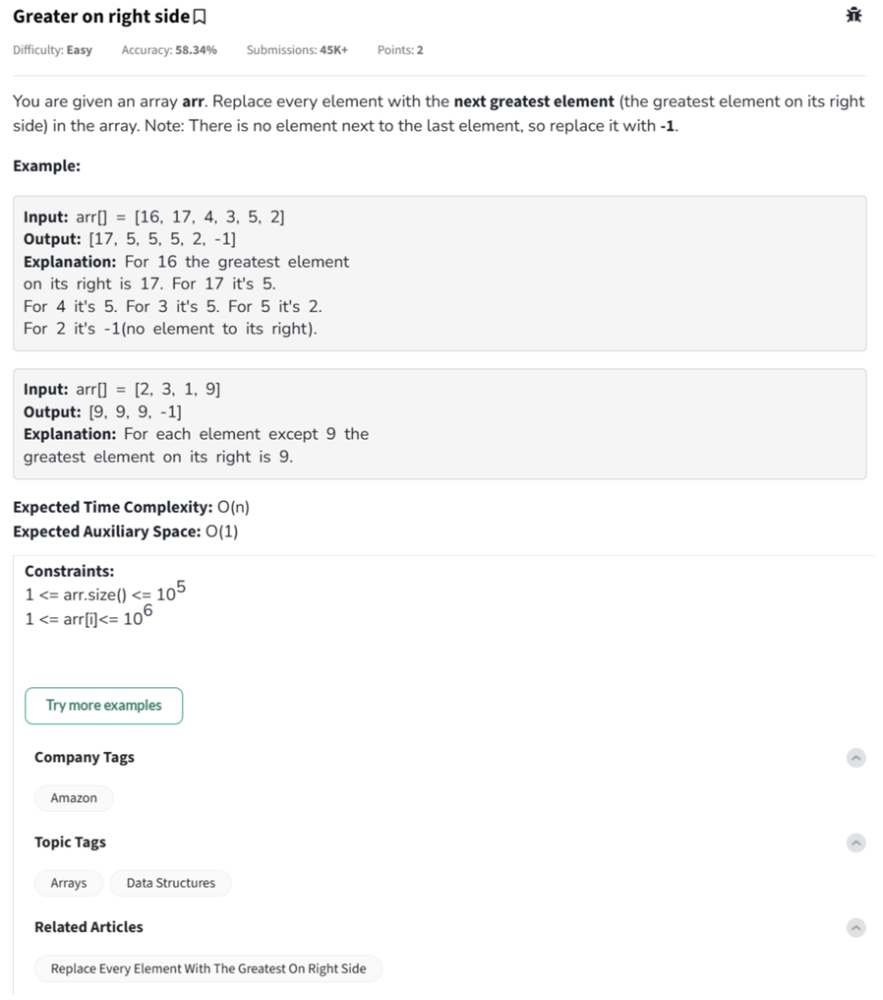

Question

---

This problem asks you to **replace every element in an array with the greatest element to its right**. The last element has no element to its right, so it should be replaced with `-1`.

---

### ✅ Example Breakdown

**Input:**
`arr = [16, 17, 4, 3, 5, 2]`
**Output:**
`[17, 5, 5, 5, 2, -1]`

**Step-by-step explanation:**

* For 16 → max to the right is 17 → replace with 17
* For 17 → max to the right is 5 → replace with 5
* For 4 → max to the right is 5 → replace with 5
* For 3 → max to the right is 5 → replace with 5
* For 5 → max to the right is 2 → replace with 2
* For 2 → nothing on right → replace with -1

---

### 💡 Efficient Logic

Traverse the array from **right to left**, keeping track of the `max_so_far`:

1. Initialize `max_so_far = -1`
2. For each element from right to left:

   * Temporarily store current value
   * Replace current element with `max_so_far`
   * Update `max_so_far` if current value is greater

---

Would you like this implemented in Python, C++, and JavaScript with full inline comments?
