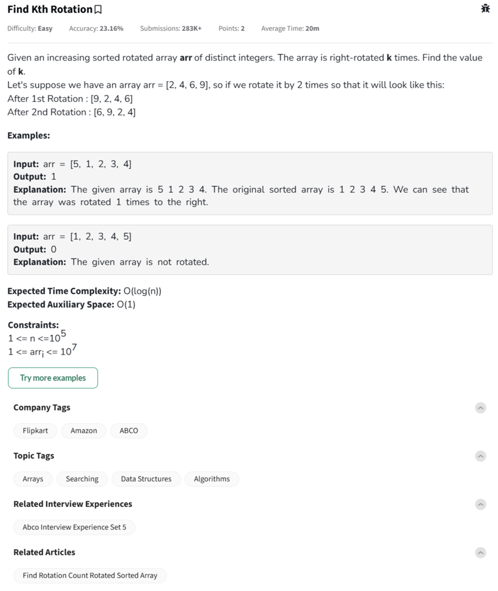

Question



---

This question asks you to find the number of times a **sorted array has been right-rotated**, based on its current arrangement. This number is also the **index of the smallest element** in the rotated array.

---

### 🔍 Explanation:

The original array is strictly increasing (e.g., `[1, 2, 3, 4, 5]`). When it is **rotated right `k` times**, the smallest element will "shift" to position `k`.

So the task becomes:

> **Find the index of the minimum element** in the rotated array.
> That index is equal to the **rotation count `k`**.

---

### ✅ Binary Search Logic:

You can use a **binary search** to find the index of the **minimum element** in `O(log n)` time:

1. If `arr[mid] <= arr[high]`, then the **minimum lies in the left half (including mid)**.
2. Else, the **minimum lies in the right half (excluding mid)**.

---

### 🧠 Example Dry Run:

For input: `arr = [5, 1, 2, 3, 4]`

* This was originally `[1, 2, 3, 4, 5]`
* After 1 rotation → `[5, 1, 2, 3, 4]`
* The smallest element (`1`) is at index `1` → so **output = 1**

---

Great! Below are the **full programs** with **inline comments** for **Python**, **C++**, and **JavaScript** to solve the **Find Kth Rotation** problem using binary search.

---

### ✅ Python Program

```python
class Solution:
    def findKRotation(self, arr):
        low, high = 0, len(arr) - 1

        while low <= high:
            # If the subarray is already sorted, return the smallest index
            if arr[low] <= arr[high]:
                return low

            mid = (low + high) // 2
            next_idx = (mid + 1) % len(arr)
            prev_idx = (mid - 1 + len(arr)) % len(arr)

            # Check if mid is the smallest element
            if arr[mid] <= arr[next_idx] and arr[mid] <= arr[prev_idx]:
                return mid
            elif arr[mid] <= arr[high]:
                high = mid - 1  # Minimum is in the left half
            else:
                low = mid + 1   # Minimum is in the right half

        return 0  # Default return if not found

# Driver code
if __name__ == "__main__":
    arr = [5, 1, 2, 3, 4]
    ob = Solution()
    print(ob.findKRotation(arr))  # Output: 1
```

---

### ✅ C++ Program

```cpp
#include <iostream>
#include <vector>
using namespace std;

class Solution {
public:
    int findKRotation(vector<int>& arr) {
        int low = 0, high = arr.size() - 1;

        while (low <= high) {
            // If subarray is already sorted
            if (arr[low] <= arr[high]) return low;

            int mid = (low + high) / 2;
            int next = (mid + 1) % arr.size();
            int prev = (mid - 1 + arr.size()) % arr.size();

            // Check if mid is smallest
            if (arr[mid] <= arr[next] && arr[mid] <= arr[prev])
                return mid;
            else if (arr[mid] <= arr[high])
                high = mid - 1;
            else
                low = mid + 1;
        }
        return 0;
    }
};

int main() {
    vector<int> arr = {5, 1, 2, 3, 4};
    Solution obj;
    cout << obj.findKRotation(arr) << endl;  // Output: 1
    return 0;
}
```

---

### ✅ JavaScript Program

```javascript
class Solution {
    findKRotation(arr) {
        let low = 0, high = arr.length - 1;

        while (low <= high) {
            // Already sorted subarray
            if (arr[low] <= arr[high]) return low;

            let mid = Math.floor((low + high) / 2);
            let next = (mid + 1) % arr.length;
            let prev = (mid - 1 + arr.length) % arr.length;

            if (arr[mid] <= arr[next] && arr[mid] <= arr[prev])
                return mid;
            else if (arr[mid] <= arr[high])
                high = mid - 1;
            else
                low = mid + 1;
        }
        return 0;
    }
}

// Driver code
let arr = [5, 1, 2, 3, 4];
let obj = new Solution();
console.log(obj.findKRotation(arr)); // Output: 1
```

---

Let's do a **dry run** of the **Find Kth Rotation** algorithm using **binary search** with the array:

### 🔹 Input:

`arr = [5, 1, 2, 3, 4]`
We expect output `1` because the array was originally sorted `[1, 2, 3, 4, 5]` and right rotated once.

---

### 🔹 Goal:

Find the index of the **minimum element**, which tells us the **rotation count**.

---

### 🔹 Step-by-Step Dry Run:

Initialize:

* `low = 0`, `high = 4`
  Array size `n = 5`

#### 🔁 Iteration 1:

* `mid = (0 + 4) // 2 = 2` → `arr[mid] = 2`
* `next = (2 + 1) % 5 = 3` → `arr[next] = 3`
* `prev = (2 - 1 + 5) % 5 = 1` → `arr[prev] = 1`

Check:

* Is `arr[mid] <= arr[next] && arr[mid] <= arr[prev]`?
  → `2 <= 3 ✅` and `2 <= 1 ❌` → ❌ Not the minimum.

Now decide which half to search:

* Is `arr[mid] <= arr[high]`?
  → `2 <= 4 ✅` → So minimum must be in the **left half**.

Update: `high = mid - 1 = 1`

---

#### 🔁 Iteration 2:

* `low = 0`, `high = 1`
* `mid = (0 + 1) // 2 = 0` → `arr[mid] = 5`
* `next = (0 + 1) % 5 = 1` → `arr[next] = 1`
* `prev = (0 - 1 + 5) % 5 = 4` → `arr[prev] = 4`

Check:

* `5 <= 1 ❌` and `5 <= 4 ❌` → ❌ Not minimum.

Check: `arr[mid] <= arr[high]` → `5 <= 1 ❌` → So minimum is in the **right half**.

Update: `low = mid + 1 = 1`

---

#### 🔁 Iteration 3:

* `low = 1`, `high = 1`
* `mid = 1` → `arr[mid] = 1`
* `next = 2` → `arr[next] = 2`
* `prev = 0` → `arr[prev] = 5`

Check:

* `1 <= 2 ✅` and `1 <= 5 ✅` → ✅ This is the **minimum** element

✅ **Answer = 1**, which is the rotation count.

---

### ✅ Final Result:

**Rotation count is 1**.


