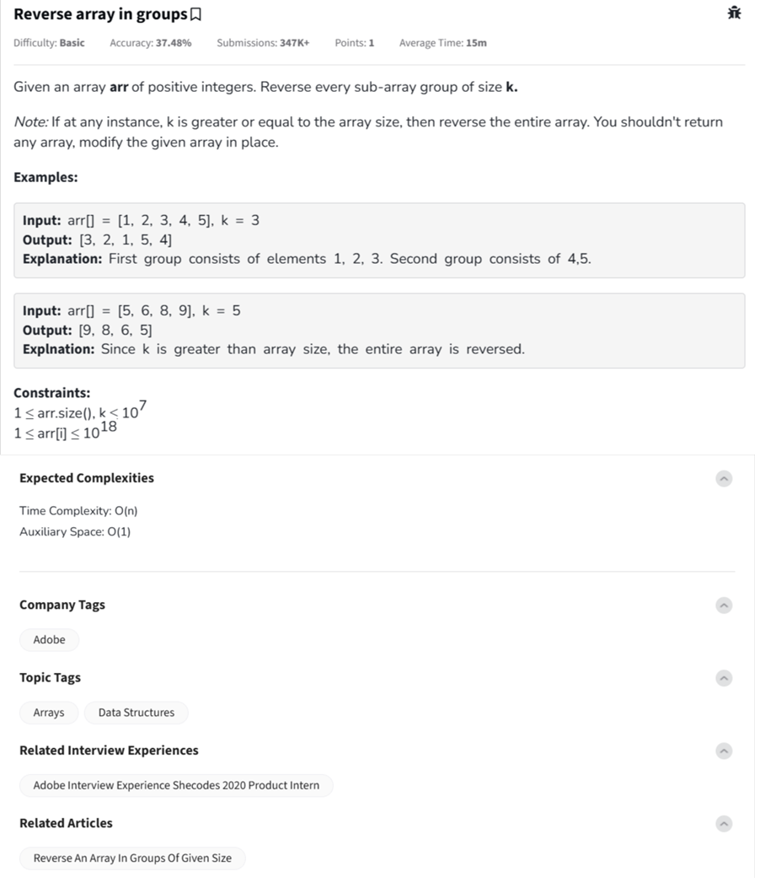
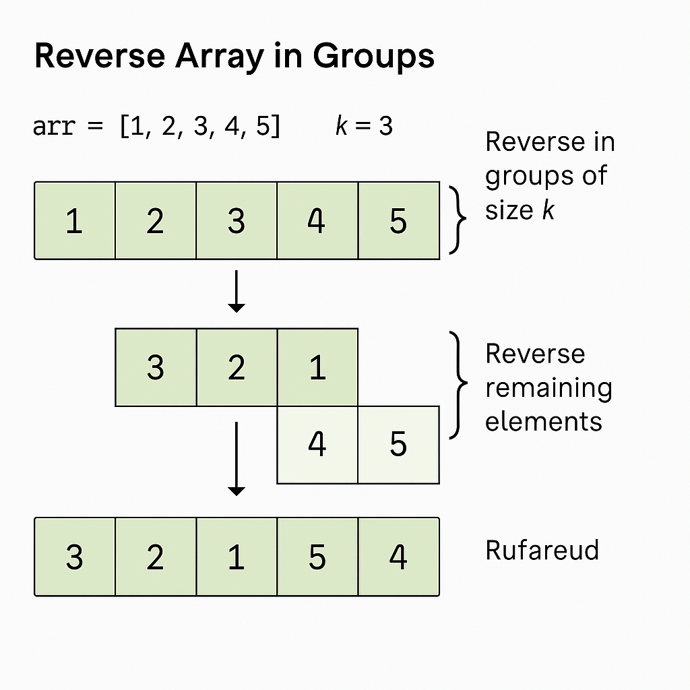

Question



---
Yes! Let's break it down **very visually and clearly**:

---

### Imagine this array:
```
arr = [1, 2, 3, 4, 5]
k = 3
```

- **Group 1:** First `k=3` elements → `[1, 2, 3]`
- **Group 2:** Next elements → `[4, 5]` (less than `k`, but still reverse)

Now:

1. **Reverse** `[1, 2, 3]` → `[3, 2, 1]`
2. **Reverse** `[4, 5]` → `[5, 4]`

---

### Final Result:
```
[3, 2, 1, 5, 4]
```

---

### 🛠 Simple Steps:

- Start at `i = 0`
- Reverse elements from `i` to `i+k-1`
- Move to `i = i + k`
- Repeat until end of array.

**If last group has <k elements**, reverse whatever is left!

---

### 💥 Special Case:
If `k` is **greater than or equal to array size**, just **reverse the whole array** once!

Example:
```
arr = [5, 6, 8, 9], k = 5
```
Since `k=5 > 4 (array size)`, just reverse whole array:
```
[9, 8, 6, 5]
```

---

Got it — this is the **Reverse Array in Groups** problem!

---

### 🧠 Problem Summary:
Given an array `arr[]` and an integer `k`:
- Reverse every subarray group of size `k`.
- If `k` is greater than or equal to the array size, **reverse the whole array**.
- Perform the reversal **in-place** (no extra arrays).

---

### ✅ Python Code:
```python
def reverseInGroups(arr, k):
    n = len(arr)
    for i in range(0, n, k):
        left = i
        right = min(i + k - 1, n - 1)

        while left < right:
            arr[left], arr[right] = arr[right], arr[left]
            left += 1
            right -= 1

    return arr
```

---

### 🧪 Example Usage:
```python
print(reverseInGroups([1, 2, 3, 4, 5], 3))  # Output: [3, 2, 1, 5, 4]
print(reverseInGroups([5, 6, 8, 9], 5))     # Output: [9, 8, 6, 5]
```

---

### ⏱ Time & Space Complexity:
- **Time Complexity:** `O(n)` — Single pass, reversing segments.
- **Space Complexity:** `O(1)` — In-place.

---

Of course! Here’s the **C++** and **JavaScript** code for the **Reverse Array in Groups** problem:

---

### ✅ C++ Code:
```cpp
#include <vector>
#include <algorithm>
using namespace std;

void reverseInGroups(vector<int>& arr, int k) {
    int n = arr.size();
    for (int i = 0; i < n; i += k) {
        int left = i;
        int right = min(i + k - 1, n - 1);
        
        while (left < right) {
            swap(arr[left], arr[right]);
            left++;
            right--;
        }
    }
}
```

### 🧪 Example Usage in C++:
```cpp
#include <iostream>

int main() {
    vector<int> arr = {1, 2, 3, 4, 5};
    int k = 3;
    
    reverseInGroups(arr, k);
    
    for (int num : arr) {
        cout << num << " ";
    }
    // Output: 3 2 1 5 4

    return 0;
}
```

---

### ✅ JavaScript Code:
```javascript
function reverseInGroups(arr, k) {
    const n = arr.length;
    for (let i = 0; i < n; i += k) {
        let left = i;
        let right = Math.min(i + k - 1, n - 1);

        while (left < right) {
            [arr[left], arr[right]] = [arr[right], arr[left]];
            left++;
            right--;
        }
    }
    return arr;
}
```

### 🧪 Example Usage in JavaScript:
```javascript
console.log(reverseInGroups([1, 2, 3, 4, 5], 3));
// Output: [3, 2, 1, 5, 4]
```

---

### ⏱ Time & Space Complexity (for both versions):
- **Time Complexity:** `O(n)`
- **Space Complexity:** `O(1)` (in-place)

