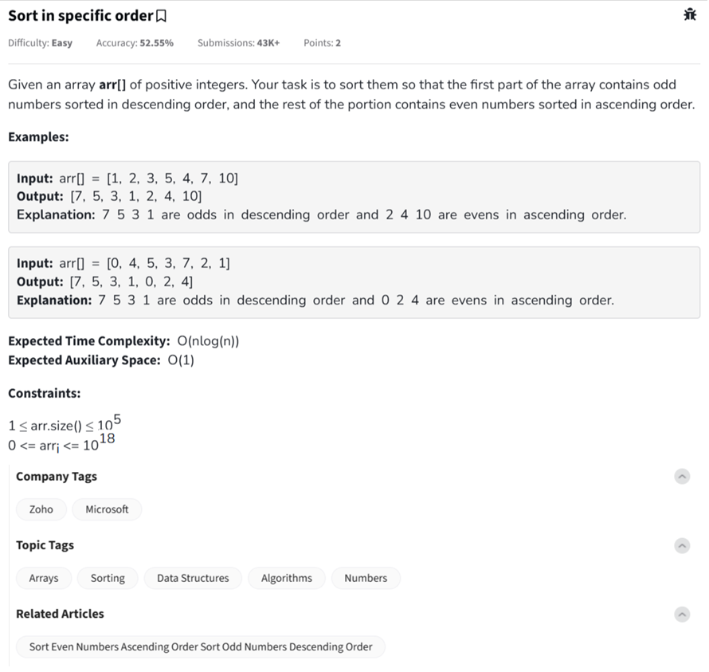

Question

---

This question asks you to **sort an array of positive integers** in a *specific order*:

---

### ✅ **Goal:**

Split the array into two groups:

* **Odd numbers** → sorted in **descending order**
* **Even numbers** → sorted in **ascending order**

Finally, **concatenate** the sorted odd numbers (first) with the sorted even numbers (second).

---

### 📘 **Example 1:**

**Input:**
`arr[] = [1, 2, 3, 5, 4, 7, 10]`

**Step-by-step:**

* Odd numbers: `[1, 3, 5, 7]` → sorted **descending** → `[7, 5, 3, 1]`
* Even numbers: `[2, 4, 10]` → sorted **ascending** → `[2, 4, 10]`

**Output:**
`[7, 5, 3, 1, 2, 4, 10]`

---

### 📘 **Example 2:**

**Input:**
`arr[] = [0, 4, 5, 3, 7, 2, 1]`

**Step-by-step:**

* Odd: `[5, 3, 7, 1]` → `[7, 5, 3, 1]`
* Even: `[0, 4, 2]` → `[0, 2, 4]`

**Output:**
`[7, 5, 3, 1, 0, 2, 4]`

---

### 💡 Summary:

* Split the array into odd and even numbers.
* Sort odd numbers in descending order.
* Sort even numbers in ascending order.
* Combine the two lists.

Would you like the implementation of this logic in Python, C++, and JavaScript with inline comments?
