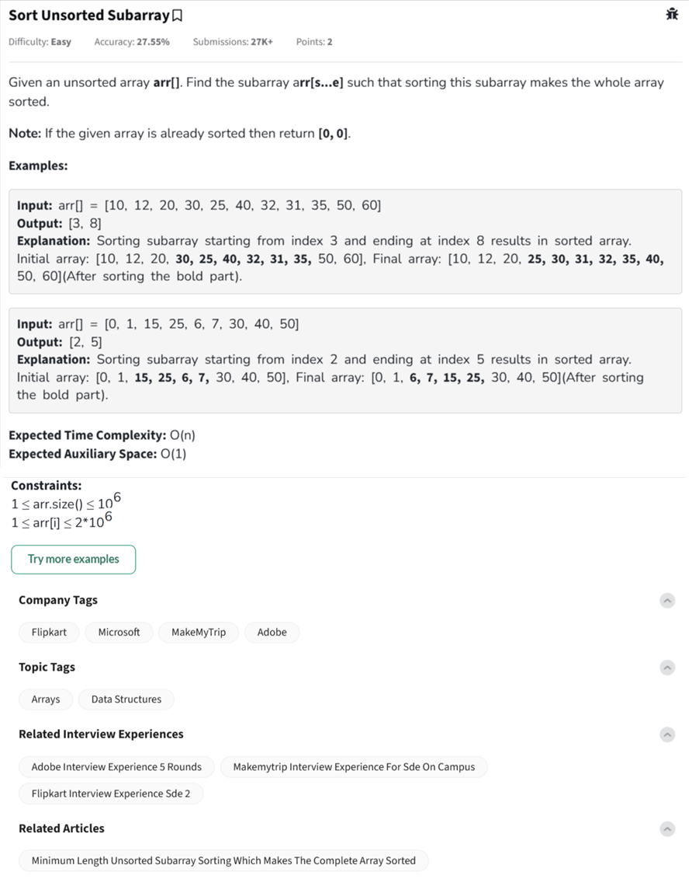

Question



---

Below are the **full implementations** of the "Sort Unsorted Subarray" problem in **Python**, **C++**, and **JavaScript**, each with **inline comments explaining the logic**.

---

### ✅ Python Implementation

```python
class Solution:
    def findUnsortedSubarray(self, arr):
        n = len(arr)
        start, end = -1, -1

        # Step 1: Find the first index from the left where order breaks
        for i in range(n - 1):
            if arr[i] > arr[i + 1]:
                start = i
                break

        if start == -1:
            return [0, 0]  # Already sorted

        # Step 2: Find the first index from the right where order breaks
        for i in range(n - 1, 0, -1):
            if arr[i] < arr[i - 1]:
                end = i
                break

        # Step 3: Find min and max in the unsorted subarray
        sub_min = min(arr[start:end + 1])
        sub_max = max(arr[start:end + 1])

        # Step 4: Expand start and end if needed
        for i in range(start):
            if arr[i] > sub_min:
                start = i
                break

        for i in range(n - 1, end, -1):
            if arr[i] < sub_max:
                end = i
                break

        return [start, end]


# Driver code
if __name__ == "__main__":
    arr = list(map(int, input().split()))
    sol = Solution()
    print(sol.findUnsortedSubarray(arr))
```

---

### ✅ C++ Implementation

```cpp
#include <iostream>
#include <vector>
#include <algorithm>
using namespace std;

class Solution {
public:
    pair<int, int> findUnsortedSubarray(vector<int>& arr) {
        int n = arr.size();
        int start = -1, end = -1;

        // Step 1: From left, find first violation of sorted order
        for (int i = 0; i < n - 1; i++) {
            if (arr[i] > arr[i + 1]) {
                start = i;
                break;
            }
        }

        if (start == -1) return {0, 0};  // Already sorted

        // Step 2: From right, find first violation
        for (int i = n - 1; i > 0; i--) {
            if (arr[i] < arr[i - 1]) {
                end = i;
                break;
            }
        }

        // Step 3: Find min and max in unsorted part
        int sub_min = *min_element(arr.begin() + start, arr.begin() + end + 1);
        int sub_max = *max_element(arr.begin() + start, arr.begin() + end + 1);

        // Step 4: Expand bounds if needed
        for (int i = 0; i < start; i++) {
            if (arr[i] > sub_min) {
                start = i;
                break;
            }
        }

        for (int i = n - 1; i > end; i--) {
            if (arr[i] < sub_max) {
                end = i;
                break;
            }
        }

        return {start, end};
    }
};

int main() {
    int x;
    vector<int> arr;
    while (cin >> x) arr.push_back(x);

    Solution sol;
    auto res = sol.findUnsortedSubarray(arr);
    cout << res.first << " " << res.second << endl;
    return 0;
}
```

---

### ✅ JavaScript Implementation

```javascript
class Solution {
    findUnsortedSubarray(arr) {
        let n = arr.length;
        let start = -1, end = -1;

        // Step 1: From left, find where order breaks
        for (let i = 0; i < n - 1; i++) {
            if (arr[i] > arr[i + 1]) {
                start = i;
                break;
            }
        }

        if (start === -1) return [0, 0]; // Already sorted

        // Step 2: From right, find where order breaks
        for (let i = n - 1; i > 0; i--) {
            if (arr[i] < arr[i - 1]) {
                end = i;
                break;
            }
        }

        // Step 3: Find min and max in the subarray
        let sub_min = Math.min(...arr.slice(start, end + 1));
        let sub_max = Math.max(...arr.slice(start, end + 1));

        // Step 4: Expand to left if needed
        for (let i = 0; i < start; i++) {
            if (arr[i] > sub_min) {
                start = i;
                break;
            }
        }

        // Step 5: Expand to right if needed
        for (let i = n - 1; i > end; i--) {
            if (arr[i] < sub_max) {
                end = i;
                break;
            }
        }

        return [start, end];
    }
}

// Driver code
const input = [10, 12, 20, 30, 25, 40, 32, 31, 35, 50, 60];
const sol = new Solution();
console.log(sol.findUnsortedSubarray(input));  // Output: [3, 8]
```

---


