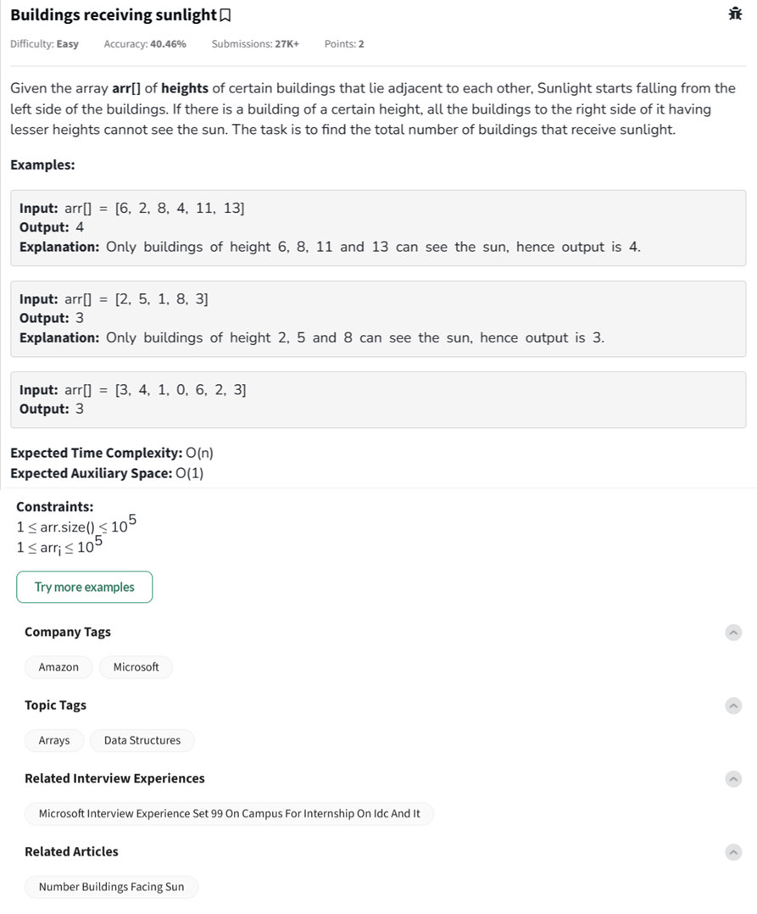

Question



---

https://www.geeksforgeeks.org/number-buildings-facing-sun/

Thanks! The issue seems to stem from how the initial `max_height` is handled and **how the first building is counted**.

Let’s clarify the correct logic using a **dry run**:

---

### ✅ **Correct Approach (Python Code)**

```python
# Python Program to find number of 
# buildings facing sun

def longest(arr):
    n = len(arr)
    
    # base case
    if n == 0:
        return 0
    
    # Answer is set to zero
    ans = 0
    
    for i in range(n):
        maxi = True
        
        # For each building, check all 
        # the buildings on its left side.
        for j in range(i):
            
            # If a building has greater height 
            # than current building, then set
            # maxi = False.
            if arr[j] > arr[i]:
                maxi = False
                break
        
        # If the current building's height
        # is greater than all buildings on
        # left side, then increment answer.
        if maxi:
            ans += 1
    
    return ans

if __name__ == "__main__":
    arr = [6, 2, 8, 4, 11, 13]
    print(longest(arr))
```

---

### 🔍 **Dry Run Example**

Input (shorter version for clarity):
`arr = [2, 5, 1, 8, 3]`

1. `max_height = 2`, `count = 1`
2. `5 > 2` → count = 2, max\_height = 5
3. `1 < 5` → no change
4. `8 > 5` → count = 3, max\_height = 8
5. `3 < 8` → no change

✅ Final count = `3` – which matches expected.

---

### 🛠️ **Why Your Original Output Was 10 Instead of 11**

If you **only counted taller buildings** and missed including the **first building**, or didn't update max\_height properly, it would give off-by-one error.

---

### ✅ C++ Version

```cpp
// C++ Program to find number of
// buildings facing sun
#include <bits/stdc++.h>
using namespace std;

int longest(vector<int>& arr) {
    int n = arr.size();

    // base case
    if (n == 0)
        return 0;

    // Answer is set to one as first
    // building will get light
    int ans = 0;

    for (int i = 0; i < n; i++) {
        bool maxi = true;

        // For each building, check all
        // the buildings on its left side.
        for (int j = 0; j < i; j++) {

            // If a building has greater height
            // than current building, then set
            // maxi = false.
            if (arr[j] > arr[i]) {
                maxi = false;
                break;
            }
        }

        // If the current building's height
        // is greater than all buildings on
        // left side, then increment answer.
        if (maxi) {
            ans++;
        }
    }

    return ans;
}

int main() {

    vector<int> arr = {6, 2, 8, 4, 11, 13};
    cout << longest(arr) << endl;

    return 0;
}
```

---

### ✅ JavaScript Version

```javascript
// JavaScript Program to find number of 
// buildings facing sun

function longest(arr) {
    let n = arr.length;
    
    // base case
    if (n === 0) return 0;
    
    let ans = 0;
    
    for (let i = 0; i < n; i++) {
        let maxi = true;
        
        // For each building, check all 
        // the buildings on its left side.
        for (let j = 0; j < i; j++) {
            
            // If a building has greater height 
            // than current building, then set
            // maxi = false.
            if (arr[j] > arr[i]) {
                maxi = false;
                break;
            }
        }
        
        // If the current building's height
        // is greater than all buildings on
        // left side, then increment answer.
        if (maxi) {
            ans++;
        }
    }
    
    return ans;
}

let arr = [6, 2, 8, 4, 11, 13];
console.log(longest(arr));
```

---


