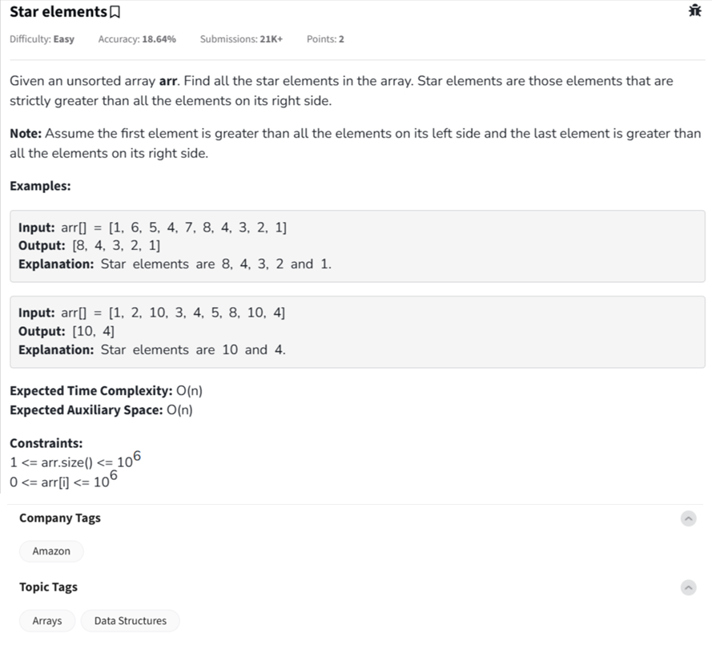

Question



---
### ⭐ Problem: **Star Elements** (from GeeksforGeeks)

**Definition:**
A *star element* in an array is an element that is **strictly greater** than all the elements to its **right**.

**Objective:**
Find all star elements in the array and print them in **left-to-right** order of appearance.

---

### ✅ Dry Run Example:

**Input:**
`arr = [1, 6, 5, 4, 7, 8, 4, 3, 2, 1]`

**Step-by-step walkthrough (right to left):**

* Start from last element:

  * `1` is always a star (no elements to its right). → `res = [1]`
* `2` > 1 → star → `res = [1, 2]`
* `3` > 2 → star → `res = [1, 2, 3]`
* `4` > 3 → star → `res = [1, 2, 3, 4]`
* `8` > 4 → star → `res = [1, 2, 3, 4, 8]`
* `7` < 8 → not a star
* and so on...

**Final result (reversed):**
`[8, 4, 3, 2, 1]`

---

### ✅ Time and Space Complexity:

* Time: `O(n)` — we traverse the array once
* Space: `O(n)` — to store result

---

### 🔧 Python Code (with inline comments)

```python
class Solution:
    def starElements(self, arr):
        result = []
        max_right = float('-inf')  # To track max on the right

        # Traverse array from right to left
        for i in reversed(range(len(arr))):
            if arr[i] > max_right:
                result.append(arr[i])  # It's a star element
                max_right = arr[i]  # Update max from the right
        
        result.reverse()  # To maintain left-to-right order
        return result


# Driver Code
t = int(input())
for _ in range(t):
    arr = list(map(int, input().split()))
    sol = Solution()
    res = sol.starElements(arr)
    print(" ".join(map(str, res)))
    print("~")
```

---

### 🔧 C++ Code (with inline comments)

```cpp
#include <iostream>
#include <vector>
using namespace std;

class Solution {
public:
    vector<int> starElements(vector<int>& arr) {
        vector<int> result;
        int max_right = INT_MIN;

        // Traverse from right to left
        for (int i = arr.size() - 1; i >= 0; --i) {
            if (arr[i] > max_right) {
                result.push_back(arr[i]);  // It's a star
                max_right = arr[i];
            }
        }

        // Reverse to maintain original order
        reverse(result.begin(), result.end());
        return result;
    }
};

int main() {
    int t;
    cin >> t;
    cin.ignore();

    while (t--) {
        vector<int> arr;
        string line;
        getline(cin, line);
        stringstream ss(line);
        int num;

        while (ss >> num)
            arr.push_back(num);

        Solution obj;
        vector<int> res = obj.starElements(arr);
        for (int i = 0; i < res.size(); ++i) {
            cout << res[i];
            if (i != res.size() - 1)
                cout << " ";
        }
        cout << endl << "~" << endl;
    }
    return 0;
}
```

---

### 🔧 JavaScript Code (with inline comments)

```javascript
class Solution {
    starElements(arr) {
        let result = [];
        let maxRight = -Infinity;

        // Traverse from right to left
        for (let i = arr.length - 1; i >= 0; i--) {
            if (arr[i] > maxRight) {
                result.push(arr[i]);  // Found star
                maxRight = arr[i];
            }
        }

        result.reverse();  // Maintain left-to-right order
        return result;
    }
}


// Driver Code
'use strict';

process.stdin.resume();
process.stdin.setEncoding('utf-8');

let inputString = '';
let currentLine = 0;

process.stdin.on('data', inputStdin => { inputString += inputStdin; });
process.stdin.on('end', _ => {
    inputString = inputString.trim().split('\n');
    main();
});

function readLine() {
    return inputString[currentLine++];
}

function main() {
    let t = parseInt(readLine());
    for (let i = 0; i < t; i++) {
        const arr = readLine().split(' ').map(Number);
        const obj = new Solution();
        const result = obj.starElements(arr);
        console.log(result.join(' '));
        console.log("~");
    }
}
```

---