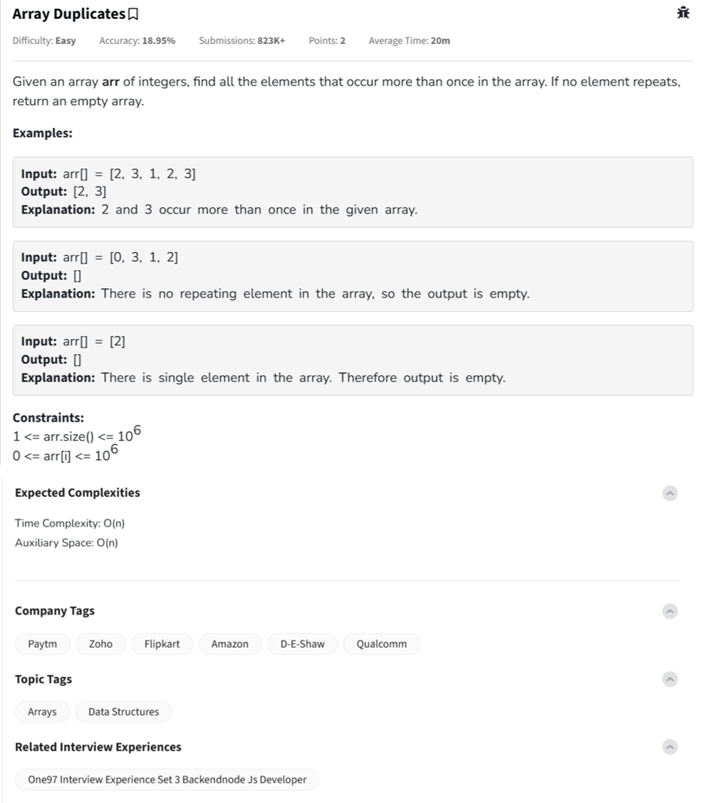

Question



---

### 💡 Problem Summary: **Array Duplicates** (from GeeksforGeeks)

**Task**:
Given an array `arr[]` of integers, find all the elements that occur **more than once**.
If no element repeats, return an empty array.

---

### 🧠 Constraints

* $1 \leq \text{arr.size()} \leq 10^6$
* $0 \leq \text{arr}[i] \leq 10^6$
* **Expected Time Complexity**: O(n)
* **Expected Auxiliary Space**: O(n)

---

### ✅ Explanation with Step-by-Step Dry Run

#### Input:

```python
arr = [2, 3, 1, 2, 3]
```

#### Objective:

Identify numbers that appear more than once.

#### Step-by-Step:

1. Initialize an empty hash map (dictionary or unordered\_map) to store frequencies.
2. Traverse the array and update counts.
3. After traversal, collect all numbers with frequency > 1.

**Dry Run Table:**

| Element | Frequency Count |
| ------- | --------------- |
| 2       | 2 ✅             |
| 3       | 2 ✅             |
| 1       | 1 ❌             |

✅ **Output**: `[2, 3]`

---

## 🚀 Code Implementations

---

### 🔹 Python

```python
class Solution:
    def duplicates(self, arr):
        freq = {}
        res = []

        # Count frequency
        for num in arr:
            freq[num] = freq.get(num, 0) + 1

        # Collect duplicates
        for num in sorted(freq):
            if freq[num] > 1:
                res.append(num)

        return res


# Driver Code
t = int(input())
for _ in range(t):
    arr = list(map(int, input().split()))
    ans = Solution().duplicates(arr)
    print(" ".join(map(str, ans)) if ans else "[]")
```

---

### 🔹 C++

```cpp
#include <iostream>
#include <unordered_map>
#include <vector>
#include <algorithm>
using namespace std;

class Solution {
public:
    vector<int> duplicates(vector<int>& arr) {
        unordered_map<int, int> freq;
        vector<int> res;

        for (int num : arr)
            freq[num]++;

        for (auto& p : freq)
            if (p.second > 1)
                res.push_back(p.first);

        sort(res.begin(), res.end());
        return res;
    }
};

// Driver Code
int main() {
    int t;
    cin >> t;
    cin.ignore();

    while (t--) {
        vector<int> arr;
        string line;
        getline(cin, line);
        stringstream ss(line);
        int num;
        while (ss >> num)
            arr.push_back(num);

        Solution sol;
        vector<int> result = sol.duplicates(arr);
        if (result.empty()) {
            cout << "[]\n";
        } else {
            for (int x : result)
                cout << x << " ";
            cout << endl;
        }
    }
    return 0;
}
```

---

### 🔹 JavaScript

```javascript
class Solution {
    duplicates(arr) {
        const freq = new Map();
        const result = [];

        // Count frequencies
        for (let num of arr) {
            freq.set(num, (freq.get(num) || 0) + 1);
        }

        // Collect duplicates
        for (let [num, count] of freq.entries()) {
            if (count > 1) result.push(num);
        }

        return result.sort((a, b) => a - b);
    }
}


// Driver Code
const readline = require("readline");
const rl = readline.createInterface({ input: process.stdin, output: process.stdout });

let lines = [], current = 0;
rl.on("line", line => lines.push(line.trim()));
rl.on("close", () => {
    let t = parseInt(lines[current++]);
    for (let i = 0; i < t; i++) {
        let arr = lines[current++].split(" ").map(Number);
        const sol = new Solution();
        let res = sol.duplicates(arr);
        console.log(res.length ? res.join(" ") : "[]");
    }
});
```

---