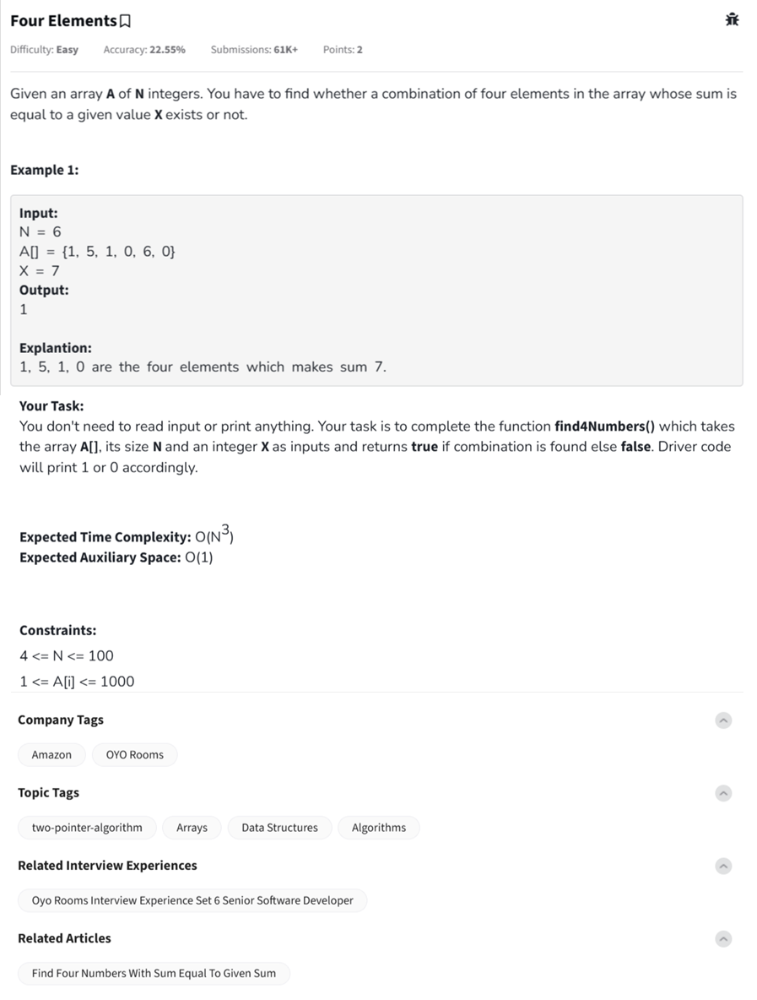

Question



---

Here's the full breakdown for the "Four Elements" problem from GeeksforGeeks:

---

### 🔍 **Problem Summary:**

You're given an array `A` of size `N` and an integer `X`. You need to determine if there exists any combination of **four distinct elements** in `A` such that their sum is exactly `X`.

---

### 🧠 **Approach:**

We will:

1. **Sort** the array.
2. **Fix two elements** using two loops.
3. For the remaining subarray, use the **two-pointer technique** to find the other two numbers that complete the target sum `X`.

This brings the overall time complexity to **O(N³)**, which is acceptable for `N <= 100`.

---

### 🧪 **Dry Run (Step-by-step):**

**Example Input:**

```
A = [1, 5, 1, 0, 6, 0], X = 7
```

**Sorted A:** \[0, 0, 1, 1, 5, 6]

Start fixing `i=0` (value 0), `j=1` (value 0)
Target for remaining two elements = 7 - 0 - 0 = 7
Use two pointers between indices 2 and 5.
Try:

* 1 + 6 = 7 ✅ → Found.

Return `True`.

---

### ✅ **Python Implementation**

```python
# User function Template for python3
def find4Numbers(A, n, X):
    A.sort()  # Sort the array to use two-pointer technique
    for i in range(n - 3):
        for j in range(i + 1, n - 2):
            left = j + 1
            right = n - 1
            target = X - A[i] - A[j]
            while left < right:
                current_sum = A[left] + A[right]
                if current_sum == target:
                    return True
                elif current_sum < target:
                    left += 1
                else:
                    right -= 1
    return False

# Driver code
def main():
    T = int(input())
    while T > 0:
        n = int(input())
        A = list(map(int, input().split()))
        X = int(input())
        print(1 if find4Numbers(A, n, X) else 0)
        T -= 1
        print("~")

if __name__ == "__main__":
    main()
```

---

### ✅ **C++ Implementation**

```cpp
// User function Template for C++
bool find4Numbers(int A[], int n, int X) {
    sort(A, A + n);  // Step 1: Sort array
    for (int i = 0; i < n - 3; i++) {
        for (int j = i + 1; j < n - 2; j++) {
            int left = j + 1, right = n - 1;
            int target = X - A[i] - A[j];
            while (left < right) {
                int sum = A[left] + A[right];
                if (sum == target) return true;
                else if (sum < target) left++;
                else right--;
            }
        }
    }
    return false;
}
```

---

### ✅ **JavaScript Implementation**

```javascript
class Solution {
    find4Numbers(arr, n, X) {
        arr.sort((a, b) => a - b);  // Step 1: Sort array

        for (let i = 0; i < n - 3; i++) {
            for (let j = i + 1; j < n - 2; j++) {
                let left = j + 1, right = n - 1;
                let target = X - arr[i] - arr[j];

                while (left < right) {
                    let sum = arr[left] + arr[right];
                    if (sum === target) return true;
                    else if (sum < target) left++;
                    else right--;
                }
            }
        }
        return false;
    }
}
```

---

