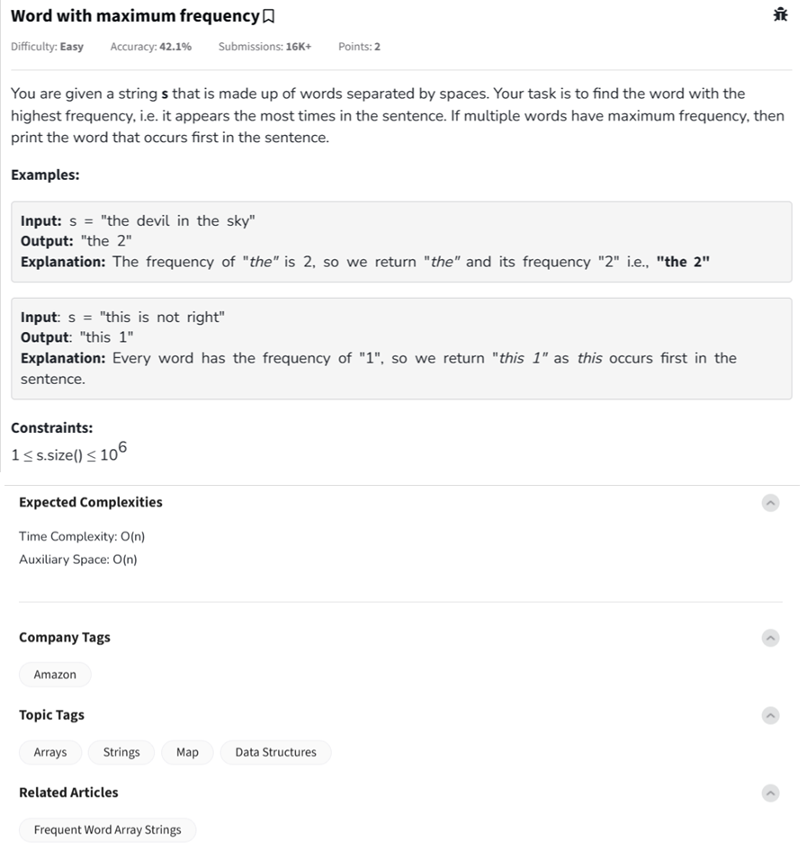

Question



---
Here's the **complete explanation**, **dry run**, and **full implementations** for the **"Word with maximum frequency"** problem from GeeksforGeeks in **Python**, **C++**, and **JavaScript** formats.

---

### ✅ Problem Summary:

You're given a sentence `s` made up of words separated by spaces. Your task is to **find the word with the highest frequency**.

* If multiple words have the same maximum frequency, **return the one that appears first** in the sentence.

---

### 🔍 Step-by-step Dry Run:

**Input:** `"the devil in the sky"`

* Words in the sentence: `["the", "devil", "in", "the", "sky"]`
* Frequencies:

  * `"the"` → 2
  * `"devil"` → 1
  * `"in"` → 1
  * `"sky"` → 1

→ Max frequency is 2. Word `"the"` appears first among all such words.

**Output:** `"the 2"`

---

### ✅ Python Implementation (With Comments)

```python
class Solution:
    def maximumFrequency(self, s):
        words = s.split()  # Split by space
        freq = {}  # Dictionary to count frequency
        first_occurrence = {}  # Track first occurrence index
        max_freq = 0
        result_word = ""

        for index, word in enumerate(words):
            freq[word] = freq.get(word, 0) + 1
            if word not in first_occurrence:
                first_occurrence[word] = index

            # Update max frequency and select earliest word
            if (freq[word] > max_freq) or \
               (freq[word] == max_freq and first_occurrence[word] < first_occurrence[result_word]):
                max_freq = freq[word]
                result_word = word

        return f"{result_word} {max_freq}"

# Driver Code
if __name__ == "__main__":
    t = int(input().strip())
    for _ in range(t):
        s = input().strip()
        obj = Solution()
        print(obj.maximumFrequency(s))
        print("~")
```

---

### ✅ C++ Implementation (With Comments)

```cpp
class Solution {
  public:
    string maximumFrequency(string& s) {
        istringstream iss(s);
        string word;
        unordered_map<string, int> freq;
        unordered_map<string, int> firstIndex;
        int index = 0, maxFreq = 0;
        string result;

        while (iss >> word) {
            freq[word]++;
            if (firstIndex.find(word) == firstIndex.end()) {
                firstIndex[word] = index;
            }

            if (freq[word] > maxFreq || 
               (freq[word] == maxFreq && firstIndex[word] < firstIndex[result])) {
                maxFreq = freq[word];
                result = word;
            }
            index++;
        }

        return result + " " + to_string(maxFreq);
    }
};
```

---

### ✅ JavaScript Implementation (With Comments)

```javascript
class Solution {
    maximumFrequency(s) {
        const words = s.trim().split(/\s+/);
        const freq = {};
        const firstIndex = {};
        let maxFreq = 0;
        let result = "";

        for (let i = 0; i < words.length; i++) {
            const word = words[i];
            freq[word] = (freq[word] || 0) + 1;
            if (!(word in firstIndex)) {
                firstIndex[word] = i;
            }

            if (
                freq[word] > maxFreq ||
                (freq[word] === maxFreq && firstIndex[word] < firstIndex[result])
            ) {
                maxFreq = freq[word];
                result = word;
            }
        }

        return `${result} ${maxFreq}`;
    }
}
```

---

