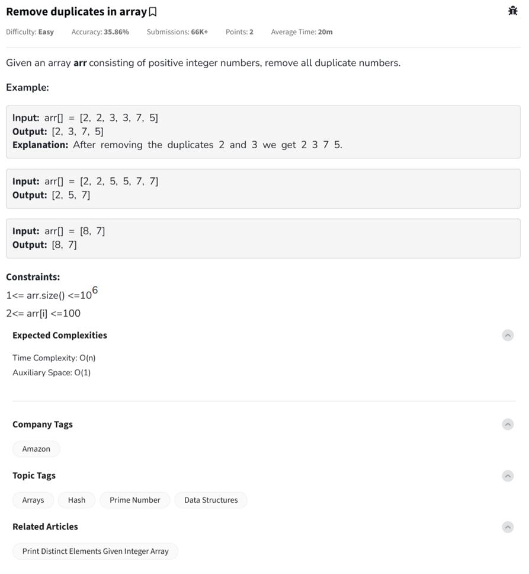

Question



---

Here's the complete explanation and implementation for the **"Remove Duplicates in Array"** problem from GeeksforGeeks:

---

## ✅ Problem Summary:

You are given an array `arr[]` of positive integers. Your task is to **remove all duplicate elements** and return a new array containing only **distinct elements** in the **original order** of appearance.

---

## 🔍 Step-by-Step Dry Run:

### Input:

```
arr = [2, 2, 3, 3, 7, 5]
```

### Steps:

* Initialize a `set` to track seen elements.
* Initialize an empty `result` list.
* Traverse each element in the array:

  * If the element is **not in the set**, append it to `result` and add to `set`.
  * If it's already in the set, skip it.

### Iteration:

```
2 → not seen → result = [2]
2 → seen → skip
3 → not seen → result = [2, 3]
3 → seen → skip
7 → not seen → result = [2, 3, 7]
5 → not seen → result = [2, 3, 7, 5]
```

### Output:

```
[2, 3, 7, 5]
```

---

## ✅ Python Code

```python
# User function Template for Python 3

class Solution:
    def removeDuplicates(self, arr):
        seen = set()        # Set to track seen elements
        result = []

        for num in arr:
            if num not in seen:
                result.append(num)   # Keep first occurrence
                seen.add(num)        # Mark as seen
        return result


# Driver Code
if __name__ == "__main__":
    t = int(input())
    while t > 0:
        arr = list(map(int, input().split()))
        ob = Solution()
        ans = ob.removeDuplicates(arr)
        print(*ans)
        print("~")
        t -= 1
```

---

## ✅ C++ Code

```cpp
// User function Template for C++

class Solution {
  public:
    vector<int> removeDuplicate(vector<int>& arr) {
        unordered_set<int> seen;
        vector<int> result;

        for (int num : arr) {
            if (seen.find(num) == seen.end()) {
                result.push_back(num);   // Add if not seen
                seen.insert(num);        // Track as seen
            }
        }

        return result;
    }
};

// Driver Code
int main() {
    string ts;
    getline(cin, ts);
    int t = stoi(ts);
    while (t--) {
        vector<int> arr;
        string input;
        getline(cin, input);
        stringstream ss(input);
        int number;
        while (ss >> number) {
            arr.push_back(number);
        }
        Solution obj;
        vector<int> ans = obj.removeDuplicate(arr);
        for (int i = 0; i < ans.size(); i++) {
            cout << ans[i] << " ";
        }
        cout << endl;
        cout << "~" << endl;
    }
    return 0;
}
```

---

## ✅ JavaScript Code

```javascript
// User function Template for JavaScript

class Solution {
    removeDuplicate(arr) {
        const seen = new Set();
        const result = [];

        for (let num of arr) {
            if (!seen.has(num)) {
                result.push(num);     // Keep if not seen
                seen.add(num);        // Mark as seen
            }
        }

        return result;
    }
}

// Driver Code
const readline = require('readline');
const rl = readline.createInterface({input : process.stdin, output : process.stdout});

let inputLines = [];
let currentLine = 0;

rl.on('line', (line) => { inputLines.push(line.trim()); });
rl.on('close', () => { main(); });

function readLine() { return inputLines[currentLine++]; }

function main() {
    let t = parseInt(readLine());
    while (t > 0) {
        let arr = readLine().split(' ').map(Number);
        let ob = new Solution();
        let ans = ob.removeDuplicate(arr);
        console.log(ans.join(' '));
        console.log("~");
        t--;
    }
}
```

---

Would you like this code adjusted to work in-place (modifying the array without extra space)?
