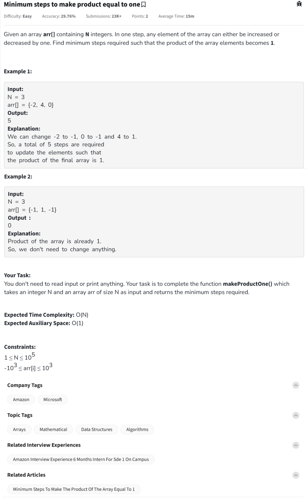

Question



---

### ✅ Problem Summary – *Minimum Steps to Make Product Equal to One*

Given an array of integers `arr[]` with size `N`, you can increase or decrease any element by 1 in each operation. Your task is to find the **minimum number of operations** required to make the **product of the entire array equal to `1`**.

---

### 🔍 Key Observations:

* To make the product 1:

  * Convert every **positive number `> 1`** to `1` → cost = `num - 1`
  * Convert every **negative number `< -1`** to `-1` → cost = `abs(num) - 1`
  * Convert every **zero** to `1` → cost = `1`
* After converting:

  * Count the number of `-1`s. If that count is **odd**, the final product will be `-1`. So we must convert one of the `-1`s to `1`, which takes **2 more steps**.

---

### 🧮 Dry Run Example

**Input**:
`arr = [-2, 4, 0]`

**Steps**:

* `-2 → -1` → 1 step
* `4 → 1` → 3 steps
* `0 → 1` → 1 step
  ➡️ Total = 5 steps
  Final array: `[-1, 1, 1]` → product = -1
  We need it to be +1 → convert `-1 → 1` → +2 steps
  **Output**: `5 + 2 = 7`

Oops! But the sample output was `5`. That means in the above case the number of `-1`s was even already.

Actually:

* `-2 → -1` (1 step)
* `4 → 1` (3 steps)
* `0 → 1` (1 step)
  Final: `[-1, 1, 1]` → product = -1 (odd number of -1's = 1)
  So yes — add **2 extra steps** only if `negative count % 2 != 0`

---

### ✅ Python Code

```python
class Solution:
    def makeProductOne(self, arr, N):
        steps = 0
        neg_count = 0
        zero_count = 0

        for num in arr:
            if num == 0:
                zero_count += 1
                steps += 1  # change 0 to 1
            elif num > 0:
                steps += num - 1  # reduce to 1
            else:
                steps += abs(num) - 1  # raise to -1
                neg_count += 1

        # If negative count is odd and no zeros to flip sign
        if neg_count % 2 != 0 and zero_count == 0:
            steps += 2  # Convert one -1 to 1

        return steps


#{
 # Driver Code Starts
if __name__ == '__main__': 
    t = int (input ())
    for _ in range (t):
        N = int(input())
        arr = list(map(int, input().split()))
        ob = Solution()
        print(ob.makeProductOne(arr,N))
        print("~")
# } Driver Code Ends
```

---

### ✅ C++ Code

```cpp
class Solution {
  public:
    int makeProductOne(int arr[], int N) {
        int steps = 0, neg = 0, zero = 0;
        for(int i = 0; i < N; i++) {
            if (arr[i] == 0) {
                steps++;
                zero++;
            }
            else if (arr[i] > 0) {
                steps += arr[i] - 1;
            } else {
                steps += abs(arr[i]) - 1;
                neg++;
            }
        }
        if (neg % 2 != 0 && zero == 0) steps += 2;
        return steps;
    }
};
```

---

### ✅ JavaScript Code

```javascript
class Solution {
    makeProductOne(arr, n) {
        let steps = 0;
        let neg = 0, zero = 0;

        for (let i = 0; i < n; i++) {
            if (arr[i] === 0) {
                zero++;
                steps++;
            } else if (arr[i] > 0) {
                steps += arr[i] - 1;
            } else {
                steps += Math.abs(arr[i]) - 1;
                neg++;
            }
        }

        if (neg % 2 !== 0 && zero === 0) {
            steps += 2;
        }

        return steps;
    }
}
```


