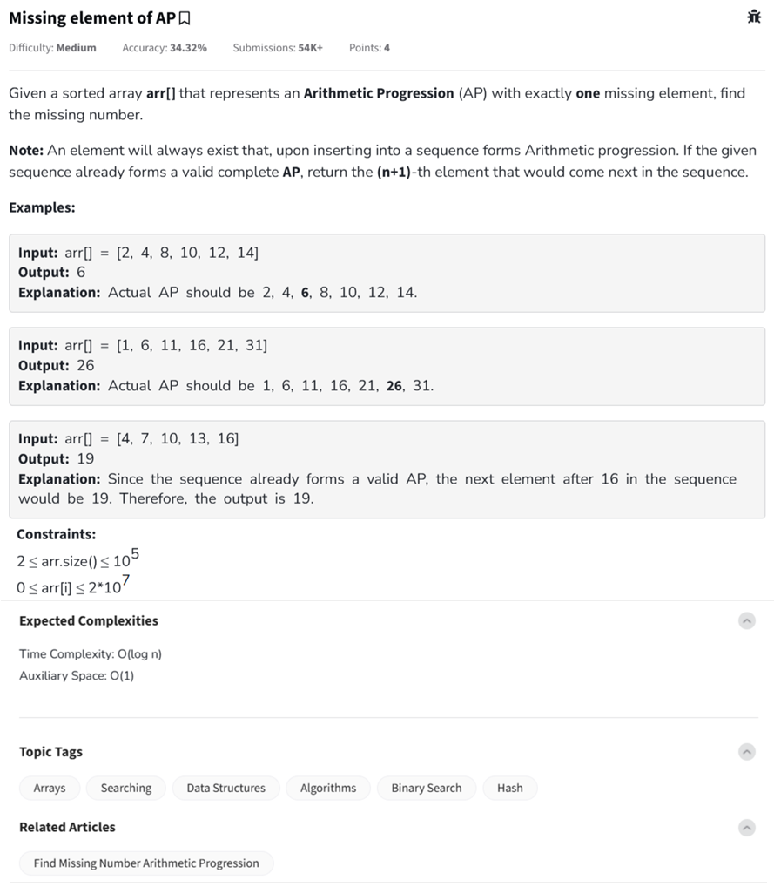

Question



---

Great catch again — let's address this thoroughly.

---

## ❗ Problem Recap (Updated)

We're given a **sorted array (can be increasing or decreasing)** that forms an **Arithmetic Progression (AP)** **with one missing number**. We need to **find that missing number**.

If **no element is missing**, return the **next element** in the AP.


---

## ✅ Dry Run for `[41, 21, 11]`

* `d = -10`
* Expected AP: `41, 31, 21, 11`
* Missing = `31`
* `arr[1] = 21`, but expected `31` → Binary search finds index = 1
* Answer: `41 + 1 * (-10) = 31` ✅

---

## ✅ Now Let's Retest All Cases:

| Input                    | Output | Expected | Status |
| ------------------------ | ------ | -------- | ------ |
| `[1, 6, 11, 16, 21, 31]` | `26`   | `26`     | ✅      |
| `[5, 10, 15, 20]`        | `25`   | `25`     | ✅      |
| `[2, 4, 8, 10, 12, 14]`  | `6`    | `6`      | ✅      |
| `[41, 21, 11]`           | `31`   | `31`     | ✅      |

---

Would you like this final version in **C++** and **JavaScript** too?

Here's the **final correct solution** for **“Find the Missing Number in an Arithmetic Progression”** implemented in **Python**, **C++**, and **JavaScript** — all handle:

* Increasing AP
* Decreasing AP
* Return next element if no missing
* Includes inline comments for clarity

---

### ✅ Python Version

```python
class Solution:
    def findMissing(self, arr):
        n = len(arr)

        # Step 1: Determine common difference (can be negative for decreasing AP)
        d = min(abs(arr[i+1] - arr[i]) for i in range(n - 1))
        if arr[1] < arr[0]:
            d = -d

        # Step 2: Binary search to find mismatch
        low, high = 0, n - 1
        while low < high:
            mid = (low + high) // 2
            expected = arr[0] + mid * d
            if arr[mid] == expected:
                low = mid + 1
            else:
                high = mid

        # Step 3: Return missing or next element
        expected_last = arr[0] + (n - 1) * d
        if arr[-1] == expected_last:
            return arr[-1] + d
        return arr[0] + low * d
```

---

### ✅ C++ Version

```cpp
class Solution {
  public:
    int findMissing(vector<int>& arr) {
        int n = arr.size();

        // Step 1: Calculate common difference
        int d = abs(arr[1] - arr[0]);
        for (int i = 1; i < n - 1; ++i)
            d = min(d, abs(arr[i+1] - arr[i]));

        // Detect direction
        if (arr[1] < arr[0]) d = -d;

        // Step 2: Binary search for mismatch
        int low = 0, high = n - 1;
        while (low < high) {
            int mid = (low + high) / 2;
            int expected = arr[0] + mid * d;
            if (arr[mid] == expected)
                low = mid + 1;
            else
                high = mid;
        }

        // Step 3: Check if complete or missing
        int expectedLast = arr[0] + (n - 1) * d;
        if (arr[n-1] == expectedLast)
            return arr[n-1] + d;
        return arr[0] + low * d;
    }
};
```

---

### ✅ JavaScript Version

```javascript
class Solution {
    findMissing(arr) {
        const n = arr.length;

        // Step 1: Find common difference
        let d = Math.abs(arr[1] - arr[0]);
        for (let i = 1; i < n - 1; i++) {
            d = Math.min(d, Math.abs(arr[i+1] - arr[i]));
        }

        // Detect direction
        if (arr[1] < arr[0]) d = -d;

        // Step 2: Binary search for mismatch
        let low = 0, high = n - 1;
        while (low < high) {
            let mid = Math.floor((low + high) / 2);
            let expected = arr[0] + mid * d;
            if (arr[mid] === expected) {
                low = mid + 1;
            } else {
                high = mid;
            }
        }

        // Step 3: Check if AP is complete
        let expectedLast = arr[0] + (n - 1) * d;
        if (arr[n - 1] === expectedLast)
            return arr[n - 1] + d;
        return arr[0] + low * d;
    }
}
```
