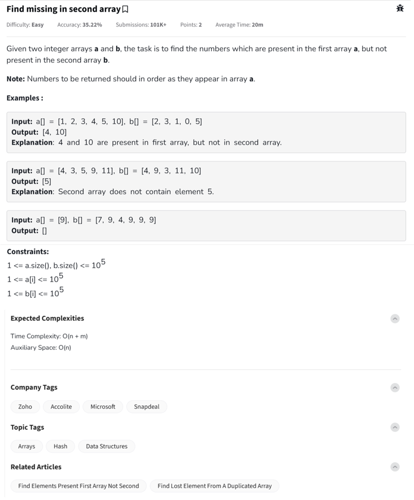

Question



---

Here’s the **full explanation, dry run, and implementation** of the **"Find missing in second array"** problem from GeeksforGeeks in **Python, C++, and JavaScript**, using the formats and templates you provided.

---

### 🔍 Problem Summary:

Given two arrays `a` and `b`, return all elements present in `a` **but not in** `b`, preserving the order from `a`.

---

### 🧠 Dry Run (Example 1):

**Input:**

* a = \[1, 2, 3, 4, 5, 10]
* b = \[2, 3, 1, 0, 5]

**Step-by-step:**

* Convert `b` to a set for O(1) lookups: `{0, 1, 2, 3, 5}`
* Iterate through `a`:

  * 1 → in `b` → skip
  * 2 → in `b` → skip
  * 3 → in `b` → skip
  * 4 → not in `b` → ✅
  * 5 → in `b` → skip
  * 10 → not in `b` → ✅
* **Output**: \[4, 10]

---

### ✅ Python Code

```python
#User function Template for python3
class Solution:
    def findMissing(self, a, b):
        b_set = set(b)  # Use set for fast lookup
        result = []
        for num in a:
            if num not in b_set:
                result.append(num)
        return result

# Driver Code
if __name__ == "__main__":
    t = int(input())
    for _ in range(0, t):
        a = list(map(int, input().split()))
        b = list(map(int, input().split()))
        ob = Solution()
        ans = ob.findMissing(a, b)
        for each in ans:
            print(each, end=' ')
        print()
        print("~")
```

---

### ✅ C++ Code

```cpp
//{ Driver Code Starts
#include <bits/stdc++.h>
using namespace std;
// } Driver Code Ends

class Solution {
  public:
    vector<int> findMissing(vector<int>& a, vector<int>& b) {
        unordered_set<int> b_set(b.begin(), b.end());
        vector<int> result;
        for (int num : a) {
            if (b_set.find(num) == b_set.end()) {
                result.push_back(num);
            }
        }
        return result;
    }
};

//{ Driver Code Starts.
int main() {
    int t;
    cin >> t;
    cin.ignore();
    while (t--) {
        vector<int> a, b;
        string line;
        getline(cin, line);
        stringstream ss(line);
        int num;
        while (ss >> num) a.push_back(num);
        getline(cin, line);
        stringstream ss2(line);
        while (ss2 >> num) b.push_back(num);

        Solution ob;
        vector<int> ans = ob.findMissing(a, b);
        for (int i : ans) cout << i << " ";
        cout << "\n";
        cout << "~\n";
    }
    return 0;
}
// } Driver Code Ends
```

---

### ✅ JavaScript Code

```javascript
//{ Driver Code Starts
"use strict";

process.stdin.resume();
process.stdin.setEncoding("utf-8");

let inputString = "";
let currentLine = 0;

process.stdin.on("data", inputStdin => { inputString += inputStdin; });

process.stdin.on("end", _ => {
    inputString = inputString.trim().split("\n").map(str => str.trim());
    main();
});

function readLine() { return inputString[currentLine++]; }

function printArray(arr, size) {
    console.log(arr.slice(0, size).join(" "));
}

function main() {
    let t = parseInt(readLine());
    while (t--) {
        let a = readLine().split(" ").map(Number);
        let b = readLine().split(" ").map(Number);
        let obj = new Solution();
        let res = obj.findMissing(a, b);
        printArray(res, res.length);
        console.log("~");
    }
}
// } Driver Code Ends

class Solution {
    findMissing(a, b) {
        const bSet = new Set(b);
        const result = [];
        for (let num of a) {
            if (!bSet.has(num)) {
                result.push(num);
            }
        }
        return result;
    }
}
```

---
