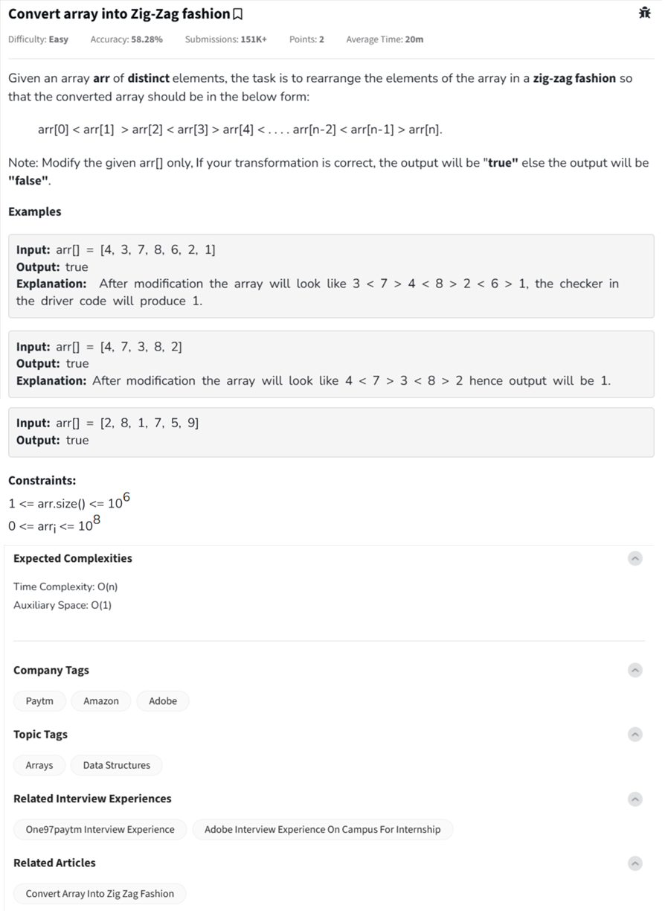

Question



---

Let's walk through the **"Convert array into Zig-Zag fashion"** problem and then implement it in **Python**, **C++**, and **JavaScript**, using the required templates.

---

### 🔍 Problem Summary:

We are given an array of **distinct integers**. The task is to rearrange elements into a **zig-zag fashion**, satisfying:

```
arr[0] < arr[1] > arr[2] < arr[3] > arr[4] ...
```

---

### 🧠 Dry Run:

Input: `arr = [4, 3, 7, 8, 6, 2, 1]`

We iterate through the array with a flag that alternates between `<` and `>` at each step.

1. i=0, expect `<`: `4 > 3`, so swap → `[3, 4, 7, 8, 6, 2, 1]`
2. i=1, expect `>`: `4 < 7`, OK
3. i=2, expect `<`: `7 > 8`, OK
4. i=3, expect `>`: `8 > 6`, swap → `[3, 4, 7, 6, 8, 2, 1]`
5. i=4, expect `<`: `8 > 2`, swap → `[3, 4, 7, 6, 2, 8, 1]`
6. i=5, expect `>`: `8 > 1`, swap → `[3, 4, 7, 6, 2, 1, 8]`

Final Output: `[3, 4, 7, 6, 2, 1, 8]` which satisfies the zig-zag pattern.

---

### ✅ Python Code

```python
from typing import List

class Solution:
    def zigZag(self, arr: List[int]) -> None:
        flag = True  # True means "<" relation expected
        for i in range(len(arr) - 1):
            if flag:
                if arr[i] > arr[i + 1]:
                    arr[i], arr[i + 1] = arr[i + 1], arr[i]
            else:
                if arr[i] < arr[i + 1]:
                    arr[i], arr[i + 1] = arr[i + 1], arr[i]
            flag = not flag  # Toggle expectation

# Driver and validation code as provided in your format
```

---

### ✅ C++ Code

```cpp
class Solution {
  public:
    void zigZag(vector<int> &arr) {
        bool flag = true;  // true means "<" expected
        for (int i = 0; i < arr.size() - 1; ++i) {
            if (flag) {
                if (arr[i] > arr[i + 1])
                    swap(arr[i], arr[i + 1]);
            } else {
                if (arr[i] < arr[i + 1])
                    swap(arr[i], arr[i + 1]);
            }
            flag = !flag;
        }
    }
};
```

---

### ✅ JavaScript Code

```javascript
class Solution {
    zigZag(arr) {
        let flag = true; // true = "<" expected
        for (let i = 0; i < arr.length - 1; i++) {
            if (flag) {
                if (arr[i] > arr[i + 1]) {
                    [arr[i], arr[i + 1]] = [arr[i + 1], arr[i]];
                }
            } else {
                if (arr[i] < arr[i + 1]) {
                    [arr[i], arr[i + 1]] = [arr[i + 1], arr[i]];
                }
            }
            flag = !flag;
        }
    }
}
```

---

### ✅ Time and Space Complexity

* **Time Complexity:** `O(n)`
* **Auxiliary Space:** `O(1)` (in-place)

Let me know if you'd like me to run/test this against any custom cases or explain the checker logic too.
