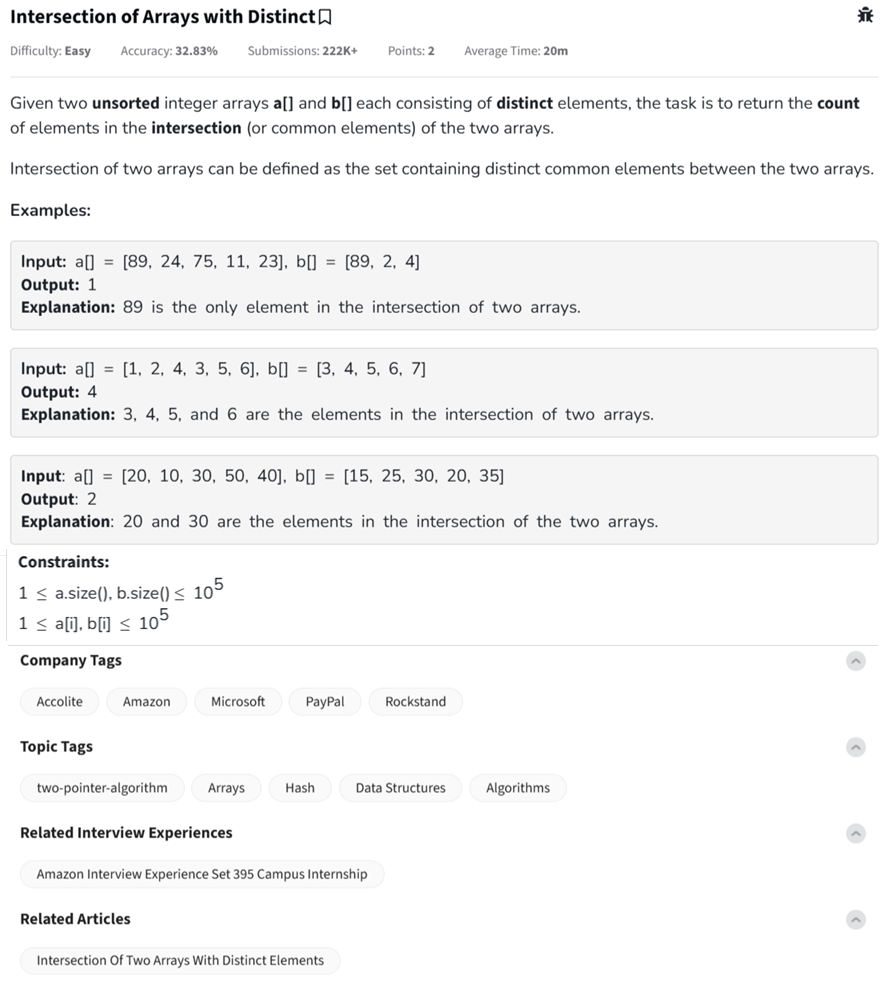

Question



---

Let's solve the **"Intersection of Arrays with Distinct"** problem from GeeksforGeeks, and implement it in **Python**, **C++**, and **JavaScript** formats.

---

### 🔍 Problem Summary:

Given two **unsorted** arrays `a[]` and `b[]` with **distinct elements**, we need to return the **count** of distinct elements **common** to both arrays.

---

### ✅ Step-by-Step Explanation:

Let’s dry-run this:

#### Input:

```
a[] = [1, 2, 4, 3, 5, 6]
b[] = [3, 4, 5, 6, 7]
```

* Convert `b` to a set for O(1) lookups.
* Iterate `a` and count elements that exist in `set_b`.

**Common elements:** `3, 4, 5, 6` → Count = **4**

---

### ✅ Python Code

```python
#User function Template for python3

class Solution:
    def numberofElementsInIntersection(self, a, b):
        set_b = set(b)          # Store b in set for fast lookup
        count = 0

        for num in a:
            if num in set_b:
                count += 1
                set_b.remove(num)  # To maintain distinct count

        return count

# Driver code block provided in your template
```

---

### ✅ C++ Code

```cpp
class Solution {
  public:
    int numberofElementsInIntersection(vector<int> &a, vector<int> &b) {
        unordered_set<int> set_b(b.begin(), b.end());
        int count = 0;

        for (int num : a) {
            if (set_b.find(num) != set_b.end()) {
                count++;
                set_b.erase(num); // ensure uniqueness
            }
        }

        return count;
    }
};
```

---

### ✅ JavaScript Code

```javascript
class Solution {
    numberofElementsInIntersection(a, b) {
        const setB = new Set(b);
        let count = 0;

        for (let num of a) {
            if (setB.has(num)) {
                count++;
                setB.delete(num); // maintain uniqueness
            }
        }

        return count;
    }
}
```

---

### ✅ Time & Space Complexity

* **Time Complexity:** O(n + m) – where n and m are lengths of arrays `a` and `b`.
* **Space Complexity:** O(m) – to store set for `b`.

Let me know if you want a version that also returns the actual intersection elements instead of just the count.
