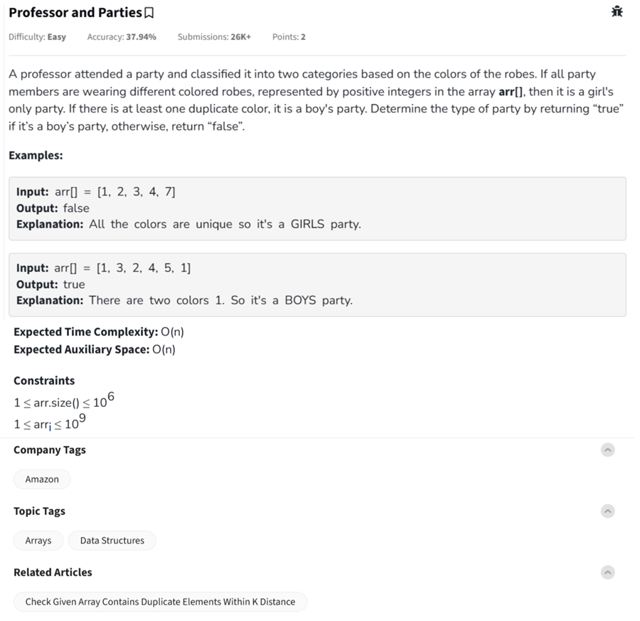

Question



---

Let’s walk through the **"Professor and Parties"** problem with explanation and code in **Python**, **C++**, and **JavaScript**.

---

### 🔍 Problem Summary

You're given an array `arr[]` of robe colors. If **all values are unique**, return `"false"` (it's a **girl's** party). If there's **any duplicate**, return `"true"` (it's a **boy's** party).

---

### ✅ Dry Run Example

#### Input:

```
arr = [1, 3, 2, 4, 5, 1]
```

* We track the colors using a set.
* On checking 1 again → it’s a duplicate.

👉 Return: `"true"` (BOY'S party)

#### Input:

```
arr = [1, 2, 3, 4, 7]
```

* All values are unique.

👉 Return: `"false"` (GIRL'S party)

---

### ✅ Python Code (with inline comments)

```python
class Solution:
    def PartyType(self, arr):
        seen = set()
        for color in arr:
            if color in seen:
                return "true"  # duplicate found
            seen.add(color)
        return "false"  # all unique

# Driver code is provided in your template
```

---

### ✅ C++ Code

```cpp
class Solution {
  public:
    string PartyType(vector<int>& arr) {
        unordered_set<int> seen;
        for (int color : arr) {
            if (seen.count(color))
                return "true";  // duplicate
            seen.insert(color);
        }
        return "false"; // all unique
    }
};
```

---

### ✅ JavaScript Code

```javascript
class Solution {
    PartyType(arr) {
        const seen = new Set();
        for (let color of arr) {
            if (seen.has(color)) {
                return "true";  // duplicate
            }
            seen.add(color);
        }
        return "false";  // all unique
    }
}
```

---

### ✅ Time & Space Complexity

* **Time Complexity:** O(n)
* **Space Complexity:** O(n) for the set

Let me know if you want this adapted to an in-place or constant-space approach with constraints.
