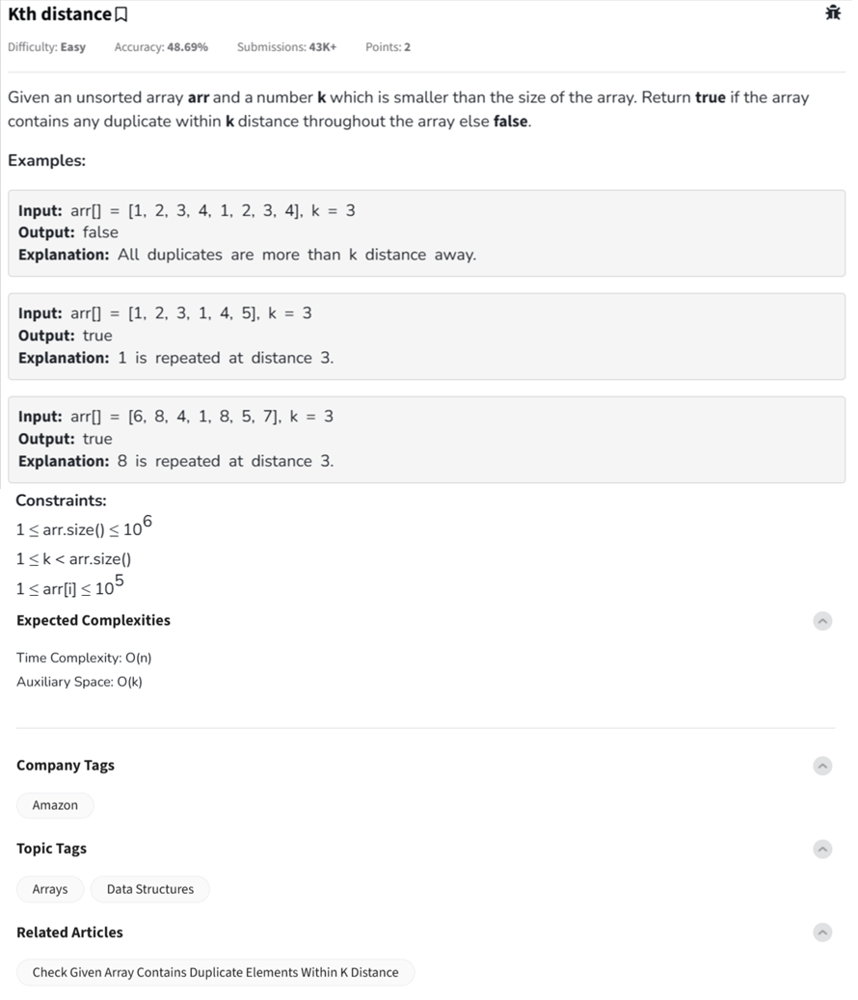

Question



---
Here’s a full explanation and implementation for the **Kth Distance Duplicate Check** problem from GeeksforGeeks, including step-by-step dry run and code in **Python**, **C++**, and **JavaScript**.

---

## 🔍 Problem Summary

You're given an unsorted array `arr[]` and an integer `k`. Return `true` if **any element is repeated within a distance `k`**, else return `false`.

---

### 🧠 Intuition & Approach

Use a **sliding window of size k** and a **set** to store recently seen elements:

1. Iterate through the array.
2. For each element:

   * If it’s already in the set → duplicate found within `k` → return `true`.
   * Otherwise, insert it into the set.
   * If the size of the sliding window exceeds `k`, remove the oldest element (`arr[i-k]`).
3. If loop finishes, return `false`.

---

## 🔁 Dry Run Example

**Input:**
`arr = [6, 8, 4, 1, 8, 5, 7], k = 3`

* `i = 0`: set = {6}
* `i = 1`: set = {6, 8}
* `i = 2`: set = {6, 8, 4}
* `i = 3`: set = {8, 4, 1} → removed 6
* `i = 4`: **8 found again** → ✅ return `true`

---

## ✅ Python Code

```python
class Solution:
    def checkDuplicatesWithinK(self, arr, k):
        seen = set()
        for i in range(len(arr)):
            if arr[i] in seen:
                return True
            seen.add(arr[i])
            if i >= k:
                seen.remove(arr[i - k])
        return False
```

---

## ✅ C++ Code

```cpp
class Solution {
  public:
    bool checkDuplicatesWithinK(vector<int>& arr, int k) {
        unordered_set<int> seen;
        for (int i = 0; i < arr.size(); i++) {
            if (seen.find(arr[i]) != seen.end())
                return true;
            seen.insert(arr[i]);
            if (i >= k)
                seen.erase(arr[i - k]);
        }
        return false;
    }
};
```

---

## ✅ JavaScript Code

```javascript
class Solution {
    checkDuplicatesWithinK(arr, k) {
        const seen = new Set();
        for (let i = 0; i < arr.length; i++) {
            if (seen.has(arr[i])) return true;
            seen.add(arr[i]);
            if (i >= k) seen.delete(arr[i - k]);
        }
        return false;
    }
}
```

---

## ⏱️ Complexity

* **Time:** O(n)
* **Space:** O(k)

Would you like the code to be tested against custom inputs or formatted for submission?
