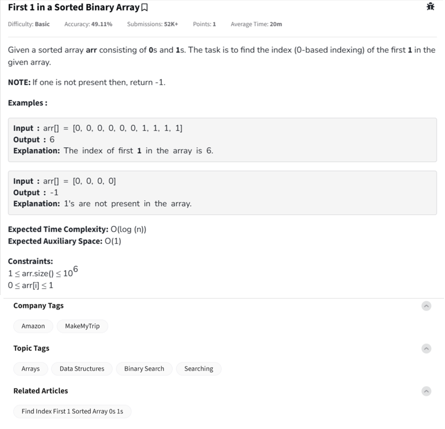

Question



---
Alright!  
This is the **First 1 in a Sorted Binary Array** problem.

---

### 🧠 Problem Understanding:

You are given a **sorted array** containing only `0`s and `1`s.

- Find the **first occurrence** (index) of `1`.
- If `1` is **not present**, return `-1`.

⚡ The array is sorted → all 0’s come first, then 1’s (if any).

---

### 🔥 Key Insight:
Since the array is sorted (`0`s first, then `1`s), we can use **Binary Search** to find the first `1` in `O(log n)` time.

---

### ✅ Python Code:
```python
def firstOne(arr):
    low, high = 0, len(arr) - 1
    answer = -1

    while low <= high:
        mid = (low + high) // 2
        if arr[mid] == 1:
            answer = mid
            high = mid - 1  # search on the left side for earlier 1
        else:
            low = mid + 1

    return answer
```

---

### 🧪 Example Usage:
```python
print(firstOne([0, 0, 0, 0, 0, 0, 1, 1, 1]))  # Output: 6
print(firstOne([0, 0, 0, 0]))                 # Output: -1
```

---

### ⏱ Time & Space Complexity:
- **Time Complexity:** `O(log n)` — binary search
- **Space Complexity:** `O(1)`

---

Would you also like the **C++** and **JavaScript** versions for full mastery? 🚀  
They're short and almost identical to the Python version!