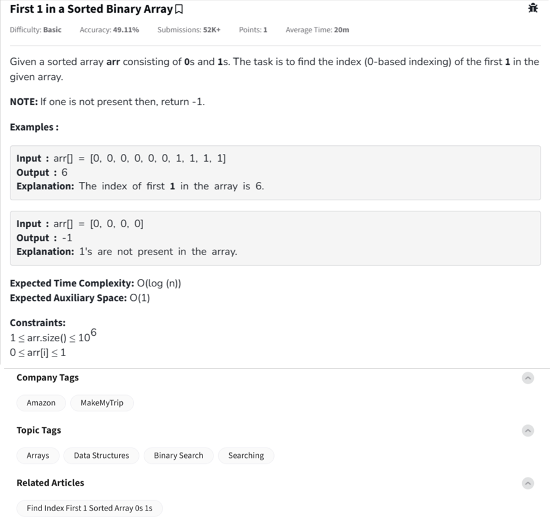

Question



---
Alright!  
This is the **First 1 in a Sorted Binary Array** problem.

---

### 🧠 Problem Understanding:

You are given a **sorted array** containing only `0`s and `1`s.

- Find the **first occurrence** (index) of `1`.
- If `1` is **not present**, return `-1`.

⚡ The array is sorted → all 0’s come first, then 1’s (if any).

---

### 🔥 Key Insight:
Since the array is sorted (`0`s first, then `1`s), we can use **Binary Search** to find the first `1` in `O(log n)` time.

---

### ✅ Python Code:
```python
def firstOne(arr):
    low, high = 0, len(arr) - 1
    answer = -1

    while low <= high:
        mid = (low + high) // 2
        if arr[mid] == 1:
            answer = mid
            high = mid - 1  # search on the left side for earlier 1
        else:
            low = mid + 1

    return answer
```

---

### 🧪 Example Usage:
```python
print(firstOne([0, 0, 0, 0, 0, 0, 1, 1, 1]))  # Output: 6
print(firstOne([0, 0, 0, 0]))                 # Output: -1
```

---

### ⏱ Time & Space Complexity:
- **Time Complexity:** `O(log n)` — binary search
- **Space Complexity:** `O(1)`

---

Awesome! Here's the full set:

---

### ✅ C++ Code:
```cpp
#include <vector>
using namespace std;

int firstOne(const vector<int>& arr) {
    int low = 0, high = arr.size() - 1;
    int answer = -1;

    while (low <= high) {
        int mid = (low + high) / 2;
        if (arr[mid] == 1) {
            answer = mid;
            high = mid - 1;  // Search on the left side
        } else {
            low = mid + 1;
        }
    }

    return answer;
}
```

### 🧪 Example Usage in C++:
```cpp
#include <iostream>

int main() {
    vector<int> arr = {0, 0, 0, 0, 1, 1, 1};
    cout << firstOne(arr) << endl; // Output: 4
}
```

---

### ✅ JavaScript Code:
```javascript
function firstOne(arr) {
    let low = 0, high = arr.length - 1;
    let answer = -1;

    while (low <= high) {
        let mid = Math.floor((low + high) / 2);

        if (arr[mid] === 1) {
            answer = mid;
            high = mid - 1; // Search on the left side
        } else {
            low = mid + 1;
        }
    }

    return answer;
}
```

### 🧪 Example Usage in JavaScript:
```javascript
console.log(firstOne([0, 0, 0, 0, 1, 1, 1]));  // Output: 4
console.log(firstOne([0, 0, 0, 0]));           // Output: -1
```

---

### 🔥 Summary:
| Language  | Time Complexity | Space Complexity |
|-----------|------------------|------------------|
| Python    | O(log n)          | O(1)             |
| C++       | O(log n)          | O(1)             |
| JavaScript| O(log n)          | O(1)             |

✅ All work exactly the same way using **Binary Search**!

---
