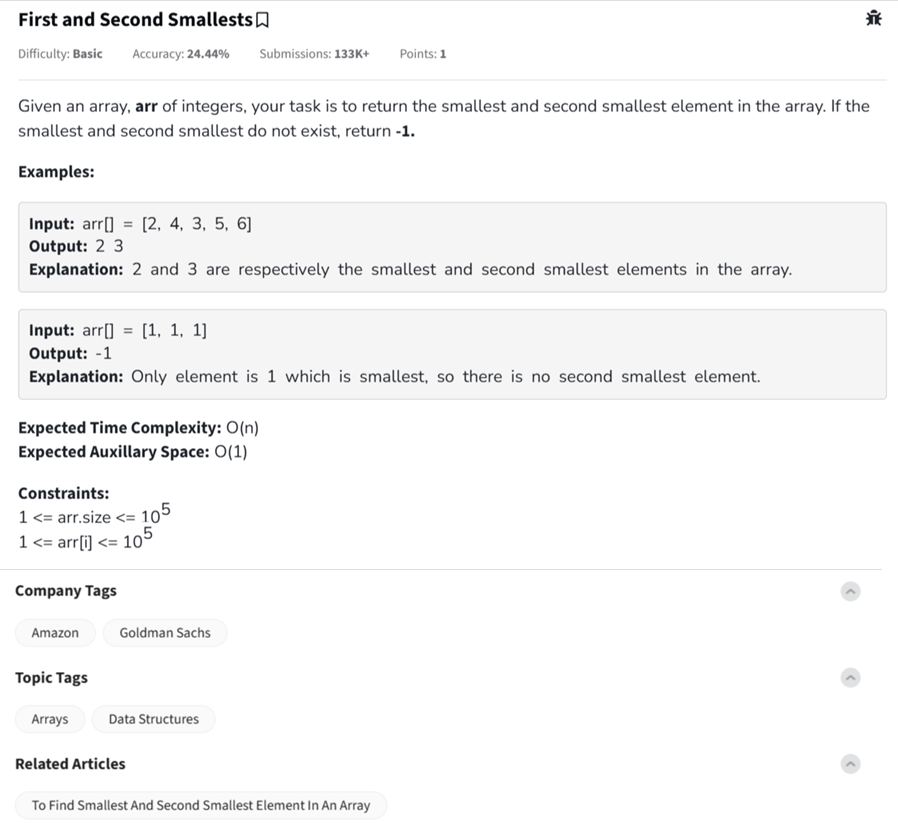

Question



---

Great! You're working on a problem titled **"First and Second Smallests"**, which asks you to find the smallest and second smallest unique elements in an array of integers.

---

### 🧠 **Understanding the Problem**
You are given an array `arr[]` and need to find:
- The **smallest** and **second smallest** unique elements.
- If the second smallest **does not exist** (e.g., all elements are the same), return `-1`.

---

### 💡 **Key Constraints**
- Time Complexity: `O(n)` (So no sorting allowed!)
- Space Complexity: `O(1)` (No extra data structures like sets or maps)

---

### ✅ **Sample Inputs & Outputs**
```plaintext
Input:  arr[] = [2, 4, 3, 5, 6]
Output: 2 3
Explanation: 2 is smallest, 3 is second smallest

Input:  arr[] = [1, 1, 1]
Output: -1
Explanation: Only one unique value
```

---

### 🧮 **Algorithm (O(n) Time | O(1) Space)**

1. Initialize:
   - `first = INT_MAX`
   - `second = INT_MAX`

2. Iterate through array:
   - If `arr[i] < first`: update `second = first`, then `first = arr[i]`
   - Else if `arr[i] < second` and `arr[i] != first`: update `second = arr[i]`

3. After loop:
   - If `second == INT_MAX`, return `-1`
   - Otherwise, return `first` and `second`

---
You got it! 🎯 Below are the **full codes** for C++, Python, and JavaScript, **with inline comments** that explain each step of the logic to find the **first and second smallest** unique values in an array.

---

## 🧑‍💻 C++ Code (With Comments)

```cpp
#include <iostream>
#include <vector>
#include <climits> // For INT_MAX
using namespace std;

void findTwoSmallest(const vector<int>& arr) {
    // Initialize two variables to the maximum possible int value
    int first = INT_MAX;
    int second = INT_MAX;

    // Traverse the array once (O(n) time)
    for (int num : arr) {
        if (num < first) {
            // Found a new smallest number
            second = first; // Update second smallest
            first = num;    // Update smallest
        } else if (num < second && num != first) {
            // Found a new second smallest, not equal to first
            second = num;
        }
    }

    // If second smallest never got updated, it means there is no second unique value
    if (second == INT_MAX)
        cout << -1 << endl;
    else
        cout << first << " " << second << endl;
}

int main() {
    vector<int> arr = {2, 4, 3, 5, 6}; // Sample input
    findTwoSmallest(arr);             // Output: 2 3
    return 0;
}
```

---

## 🐍 Python Code (With Comments)

```python
def find_two_smallest(arr):
    # Initialize first and second smallest to infinity
    first = float('inf')
    second = float('inf')

    # Traverse through the array once
    for num in arr:
        if num < first:
            # New smallest found
            second = first
            first = num
        elif num < second and num != first:
            # New second smallest found
            second = num

    # If second is not updated, return -1
    if second == float('inf'):
        print(-1)
    else:
        print(first, second)

# Example usage
arr = [2, 4, 3, 5, 6]
find_two_smallest(arr)  # Output: 2 3
```

---

## 🌐 JavaScript Code (With Comments)

```javascript
function findTwoSmallest(arr) {
    // Initialize first and second smallest to Infinity
    let first = Infinity;
    let second = Infinity;

    // Traverse the array
    for (let num of arr) {
        if (num < first) {
            // New smallest found
            second = first;
            first = num;
        } else if (num < second && num !== first) {
            // New second smallest found (must be unique)
            second = num;
        }
    }

    // If second is still Infinity, there's no second smallest
    if (second === Infinity) {
        console.log(-1);
    } else {
        console.log(first, second);
    }
}

// Example usage
let arr = [2, 4, 3, 5, 6];
findTwoSmallest(arr);  // Output: 2 3
```

---

### 🚀 Summary of Logic
- Initialize `first` and `second` to infinity (`INT_MAX` or `float('inf')` or `Infinity`).
- For each number:
  - If it’s smaller than `first`, it becomes the new smallest; the old `first` becomes `second`.
  - If it’s between `first` and `second`, and not equal to `first`, it becomes the new `second`.
- If `second` was never updated, return `-1`.
