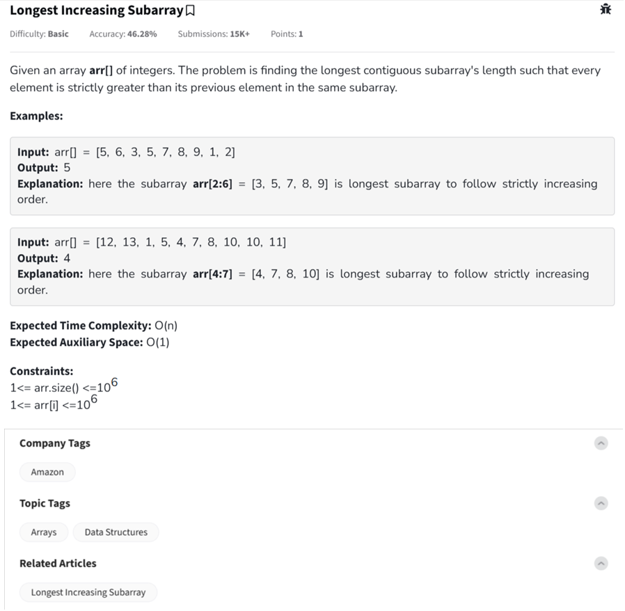
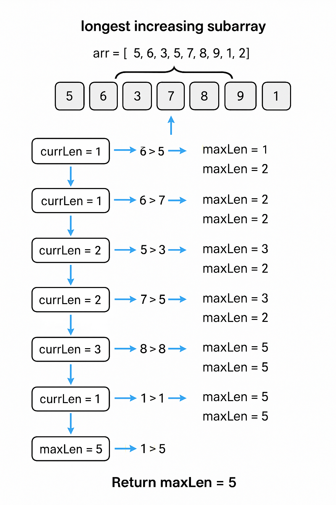

Question



---
Alright!  
This is the **Longest Increasing Subarray** problem.

---

### 🧠 Problem Understanding:

Given an array `arr[]`, find the **length** of the **longest contiguous subarray** where every element is **strictly greater** than the previous element.

⚡ The array must be **contiguous** — no skipping elements!

---

### ✅ Python Code:
```python
def longestIncreasingSubarray(arr):
    n = len(arr)
    max_len = 1
    curr_len = 1

    for i in range(1, n):
        if arr[i] > arr[i - 1]:
            curr_len += 1
            max_len = max(max_len, curr_len)
        else:
            curr_len = 1

    return max_len
```

---

### 🧪 Example Usage:
```python
print(longestIncreasingSubarray([5, 6, 3, 5, 7, 8, 9, 1, 2]))  # Output: 5
print(longestIncreasingSubarray([12, 13, 1, 5, 4, 7, 8, 10, 10, 11]))  # Output: 4
```

---

### ⏱ Time & Space Complexity:
- **Time Complexity:** `O(n)` — single pass
- **Space Complexity:** `O(1)` — constant extra space

---

Awesome! Here's the **C++** and **JavaScript** versions for the **Longest Increasing Subarray** problem:

---

### ✅ C++ Code:
```cpp
#include <vector>
#include <algorithm>
using namespace std;

int longestIncreasingSubarray(const vector<int>& arr) {
    int n = arr.size();
    int max_len = 1, curr_len = 1;

    for (int i = 1; i < n; ++i) {
        if (arr[i] > arr[i - 1]) {
            curr_len++;
            max_len = max(max_len, curr_len);
        } else {
            curr_len = 1;
        }
    }

    return max_len;
}
```

### 🧪 Example Usage in C++:
```cpp
#include <iostream>

int main() {
    vector<int> arr = {5, 6, 3, 5, 7, 8, 9, 1, 2};
    cout << longestIncreasingSubarray(arr) << endl; // Output: 5
}
```

---

### ✅ JavaScript Code:
```javascript
function longestIncreasingSubarray(arr) {
    let n = arr.length;
    let maxLen = 1, currLen = 1;

    for (let i = 1; i < n; i++) {
        if (arr[i] > arr[i - 1]) {
            currLen++;
            maxLen = Math.max(maxLen, currLen);
        } else {
            currLen = 1;
        }
    }

    return maxLen;
}
```

### 🧪 Example Usage in JavaScript:
```javascript
console.log(longestIncreasingSubarray([5, 6, 3, 5, 7, 8, 9, 1, 2])); // Output: 5
console.log(longestIncreasingSubarray([12, 13, 1, 5, 4, 7, 8, 10, 10, 11])); // Output: 4
```

---

### 🚀 Quick Summary:
- Traverse the array once.
- Maintain:
  - `currLen` → Current increasing subarray length
  - `maxLen` → Maximum length found so far
- Reset `currLen = 1` if the current number is not greater than the previous.

---

