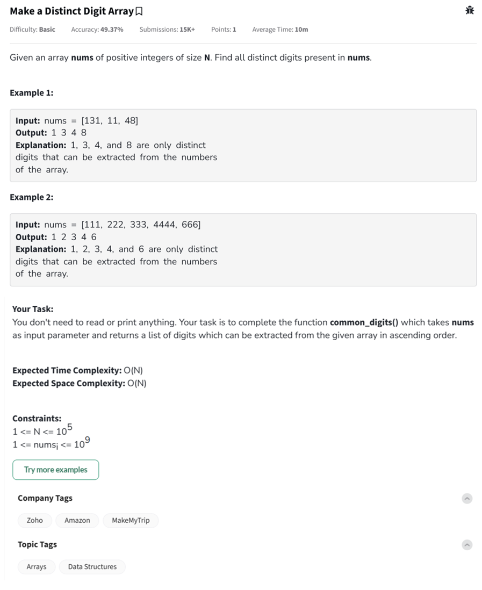

Question



---
Got it — this is the **Make a Distinct Digit Array** problem!

---

### 🧠 Problem Summary:
Given an array `nums[]` of positive integers:
- Find **all distinct digits** (0–9) **present** in any of the numbers.
- Return the list of digits **sorted in ascending order**.

---

### ✅ Python Code:
```python
def common_digits(nums):
    digit_set = set()

    for num in nums:
        while num > 0:
            digit_set.add(num % 10)
            num //= 10

    return sorted(digit_set)
```

---

### 🧪 Example Usage:
```python
print(common_digits([131, 11, 48]))  # Output: [1, 3, 4, 8]
print(common_digits([111, 222, 333, 4444, 666]))  # Output: [1, 2, 3, 4, 6]
```

---

### â± Time & Space Complexity:
- **Time Complexity:** `O(total_digits)` ≈ `O(N)` because the number of digits per number is constant bounded (≤10 digits).
- **Space Complexity:** `O(1)` because at most 10 digits (0–9).

---

Awesome! Here's the **C++** and **JavaScript** versions for the **Make a Distinct Digit Array** problem:

---

### ✅ C++ Code:
```cpp
#include <vector>
#include <set>
#include <algorithm>
using namespace std;

vector<int> common_digits(const vector<int>& nums) {
    set<int> digitSet;

    for (int num : nums) {
        while (num > 0) {
            digitSet.insert(num % 10);
            num /= 10;
        }
    }

    return vector<int>(digitSet.begin(), digitSet.end());
}
```

### 🧪 Example Usage in C++:
```cpp
#include <iostream>

int main() {
    vector<int> nums = {131, 11, 48};
    vector<int> result = common_digits(nums);
    for (int digit : result) {
        cout << digit << " ";
    }
    // Output: 1 3 4 8
    return 0;
}
```

---

### ✅ JavaScript Code:
```javascript
function common_digits(nums) {
    const digitSet = new Set();

    for (let num of nums) {
        while (num > 0) {
            digitSet.add(num % 10);
            num = Math.floor(num / 10);
        }
    }

    return Array.from(digitSet).sort((a, b) => a - b);
}
```

### 🧪 Example Usage in JavaScript:
```javascript
console.log(common_digits([131, 11, 48]));  // Output: [1, 3, 4, 8]
console.log(common_digits([111, 222, 333, 4444, 666]));  // Output: [1, 2, 3, 4, 6]
```

---

### 🔥 Quick Summary:
- **Set** is used to store distinct digits.
- Final result is **sorted** before returning.

---

Would you also like a **visual diagram** explaining how the digits are extracted and collected step-by-step? 🯠(It’s super easy to remember with that!)