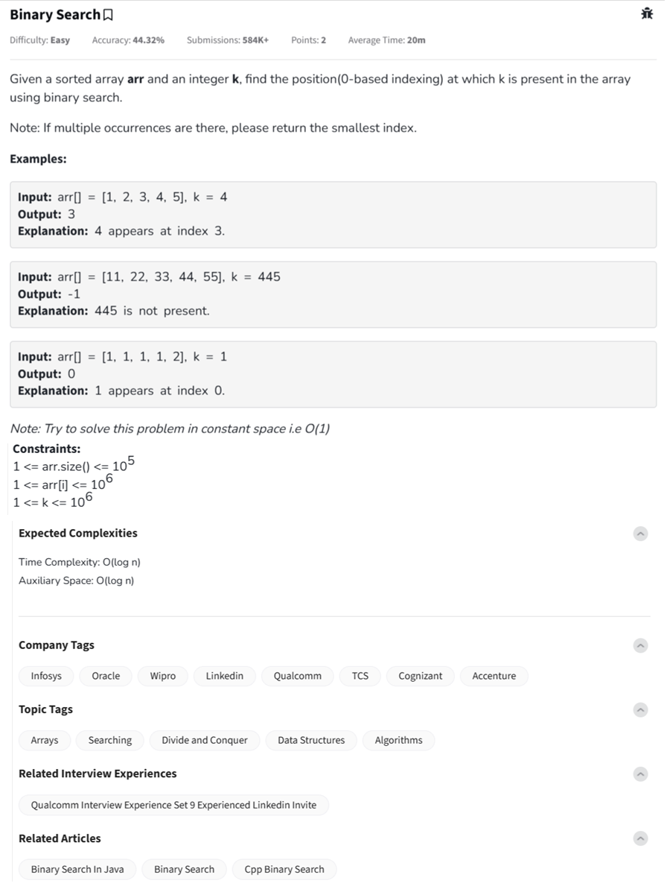

Question



---

GeeksforGeeks problem **“Binary Search”**, including:

---

## ✅ Problem Summary:

Given:

* A sorted array `arr[]`
* An integer `k`

**Goal**: Return the index (0-based) of the **first occurrence** of `k` using **binary search**. If `k` is not found, return `-1`.

---

## 🔍 Dry Run (Step-by-Step):

### Example:

**Input:**

```plaintext
arr = [1, 1, 1, 2], k = 1
```

### Binary Search Steps:

1. `low = 0`, `high = 3`
2. `mid = (0 + 3) // 2 = 1`, `arr[1] = 1` → equals `k`

   * But we want **first occurrence**: so `high = mid - 1 = 0`
3. `mid = (0 + 0) // 2 = 0`, `arr[0] = 1` → equals `k`

   * Found again, move left: `high = -1`
4. Terminate loop: return `low = 0`

**Output:** `0` (index of first occurrence)

---

## ✅ Python Implementation

```python
class Solution:
    def binarysearch(self, arr, k):
        low, high = 0, len(arr) - 1
        result = -1

        while low <= high:
            mid = (low + high) // 2
            if arr[mid] == k:
                result = mid        # Record position
                high = mid - 1      # Search left for first occurrence
            elif arr[mid] < k:
                low = mid + 1
            else:
                high = mid - 1

        return result

# Driver Code
if __name__ == "__main__":
    t = int(input())
    for _ in range(t):
        k = int(input())
        arr = list(map(int, input().split()))
        ob = Solution()
        res = ob.binarysearch(arr, k)
        print(res)
        print("~")
```

---

## ✅ C++ Implementation

```cpp
class Solution {
  public:
    int binarysearch(vector<int> &arr, int k) {
        int low = 0, high = arr.size() - 1, result = -1;

        while (low <= high) {
            int mid = low + (high - low) / 2;

            if (arr[mid] == k) {
                result = mid;       // Track first occurrence
                high = mid - 1;
            } else if (arr[mid] < k) {
                low = mid + 1;
            } else {
                high = mid - 1;
            }
        }
        return result;
    }
};

// Driver Code
int main() {
    int t;
    cin >> t;
    cin.ignore();

    while (t--) {
        int k;
        cin >> k;
        vector<int> arr;
        string input;
        cin.ignore();
        getline(cin, input);
        stringstream ss(input);
        int number;
        while (ss >> number) {
            arr.push_back(number);
        }

        Solution ob;
        int res = ob.binarysearch(arr, k);
        cout << res << endl;
        cout << "~" << endl;
    }
    return 0;
}
```

---

## ✅ JavaScript Implementation

```javascript
class Solution {
    binarysearch(arr, k) {
        let low = 0, high = arr.length - 1;
        let result = -1;

        while (low <= high) {
            let mid = Math.floor((low + high) / 2);

            if (arr[mid] === k) {
                result = mid;
                high = mid - 1; // Move left for first occurrence
            } else if (arr[mid] < k) {
                low = mid + 1;
            } else {
                high = mid - 1;
            }
        }

        return result;
    }
}

// Driver Code
'use strict';

process.stdin.resume();
process.stdin.setEncoding('utf-8');

let inputString = '';
let currentLine = 0;

process.stdin.on('data', inputStdin => { inputString += inputStdin; });

process.stdin.on('end', _ => {
    inputString = inputString.trim().split('\n').map(string => string.trim());
    main();
});

function readLine() { return inputString[currentLine++]; }

function main() {
    let t = parseInt(readLine());

    for (let i = 0; i < t; i++) {
        let k = parseInt(readLine());
        let arr = readLine().split(' ').map(Number);
        let obj = new Solution();
        let res = obj.binarysearch(arr, k);
        console.log(res);
        console.log("~");
    }
}
```

---

