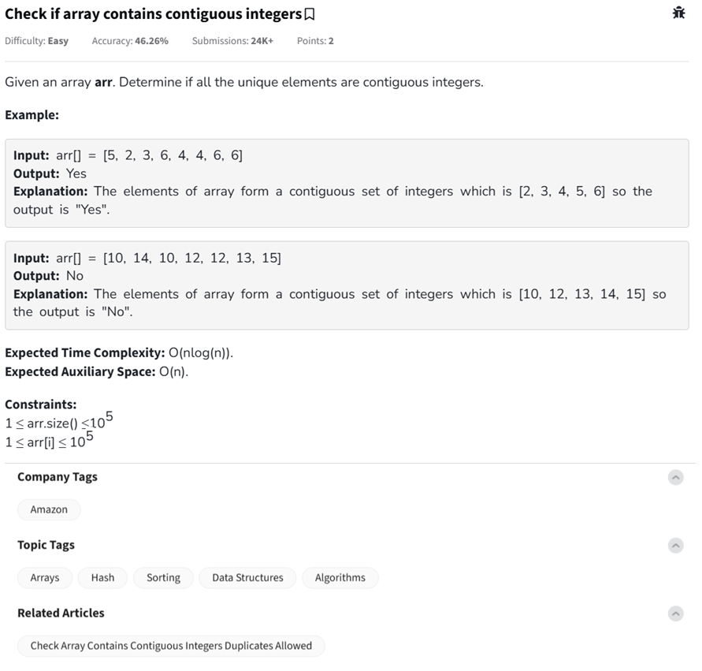

Question



---

## ✅ Python – Full Program (with inline comments)

```python
# Function to check if array has all contiguous integers
class Solution:
    def areElementsContiguous(self, arr): 
        unique = set(arr)  # Remove duplicates
        min_val = min(unique)
        max_val = max(unique)

        # Check if every value from min to max is present
        for num in range(min_val, max_val + 1):
            if num not in unique:
                return False  # If any value is missing, not contiguous
        return True  # All numbers are present, so contiguous

# Driver code to test multiple test cases
if __name__ == "__main__":
    t = int(input())  # Number of test cases
    while t > 0:
        arr = list(map(int, input().split()))
        ob = Solution()
        res = ob.areElementsContiguous(arr)
        if res:
            print("Yes")
        else:
            print("No")
        print("~")  # Separator
        t -= 1
```

---

## ✅ C++ – Full Program (with inline comments)

```cpp
#include <iostream>
#include <vector>
#include <unordered_set>
#include <algorithm>
using namespace std;

// Function to check if array has contiguous integers
bool areElementsContiguous(const vector<int>& arr) {
    unordered_set<int> unique(arr.begin(), arr.end()); // Remove duplicates

    int min_val = *min_element(unique.begin(), unique.end());
    int max_val = *max_element(unique.begin(), unique.end());

    // Check if all elements from min to max exist in set
    for (int i = min_val; i <= max_val; ++i) {
        if (unique.find(i) == unique.end())
            return false; // Missing element => not contiguous
    }
    return true;
}

int main() {
    int t;
    cin >> t; // Number of test cases
    while (t--) {
        vector<int> arr;
        int x;
        // Read until newline
        while (cin.peek() != '\n' && cin >> x) {
            arr.push_back(x);
        }
        if (areElementsContiguous(arr)) cout << "Yes\n";
        else cout << "No\n";
        cout << "~\n";
    }
    return 0;
}
```

---

## ✅ JavaScript – Full Program (Node.js Style with inline comments)

```javascript
// Function to check if array has contiguous integers
function areElementsContiguous(arr) {
    const unique = new Set(arr); // Remove duplicates
    const uniqueArr = Array.from(unique);
    const min = Math.min(...uniqueArr);
    const max = Math.max(...uniqueArr);

    // Check every number in the range [min, max] is present
    for (let i = min; i <= max; i++) {
        if (!unique.has(i)) return false; // If any number is missing
    }
    return true;
}

// Node.js driver code
const readline = require("readline");
const rl = readline.createInterface({
    input: process.stdin,
    output: process.stdout
});

let inputLines = [], t = null;

rl.on("line", (line) => {
    if (t === null) {
        t = parseInt(line.trim());
    } else {
        inputLines.push(line.trim());
        if (inputLines.length === t) rl.close();
    }
});

rl.on("close", () => {
    inputLines.forEach(line => {
        const arr = line.split(" ").map(Number);
        const res = areElementsContiguous(arr);
        console.log(res ? "Yes" : "No");
        console.log("~");
    });
});
```

---

### ✅ Logic Summary:

* Use a set to collect **unique elements**.
* Compute `min` and `max`.
* Check if **every integer** between `min` and `max` is present in the set.
* If **any are missing**, it’s not contiguous.
