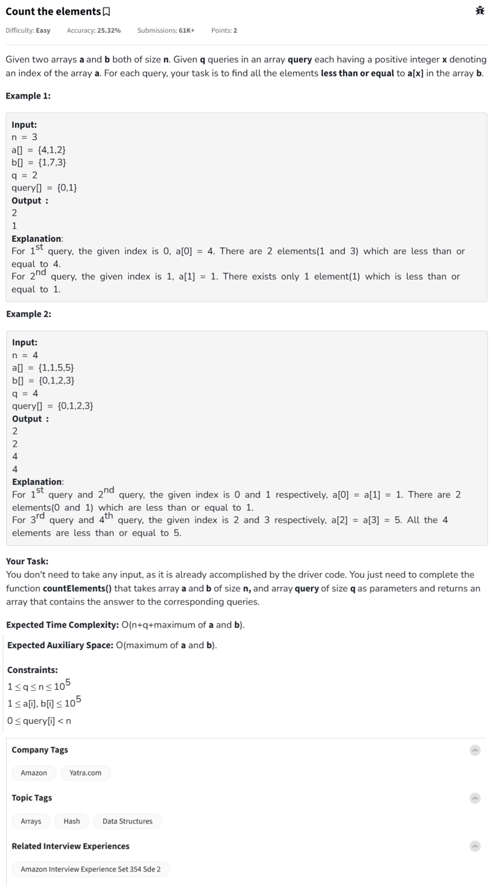

Question



---

**“Count the Elements”** problem:

---

## 🔷 Problem Summary

You're given:

* Two integer arrays `a` and `b`, both of size `n`
* An array `query` of size `q`, where each element represents an index `i` in `a`

**Task:** For each index `i` from `query`, count how many elements in array `b` are **less than or equal to** `a[i]`.

---

## 🧠 Step-by-Step Text Explanation

### Example:

```
n = 3  
a = [4, 1, 2]  
b = [1, 7, 3]  
query = [0, 1]  
```

### Goal:

* For `query[0] = 0` → a\[0] = 4
  Count elements in b ≤ 4 → `b = [1, 7, 3]` → elements: 1, 3 → count = **2**

* For `query[1] = 1` → a\[1] = 1
  Count elements in b ≤ 1 → elements: 1 → count = **1**

### Final Output:

```
[2, 1]
```

---

## 👀 Optimized Strategy

1. **Build frequency count** of elements in `b` up to the **maximum value**.
2. Use a **prefix sum array** to quickly compute how many elements are ≤ `x`.
3. For each query index `i`, just return `prefix[a[i]]`.

---

## 🧪 Dry Run for Example 2:

```
n = 4  
a = [1, 1, 5, 5]  
b = [0, 1, 2, 3]  
query = [0, 1, 2, 3]  
```

### Frequency Count of b:

* b: \[0, 1, 2, 3]
* freq: \[1, 1, 1, 1]

### Prefix Sum:

* prefix: \[1, 2, 3, 4]
  (meaning: prefix\[i] = number of elements ≤ i)

### Answers:

* query\[0] → a\[0]=1 → prefix\[1] = 2
* query\[1] → a\[1]=1 → prefix\[1] = 2
* query\[2] → a\[2]=5 → prefix\[5] = 4
* query\[3] → a\[3]=5 → prefix\[5] = 4

### Output:

```
[2, 2, 4, 4]
```

---

## ✅ Python Code (Driver Template + Solution)

```python
#User function Template for python3
class Solution:
    def countElements(self, a, b, n, query, q):
        max_val = max(max(a), max(b))
        freq = [0] * (max_val + 2)

        # Count frequency of b's elements
        for val in b:
            freq[val] += 1

        # Build prefix sum
        for i in range(1, max_val + 1):
            freq[i] += freq[i - 1]

        # Answer queries
        res = []
        for idx in query:
            val = a[idx]
            res.append(freq[val])
        return res

#{ Driver Code Starts
t = int(input())
for _ in range(0, t):
    n = int(input())
    a = list(map(int, input().split()))
    b = list(map(int, input().split()))
    q = int(input())
    query = []
    ob = Solution()
    for i in range(q):
        query.append(int(input()))
    ans = ob.countElements(a, b, n, query, q)
    for i in range(q):
        print(ans[i])
    print("~")
# } Driver Code Ends
```

---

## ✅ C++ Code (With Inline Comments)

```cpp
class Solution {
  public:
    vector<int> countElements(vector<int> &a, vector<int> &b, int n, vector<int> &query, int q) {
        int maxVal = *max_element(a.begin(), a.end());
        maxVal = max(maxVal, *max_element(b.begin(), b.end()));

        vector<int> freq(maxVal + 2, 0);

        for (int val : b)
            freq[val]++;

        for (int i = 1; i <= maxVal; i++)
            freq[i] += freq[i - 1];

        vector<int> result;
        for (int idx : query)
            result.push_back(freq[a[idx]]);

        return result;
    }
};
```

---

## ✅ JavaScript Code (With Inline Comments)

```javascript
class Solution {
    countElements(n, a, b, q, queries) {
        let maxVal = Math.max(...a, ...b);
        let freq = new Array(maxVal + 2).fill(0);

        for (let val of b) freq[val]++;
        for (let i = 1; i <= maxVal; i++) freq[i] += freq[i - 1];

        let result = [];
        for (let idx of queries) result.push(freq[a[idx]]);
        return result;
    }
}
```

---

