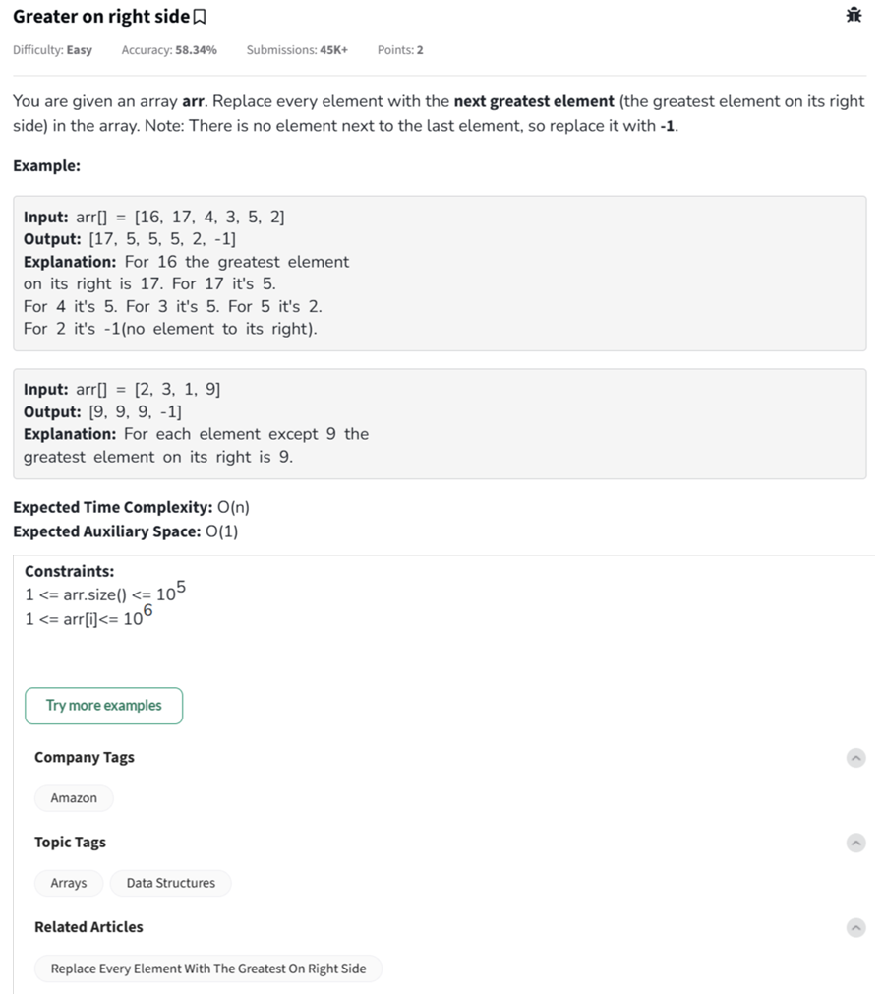

Question



---

This problem asks you to **replace every element in an array with the greatest element to its right**. The last element has no element to its right, so it should be replaced with `-1`.

---

### ✅ Example Breakdown

**Input:**
`arr = [16, 17, 4, 3, 5, 2]`
**Output:**
`[17, 5, 5, 5, 2, -1]`

**Step-by-step explanation:**

* For 16 → max to the right is 17 → replace with 17
* For 17 → max to the right is 5 → replace with 5
* For 4 → max to the right is 5 → replace with 5
* For 3 → max to the right is 5 → replace with 5
* For 5 → max to the right is 2 → replace with 2
* For 2 → nothing on right → replace with -1

---

### 💡 Efficient Logic

Traverse the array from **right to left**, keeping track of the `max_so_far`:

1. Initialize `max_so_far = -1`
2. For each element from right to left:

   * Temporarily store current value
   * Replace current element with `max_so_far`
   * Update `max_so_far` if current value is greater

---

Here is the **complete solution** for the **"Greater on Right Side"** problem in **Python, C++, and JavaScript**, including **inline comments** to explain the logic in each step.

---

### ✅ Python Version

```python
class Solution:
    def nextGreatest(self, arr):
        n = len(arr)
        maxRight = -1  # Initially, there's no element to the right
        for i in range(n - 1, -1, -1):  # Traverse from end to start
            current = arr[i]  # Store the current element
            arr[i] = maxRight  # Replace with the greatest on the right
            if current > maxRight:
                maxRight = current  # Update maxRight if current is greater
        return arr

# Example usage
arr = [16, 17, 4, 3, 5, 2]
ob = Solution()
print(ob.nextGreatest(arr))  # Output: [17, 5, 5, 5, 2, -1]
```

---

### ✅ C++ Version

```cpp
#include <iostream>
#include <vector>
using namespace std;

class Solution {
public:
    void nextGreatest(vector<int>& arr) {
        int n = arr.size();
        int maxRight = -1;  // Initially no greater element on the right

        for (int i = n - 1; i >= 0; --i) {
            int current = arr[i];  // Store current element
            arr[i] = maxRight;     // Replace with next greatest
            if (current > maxRight)
                maxRight = current;  // Update if current is greater
        }
    }
};

int main() {
    vector<int> arr = {16, 17, 4, 3, 5, 2};
    Solution ob;
    ob.nextGreatest(arr);
    for (int num : arr) {
        cout << num << " ";
    }
    // Output: 17 5 5 5 2 -1
    return 0;
}
```

---

### ✅ JavaScript Version

```javascript
class Solution {
    nextGreatest(arr) {
        let maxRight = -1; // Start with -1 for the last element
        for (let i = arr.length - 1; i >= 0; i--) {
            let current = arr[i];   // Temporarily store current value
            arr[i] = maxRight;      // Replace with maxRight
            if (current > maxRight) {
                maxRight = current; // Update maxRight if needed
            }
        }
        return arr;
    }
}

// Example usage
let arr = [16, 17, 4, 3, 5, 2];
let ob = new Solution();
console.log(ob.nextGreatest(arr)); // Output: [17, 5, 5, 5, 2, -1]
```


