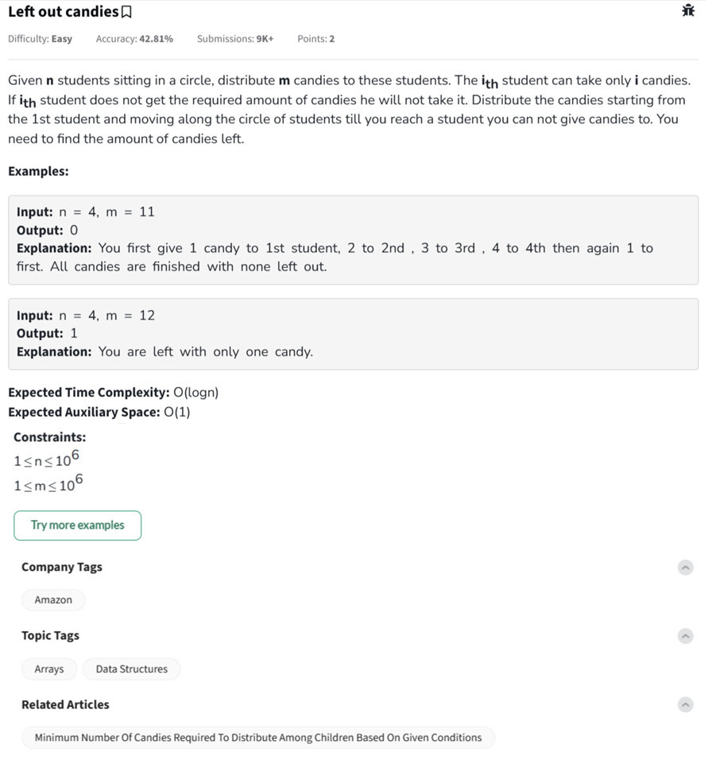

Question



---

Here's a complete explanation and implementation for the **"Left Out Candies"** problem.

---

## 🧠 Problem Summary

You are given:

* `n` students sitting in a circle.
* `m` candies.

The **i-th student** wants **i candies**.
You give:

* 1 candy to student 1,
* 2 candies to student 2,
* ..., up to student `n`.

Then, wrap around in a circle and keep distributing until you **cannot satisfy** a student.

🎯 Your goal: **Find out how many candies are left** after this process.

---

## 💡 Key Observations

The sequence of required candies is a **repeating arithmetic sequence**:

`1 + 2 + 3 + ... + n = n(n+1)/2`

Let this be one round of distribution.

If `m >= n(n+1)/2`, subtract that from `m` and repeat.

We can use **binary search** to find out how many full rounds we can perform and then simulate the final leftover loop.

---

## 🧪 Dry Run

### Input:

```
n = 4, m = 11
```

Steps:

* Round 1: give 1+2+3+4 = 10 → m = 11 - 10 = 1
* Try again: next is student 1 who wants 1 → give it → m = 0
* Done → 0 left ✅

---

## ✅ Python Code

```python
#User function Template for python3
class Solution:
    def leftCandies(self, n, m):
        low, high = 0, m
        # Binary search for max complete rounds
        while low <= high:
            mid = (low + high) // 2
            # Total candies used in mid rounds
            total = mid * n * (n + 1) // 2
            if total <= m:
                low = mid + 1
            else:
                high = mid - 1
        
        # Deduct candies used in full `high` rounds
        used = high * n * (n + 1) // 2
        m -= used
        
        # Now simulate one last incomplete round
        for i in range(1, n + 1):
            if m >= i:
                m -= i
            else:
                break
        return m


#{
# Driver Code Starts
if __name__ == '__main__':
    tc = int(input())
    while tc > 0:
        n, m = list(map(int, input().strip().split()))
        ob = Solution()
        ans = ob.leftCandies(n, m)
        print(ans)
        tc -= 1
        print("~")
# } Driver Code Ends
```

---

## ✅ C++ Code

```cpp
class Solution {
  public:
    long long leftCandies(long long n, long long m) {
        long long low = 0, high = m;

        // Binary search for maximum full rounds
        while (low <= high) {
            long long mid = (low + high) / 2;
            long long total = mid * n * (n + 1) / 2;

            if (total <= m)
                low = mid + 1;
            else
                high = mid - 1;
        }

        long long used = high * n * (n + 1) / 2;
        m -= used;

        // Final partial round
        for (long long i = 1; i <= n; i++) {
            if (m >= i)
                m -= i;
            else
                break;
        }

        return m;
    }
};


//{
int main() {
    int t;
    cin >> t;
    while (t--) {
        long long n, m;
        cin >> n >> m;
        Solution obj;
        long long ans = obj.leftCandies(n, m);
        cout << ans << "\n";
        cout << "~\n";
    }
    return 0;
}
//}
```

---

## ✅ JavaScript Code

```javascript
class Solution {
    leftCandies(n, m) {
        let low = 0, high = m;

        // Binary search for number of full rounds
        while (low <= high) {
            let mid = Math.floor((low + high) / 2);
            let total = (mid * n * (n + 1)) / 2;

            if (total <= m) low = mid + 1;
            else high = mid - 1;
        }

        // Used in complete `high` rounds
        let used = (high * n * (n + 1)) / 2;
        m -= used;

        // Final round simulation
        for (let i = 1; i <= n; i++) {
            if (m >= i) m -= i;
            else break;
        }

        return m;
    }
}


//{ Driver Code Starts
const readline = require('readline');
const rl = readline.createInterface({input : process.stdin, output : process.stdout});
let inputLines = [], currentLine = 0;

rl.on('line', line => inputLines.push(line.trim()));
rl.on('close', () => main());

function readLine() { return inputLines[currentLine++]; }

function main() {
    let tc = parseInt(readLine());
    while (tc-- > 0) {
        let [n, m] = readLine().split(' ').map(Number);
        let obj = new Solution();
        console.log(obj.leftCandies(n, m));
        console.log("~");
    }
}
//}
```

---

