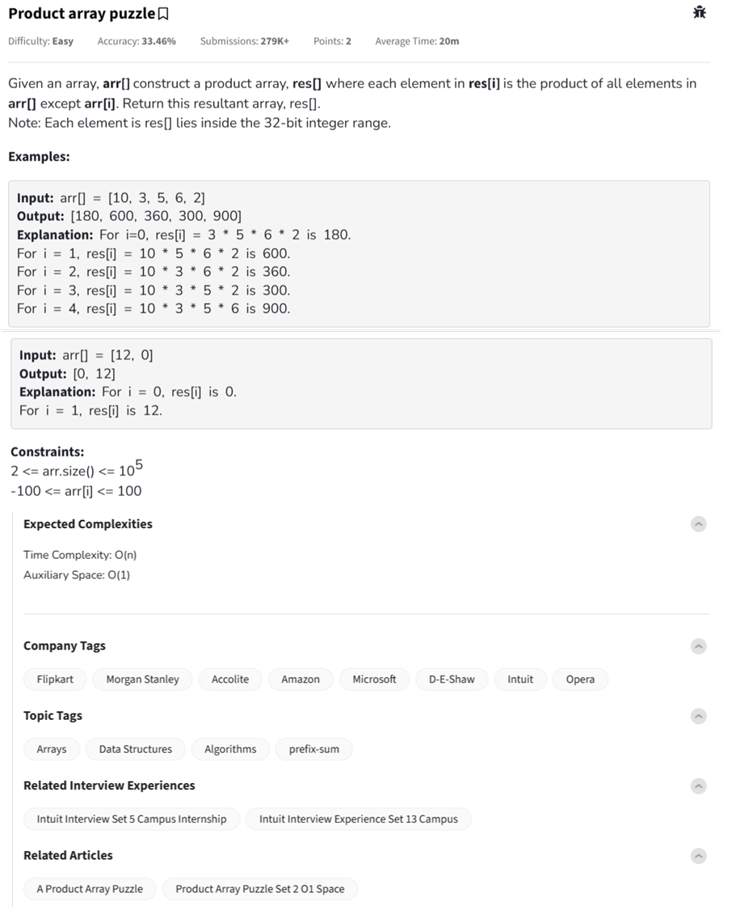

Question



---
Here are the complete programs for the **Product Array Puzzle** in Python, C++, and JavaScript, each with inline comments explaining the logic:

---

### ✅ Python

```python
def productExceptSelf(arr):
    n = len(arr)
    res = [1] * n

    # Step 1: Calculate prefix products
    prefix = 1
    for i in range(n):
        res[i] = prefix
        prefix *= arr[i]  # Product of all elements before index i

    # Step 2: Multiply with suffix products
    suffix = 1
    for i in range(n - 1, -1, -1):
        res[i] *= suffix  # Multiply with product of all elements after index i
        suffix *= arr[i]

    return res

# Example usage
arr = [10, 3, 5, 6, 2]
print(productExceptSelf(arr))  # Output: [1800, 6000, 3600, 3000, 9000]
```

---

### ✅ C++

```cpp
#include <iostream>
#include <vector>
using namespace std;

vector<int> productExceptSelf(const vector<int>& arr) {
    int n = arr.size();
    vector<int> res(n, 1);

    // Step 1: Prefix product
    int prefix = 1;
    for (int i = 0; i < n; ++i) {
        res[i] = prefix;
        prefix *= arr[i];  // Prefix holds product of elements before index i
    }

    // Step 2: Suffix product
    int suffix = 1;
    for (int i = n - 1; i >= 0; --i) {
        res[i] *= suffix;  // Multiply with product of elements after index i
        suffix *= arr[i];
    }

    return res;
}

int main() {
    vector<int> arr = {10, 3, 5, 6, 2};
    vector<int> result = productExceptSelf(arr);

    for (int val : result)
        cout << val << " ";  // Output: 1800 6000 3600 3000 9000

    return 0;
}
```

---

### ✅ JavaScript

```javascript
class Solution {
    productExceptSelf(arr) {
        const n = arr.length;
        const res = new Array(n).fill(1);

        // Step 1: Calculate prefix product
        let prefix = 1;
        for (let i = 0; i < n; i++) {
            res[i] = prefix;
            prefix *= arr[i]; // Product of all elements before index i
        }

        // Step 2: Multiply with suffix product
        let suffix = 1;
        for (let i = n - 1; i >= 0; i--) {
            res[i] *= suffix; // Multiply with product of elements after index i
            suffix *= arr[i];
        }

        return res;
    }
}

// Example usage:
const arr = [10, 3, 5, 6, 2];
const sol = new Solution();
console.log(sol.productExceptSelf(arr)); // Output: [1800, 6000, 3600, 3000, 9000]
```
