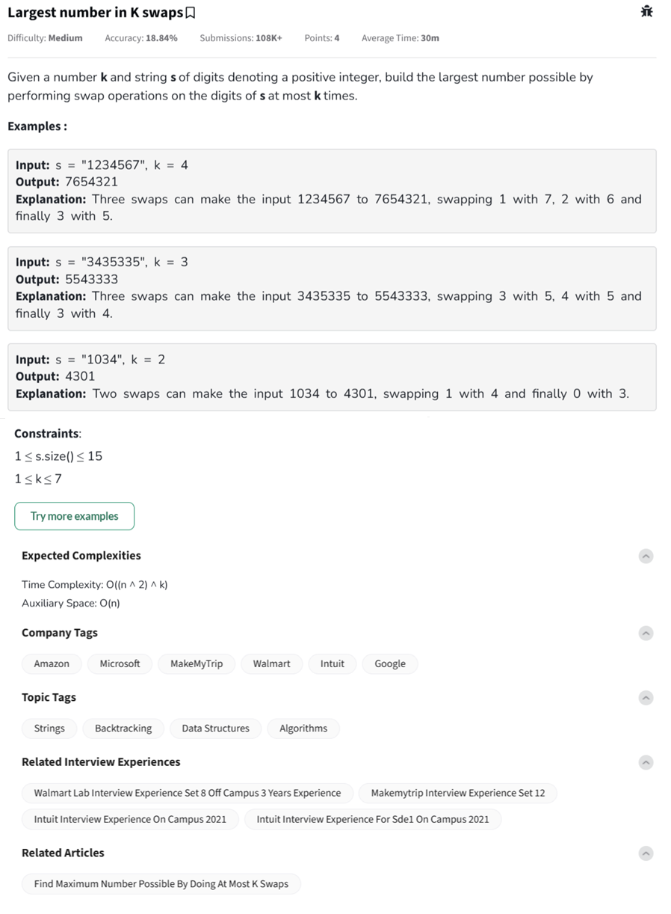

Question



---

Thanks for sharing the full code and screenshot. The **core problem is unbounded recursion**: the recursion continues even when no swap is needed (i.e., when the digit is already maximum), **causing a deep recursion stack** especially for sorted inputs like `"1234567"`.

---

### 🔍 The issue

In this section:

```python
else:
    helper(s_list, k, idx + 1)
```

You're calling the recursive helper again **even when no swap is needed**, which is fine in principle—but in cases where `k` remains high and string is already sorted, this leads to **deep recursion** without real pruning.

---

### ✅ FIX: Add termination when `idx == n`

We must stop recursion when `idx` reaches the end.

---

### ✅ Final Fixed Version (GeeksforGeeks Safe)

```python
#User function Template for python3

class Solution:
    def findMaximumNum(self, s, k):
        self.max_num = s

        def helper(s_list, k, idx):
            if k == 0 or idx == len(s_list):
                return

            max_digit = max(s_list[idx:])

            if s_list[idx] != max_digit:
                for j in range(len(s_list)-1, idx-1, -1):
                    if s_list[j] == max_digit:
                        # Swap
                        s_list[idx], s_list[j] = s_list[j], s_list[idx]
                        curr_str = ''.join(s_list)

                        # Update max_num
                        if curr_str > self.max_num:
                            self.max_num = curr_str

                        # Recurse
                        helper(s_list, k - 1, idx + 1)

                        # Backtrack
                        s_list[idx], s_list[j] = s_list[j], s_list[idx]
            else:
                # Move to next index only if current is already max
                helper(s_list, k, idx + 1)

        helper(list(s), k, 0)
        return self.max_num
```

---

### ✅ Why this works:

* `if k == 0 or idx == len(s_list): return` → Stops deep recursion on sorted inputs.
* Keeps original pruning and backtracking logic.
* Handles `1234567` with `k=4` efficiently, with bounded recursion.

---

Here’s the corrected **C++** and **JavaScript** implementation of the "Largest Number in K Swaps" problem using the **same backtracking logic with pruning and bounded recursion**, as fixed in the Python version:

---

## ✅ C++ Version (Backtracking with Pruning)

```cpp
//{ Driver Code Starts
#include <bits/stdc++.h>
using namespace std;

// } Driver Code Ends

class Solution {
public:
    string max_num;

    // Recursive helper function
    void helper(string &s, int k, int idx) {
        if (k == 0 || idx == s.length()) return;

        // Find the max digit from idx to end
        char max_digit = *max_element(s.begin() + idx, s.end());

        // Only swap if current digit is not already max
        if (s[idx] != max_digit) {
            for (int j = s.length() - 1; j >= idx; --j) {
                if (s[j] == max_digit) {
                    swap(s[idx], s[j]);

                    if (s > max_num)
                        max_num = s;

                    helper(s, k - 1, idx + 1);

                    swap(s[idx], s[j]); // backtrack
                }
            }
        } else {
            helper(s, k, idx + 1); // move to next index
        }
    }

    string findMaximumNum(string s, int k) {
        max_num = s;
        helper(s, k, 0);
        return max_num;
    }
};

//{ Driver Code Starts.
int main() {
    int t;
    cin >> t;
    while (t--) {
        int k;
        string s;
        cin >> k >> s;
        Solution ob;
        cout << ob.findMaximumNum(s, k) << endl;
        cout << "~" << endl;
    }
    return 0;
}
// } Driver Code Ends
```

---

## ✅ JavaScript Version (Backtracking with Pruning)

```javascript
//{ Driver Code Starts
'use strict';

process.stdin.resume();
process.stdin.setEncoding('utf-8');

let inputString = '';
let currentLine = 0;

process.stdin.on('data', inputStdin => {
    inputString += inputStdin;
});

process.stdin.on('end', _ => {
    inputString = inputString.trim().split('\n').map(str => str.trim());
    main();
});

function readLine() {
    return inputString[currentLine++];
}

function main() {
    let t = parseInt(readLine());
    while (t--) {
        let k = parseInt(readLine());
        let s = readLine();
        let obj = new Solution();
        console.log(obj.findMaximumNum(s, k));
        console.log("~");
    }
}

// } Driver Code Ends


// User function Template for javascript
class Solution {
    constructor() {
        this.maxNum = '';
    }

    helper(sArr, k, idx) {
        if (k === 0 || idx === sArr.length) return;

        let maxDigit = Math.max(...sArr.slice(idx));

        if (parseInt(sArr[idx]) !== maxDigit) {
            for (let j = sArr.length - 1; j >= idx; j--) {
                if (parseInt(sArr[j]) === maxDigit) {
                    [sArr[idx], sArr[j]] = [sArr[j], sArr[idx]];
                    const currStr = sArr.join('');
                    if (currStr > this.maxNum) this.maxNum = currStr;

                    this.helper(sArr, k - 1, idx + 1);
                    [sArr[idx], sArr[j]] = [sArr[j], sArr[idx]]; // backtrack
                }
            }
        } else {
            this.helper(sArr, k, idx + 1);
        }
    }

    findMaximumNum(s, k) {
        this.maxNum = s;
        this.helper(s.split(''), k, 0);
        return this.maxNum;
    }
}
```

---


