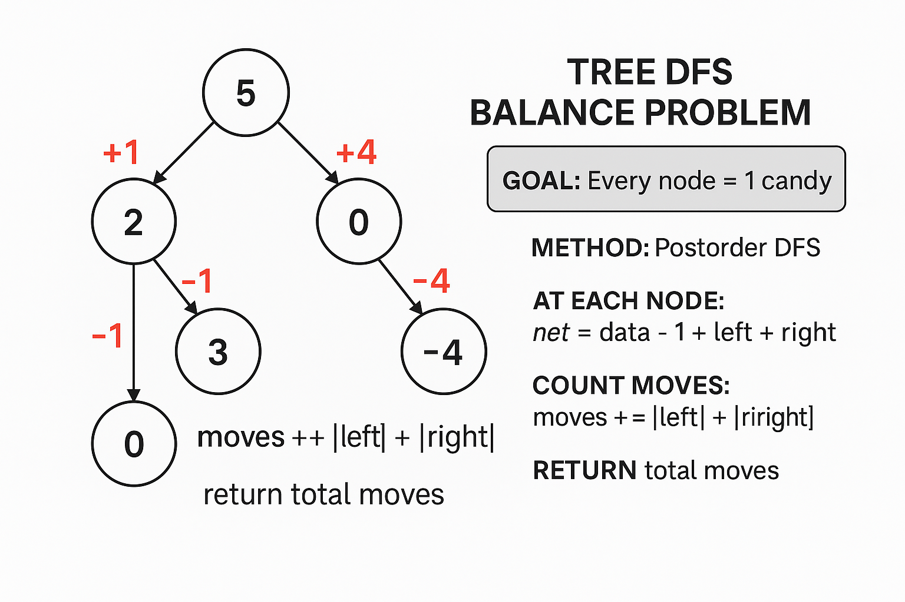

# Distribute Candies 🍬

**Difficulty:** Hard
**Accuracy:** 63.24%
**Submissions:** 32K+
**Points:** 8

---

## 🧩 Problem Statement

You are given the **root** of a binary tree with `n` nodes, where each node contains a certain number of candies, and the **total number of candies** across all nodes is equal to `n`.

In **one move**, you can select any **two adjacent nodes** and transfer one candy from one node to the other.
The transfer can occur between a parent and a child **in either direction**.

Your task is to determine the **minimum number of moves** required so that every node in the tree has **exactly one candy**.

---

### 🧠 Note:

The test cases are designed such that it is **always possible** to reach a configuration where every node has exactly one candy after some moves.

---

## ✨ Examples

### Example 1:

**Input:**

```
root = [5, 0, 0, N, N, 0, 0]
```

**Output:**

```
6
```

**Explanation:**
Move sequence:

1. Move 1 candy from root to left child
2. Move 1 candy from root to right child
3. Move 1 candy from right child to right→left node
4. Move 1 candy from root to right child
5. Move 1 candy from right child to right→right node
6. Move 1 candy from root to right child

Total = **6 moves**

Tree Visualization:

```
        5
       / \
      0   0
         / \
        0   0
```

---

### Example 2:

**Input:**

```
root = [2, 0, 0, N, N, 3, 0]
```

**Output:**

```
4
```

**Explanation:**
Move sequence:

1. Move 1 candy from root to left child
2. Move 1 candy from right→left node to right→right node
3. Move 1 candy from right node to right→right node
4. Move 1 candy from right→left node to right→right node

Total = **4 moves**

Tree Visualization:

```
        2
       / \
      0   0
         / \
        3   0
```

---

## 📏 Constraints

* `1 ≤ n ≤ 3 * 10³`
* `0 ≤ Node->data ≤ n`
* The **sum of all Node->data = n**

---

## ⚙️ Expected Complexities

| Metric              | Complexity                                |
| ------------------- | ----------------------------------------- |
| **Time Complexity** | O(n)                                      |
| **Auxiliary Space** | O(h)  — where h is the height of the tree |

---

## 🏢 Company Tags

**Microsoft**

---

## 🧱 Topic Tags

* Tree
* Data Structures

---

## 📚 Related Articles

* [Distribute Candies in a Binary Tree](https://www.geeksforgeeks.org/distribute-candies-in-a-binary-tree/)

---

---

Excellent — this problem (*Distribute Candies in a Binary Tree*) is **one of the trickiest “tree DFS balance” patterns** used by Microsoft, Amazon, and Meta interviewers.

Let’s cover:
✅ **How to remember the logic under pressure**,
✅ **How to derive it fast**,
✅ **The most expected interview questions + answers**, and
✅ A few **“bonus traps”** you should know.

---

## 🧠 (4) How to Remember and Derive the Solution Quickly in Interview

Here’s a **5-step “memory hook”** method that helps you recall this instantly:

---

### 🧩 Step 1 — Recall the Goal:

> “Every node must have **exactly one candy**, and moves only occur between parent–child.”

So you know it’s **a tree + local balance problem**.

That immediately means:
➡ You need a **DFS** (to traverse children before deciding parent flow).

---

### 🔁 Step 2 — Realize it’s a *Balance Flow Problem*:

At each node:

* If it has **extra candies**, it sends them to its parent.
* If it has **fewer candies**, it asks its parent for the deficit.

That leads to a **postorder traversal**: fix children first, then handle the parent.

---

### ⚖️ Step 3 — Write the Net Formula (Key Memory Line):

> `net = node.data - 1 + left_net + right_net`

Memorize this as:

> **“What I have minus 1 (what I need), plus what my kids give/take.”**

This `net` means:

* `net > 0` → surplus candies to pass up
* `net < 0` → candies to request from parent
* `net = 0` → perfect balance in this subtree

---

### 🚚 Step 4 — Count Moves:

For each node:

> `moves += abs(left_net) + abs(right_net)`

Because each unit of imbalance requires one move across that edge.

Memorize it as:

> “Add absolute imbalances of my children.”

---

### 🧮 Step 5 — Return Moves

At the end, `moves` holds total transfers across all edges.

💡 The trick to remember:

> “Return net, accumulate absolute nets.”

---

### 🧠 “Quick Recall Mnemonic”:

> **Postorder DFS → Return net → Count |child_nets|**

That’s all.
Even if you forget details, remember:

> “Each node wants one candy — flow of surplus/deficit goes up — sum of absolute flows = answer.”

---

## 🧩 (5) Expected Interview Questions + Answers (Microsoft, Amazon, Meta)

---

### **Q1. Why postorder traversal?**

Because you can only decide a node’s final balance **after** fixing its children — the movement direction (upward/downward) depends on their net flow.

---

### **Q2. What does “net” represent?**

It’s the **balance of candies** in that subtree:

```python
net = node.data - 1 + left_net + right_net
```

* Positive → surplus candies sent up.
* Negative → deficit candies taken from parent.
* Zero → already balanced.

---

### **Q3. Why add absolute values of left and right net to moves?**

Each unit of imbalance across an edge requires exactly **one move** — whether you’re giving or taking.

Thus,
`moves += abs(left_net) + abs(right_net)`

represents **the minimal number of transfers** to fix both child subtrees.

---

### **Q4. Why is total candies = total nodes important?**

Because otherwise, it’s impossible to reach “1 candy per node.”
This invariant ensures the final `net(root)` = 0.

---

### **Q5. What is the time and space complexity?**

* **Time:** O(n) → Each node visited once.
* **Space:** O(h) recursion stack (h = height of tree).
* For skewed tree: O(n) space worst case.

---

### **Q6. What if we allowed transfers between any two nodes (not just parent–child)?**

Then the tree restriction breaks — you could minimize moves by global balancing, which becomes a **graph minimum flow problem** (much harder).
This problem stays elegant *because it’s tree-local*.

---

### **Q7. What’s the base condition for recursion?**

If `node == None`, return `0` (no candies, no moves).

---

### **Q8. How would you detect if the configuration is invalid (not solvable)?**

If after traversal, `net(root) != 0`, then candies ≠ nodes, so invalid.

---

### **Q9. Can this problem be solved iteratively?**

Yes — by performing **postorder traversal using two stacks**, then computing net bottom-up. (Same O(n), avoids recursion limit.)

---

### **Q10. What real-world problem is this like?**

Balancing distributed resources (load, tokens, energy) across a tree topology:

* Cloud cluster balancing tasks
* Energy redistribution in networks
* Memory balancing across hierarchical caches

---

### **Q11. How would you explain this to a junior developer?**

> “We go bottom-up, calculate how many candies each subtree owes or has extra, and send that difference upward. Each exchange costs 1 move.”

---

### **Q12. What’s the intuition behind abs()?**

Moves are directional (could be give or take), but the **cost** of a move doesn’t depend on direction — every transfer costs 1.
Hence `abs()`.

---

### **Q13. Can the solution be made constant space?**

No — we need to traverse the tree.
But it’s already optimal: O(n) time, O(h) space.

---

### **Q14. How do you test your function?**

✅ Single node with 1 candy → 0 moves
✅ Skewed tree → ensure stack limit ok
✅ All candies in root → check accumulated moves
✅ Balanced tree → confirm 0 net after DFS

---

### **Q15. What kind of interviewer follow-up can happen?**

If you solve fast, they’ll ask:

* “What if edges had **different costs** per move?”
  → Extend to `moves += abs(flow) * cost(edge)`
* “What if you can only move 2 candies per operation?”
  → Divide by that limit (ceil).

---

## 🧩 Summary — The 15-second recall before the interview:

| Concept          | Quick memory hook                 |
| ---------------- | --------------------------------- |
| **Goal**         | Every node = 1 candy              |
| **Method**       | Postorder DFS                     |
| **At each node** | `net = data - 1 + left + right`   |
| **Count moves**  | `moves += abs(left) + abs(right)` |
| **Return**       | Total moves                       |
| **Complexity**   | O(n) time, O(h) space             |

---

A **1-page visual diagram (tree arrows showing surplus and deficit flow)** that you can look at just before an interview for instant recall.



---

Perfect ✅ — let’s now cover **all interviewer-level questions and answers** for the **“Distribute Candies in a Binary Tree”** problem, exactly the kind you’d get from Microsoft, Amazon, or Google engineers.

This includes **conceptual, follow-up, edge-case, and optimization** questions — categorized for easy recall before the interview.

---

# 🧩 Distribute Candies in a Binary Tree — Interview Q&A

---

## **I. Core Logic & Intuition Questions**

### **Q1. What does the problem mean in simple terms?**

You are asked to make sure every node in a binary tree has exactly one candy.
In one move, you can transfer a candy between a node and its parent.
You must compute the *minimum number of moves* required.

Each node initially may have more or fewer candies.

---

### **Q2. What’s the intuition behind the solution?**

Think of candies as a *flow of resources*.
If a node has extra candies, it passes them up to its parent.
If it needs candies, it takes them from its parent.
The goal is to *balance* the entire tree with minimal moves.

This requires a **postorder DFS** — children are balanced before their parent.

---

### **Q3. Why do we use postorder traversal (Left → Right → Node)?**

Because:

* We can only decide how many candies to move **after** we know the balance of both child subtrees.
* It’s a bottom-up dependency — typical postorder use case.

---

### **Q4. What is the “net” or “balance” value returned by each node?**

`net = node.data - 1 + left_net + right_net`

It represents how many candies this node will **send to (positive)** or **request from (negative)** its parent.

---

### **Q5. Why do we add `abs(left_net) + abs(right_net)` to moves?**

Because:

* Every nonzero net on an edge means candies are moving.
* `abs()` gives the *number of candies crossing the edge*, no matter the direction.
* Each candy moved is one operation.

Hence:

```python
moves += abs(left_net) + abs(right_net)
```

---

### **Q6. What ensures that the total configuration can be balanced?**

The problem guarantees that **sum of all candies = number of nodes**.
So the overall `net(root)` = 0 at the end — meaning balance is achievable.

If it wasn’t, balancing would be impossible.

---

## **II. Complexity & Correctness**

### **Q7. Time complexity?**

O(n) — every node is visited exactly once in DFS.

### **Q8. Space complexity?**

O(h), where `h` = height of the tree (recursion stack).
Worst-case (skewed tree): O(n).

---

### **Q9. Can this problem be solved without recursion?**

Yes.
You can use **iterative postorder traversal** using two stacks.
Compute child balances first, then propagate upward.

---

### **Q10. What happens if the total candies ≠ number of nodes?**

Then there is no way to make every node have exactly one candy.
The final net at root (`net(root)`) ≠ 0 will indicate imbalance.

You can add a validity check:

```python
if dfs(root) != 0:
    return -1  # invalid configuration
```

---

### **Q11. How do we prove that this algorithm gives the minimal moves?**

Each edge must transfer exactly the *imbalance* of its subtree to the parent.
There is no cheaper way — the number of moves is exactly the sum of absolute values of required flows.

It’s an **optimal local flow balance** argument — similar to minimum cost flow in trees.

---

## **III. Edge Case Handling**

### **Q12. What if there’s only one node with 1 candy?**

Output = 0 (already balanced).

### **Q13. What if one node has all candies and others have 0?**

Example: root = 5, children = 0s.
Then candies move downward level by level — DFS counts each transfer optimally.

Output is sum of distances * number of candies per edge.

---

### **Q14. What if some nodes have negative candies?**

Not allowed (problem constraint: 0 ≤ candies ≤ n).
But if allowed hypothetically — it represents borrowing, same logic applies.

---

### **Q15. What happens in a skewed tree (like a linked list)?**

Recursion still works, but space = O(n).
You can switch to iterative version to avoid stack overflow.

---

## **IV. Follow-Up & Deep-Dive Questions (Asked by Microsoft / Amazon)**

---

### **Q16. What if each edge has a weight (different move cost)?**

Then instead of `moves += abs(left_net) + abs(right_net)`,
you’d do:

```python
moves += abs(left_net) * left_edge_weight + abs(right_net) * right_edge_weight
```

This turns it into a **weighted flow problem**.

---

### **Q17. What if you could only move 2 candies per operation?**

Then moves = `ceil(abs(net)/2)` per edge.
This models limited transfer capacity.

---

### **Q18. What if candies can also move between siblings directly?**

Then adjacency changes — not just parent-child edges.
You’d have to perform BFS or use union-find to simulate moves across connected components.

---

### **Q19. What real-world problem does this resemble?**

Several:

* **Load balancing** in distributed systems (servers redistribute load to neighbors).
* **Resource flow networks** (water, energy, or currency across hierarchies).
* **Distributed token balancing** in blockchains or tree-shaped communication networks.
* **Balancing hierarchical cache capacity** in CPU design.

---

### **Q20. How to test correctness quickly in interview?**

Use 3 key tests:

1. ✅ Perfectly balanced tree → expect `0` moves
2. ✅ Root has all candies → expect large moves
3. ✅ Random unbalanced → verify `moves = sum(abs(net(child)))`

---

## **V. Summary — 20-Second “Memory Snapshot” Before Interview**

| Concept                  | Remember                                   |
| ------------------------ | ------------------------------------------ |
| **Traversal**            | Postorder DFS                              |
| **Formula**              | `net = node.data - 1 + left + right`       |
| **Moves Count**          | `moves += abs(left) + abs(right)`          |
| **Meaning of net**       | Positive = surplus, Negative = deficit     |
| **Base Case**            | If node is None → return 0                 |
| **Final net(root)**      | Always 0 if valid                          |
| **Complexity**           | O(n) time, O(h) space                      |
| **Intuition**            | Flow of candies between parent–child edges |
| **Real-world analogy**   | Resource flow/load balancing               |
| **Most asked follow-up** | Weighted edges, limited transfer capacity  |

---

---

awesome — here’s a **complete, runnable Python program** for **Distribute Candies in a Binary Tree** that:

* reads a binary tree in **level-order** from stdin (`N` for nulls)
* solves it with the **O(n) postorder DFS** (the interview-standard approach)
* prints the **minimum moves**,
* and **times** the run (single wall-clock and `timeit` average).
* every step is annotated with **time/space complexity** inline.

---

## Full Program

```python
#!/usr/bin/env python3
"""
Distribute Candies in a Binary Tree
-----------------------------------
Problem: In one move you may transfer exactly one candy along an edge (parent<->child).
Goal: Minimum number of moves so every node has exactly one candy.

Approach used here (interview standard):
  Postorder DFS:
    - Let net(u) = u.data - 1 + net(u.left) + net(u.right)
    - Each edge flow contributes |net(child)| moves.
    - Sum absolute child nets for every node to get total minimal moves.

Complexities:
  Time  : O(n)  -- visit each node exactly once
  Space : O(h)  -- recursion stack, h is tree height (O(n) worst case)
"""

from collections import deque
from time import perf_counter
import timeit
import sys


# ----------------------------- Node definition -----------------------------
class Node:
    def __init__(self, val):
        # O(1) time / O(1) space
        self.data = val
        self.left = None
        self.right = None


# ------------------------- Build tree from level-order ----------------------
def build_tree(tokens):
    """
    Build a binary tree from level-order tokens.
    'N' means null / missing child.

    Complexity:
      Time  : O(n)  -- each token is processed once
      Space : O(n)  -- queue + created nodes
    """
    if not tokens or tokens[0] == 'N':
        return None

    it = iter(tokens)
    root = Node(int(next(it)))  # O(1)
    q = deque([root])           # O(1)

    # Process nodes level by level -> overall O(n)
    for left_tok in it:
        parent = q.popleft()    # amortized O(1)

        # left child
        if left_tok != 'N':
            lc = Node(int(left_tok))   # O(1)
            parent.left = lc
            q.append(lc)

        # right child (guard StopIteration)
        try:
            right_tok = next(it)
        except StopIteration:
            break
        if right_tok != 'N':
            rc = Node(int(right_tok))  # O(1)
            parent.right = rc
            q.append(rc)

    return root


# ----------------------- Optimized O(n) DFS solution -----------------------
class Solution:
    def distCandy(self, root):
        """
        Postorder DFS: compute net balance and accumulate moves.

        At each node:
          left_net  = net(left subtree)
          right_net = net(right subtree)
          moves    += |left_net| + |right_net|   # candies crossing those edges
          return    = node.data - 1 + left_net + right_net

        Complexity:
          Time  : O(n)  -- every node visited once
          Space : O(h)  -- recursion stack depth
        """
        self.moves = 0  # O(1)

        def dfs(node):
            if not node:
                return 0  # O(1) — null contributes nothing

            # Postorder: solve children first
            left_net = dfs(node.left)    # O(size(left))
            right_net = dfs(node.right)  # O(size(right))

            # All flow across edges to children costs one move per candy
            self.moves += abs(left_net) + abs(right_net)  # O(1)

            # Net balance of this subtree to parent
            return node.data - 1 + left_net + right_net   # O(1)

        dfs(root)  # O(n)
        return self.moves


# ------------------------------- Timing utils ------------------------------
def time_single_run(func, *args, **kwargs):
    """Single wall-clock timing using perf_counter. O(1) overhead."""
    t0 = perf_counter()
    out = func(*args, **kwargs)
    t1 = perf_counter()
    return out, (t1 - t0)

def time_with_timeit(callable_stmt, number=5):
    """Average runtime over `number` runs using timeit. O(number * T(func))."""
    total = timeit.timeit(callable_stmt, number=number)
    return total / number


# ----------------------------------- Main ----------------------------------
def main():
    # INPUT FORMAT (level-order, space-separated; 'N' for null):
    # Example:
    #   5 0 0 N N 0 0
    # Meaning:
    #         5
    #        / \
    #       0   0
    #          / \
    #         0   0
    #
    # Read tokens
    tokens = sys.stdin.read().strip().split()
    if not tokens:
        print("No input provided.\nExample:\n  5 0 0 N N 0 0")
        return

    # Build tree: O(n)
    root = build_tree(tokens)

    solver = Solution()

    # Single run timing: O(n)
    ans, t_single = time_single_run(solver.distCandy, root)

    # timeit average: runs the solver fresh per call
    avg = time_with_timeit(lambda: Solution().distCandy(root), number=5)

    # Output
    print("Minimum moves:", ans)
    print(f"Single-run time : {t_single:.6f} s")
    print(f"Avg over 5 runs : {avg:.6f} s")

    # Quick complexity recap
    print("\nComplexity:")
    print("  Time  : O(n)")
    print("  Space : O(h) recursion (worst O(n) if skewed)")

if __name__ == "__main__":
    """
    Example run:
      echo "5 0 0 N N 0 0" | python3 distribute_candies.py
    Expected output:
      Minimum moves: 6
      Single-run time : 0.000xxx s
      Avg over 5 runs : 0.000xxx s
    """
    main()
```

---

## 7) Real-World Use Cases (high-impact & interview-relatable)

* **Load Balancing in Hierarchical Systems**
  Servers arranged in a tree (regional → zonal → rack → machine).
  “Candies” = workload units. The algorithm minimizes **data transfer** (moves) needed to reach **even load** (1 unit per node), using only **parent–child** links.

* **Token / Credit Distribution in Tree Networks**
  Distributed rate-limiting tokens across microservices.
  Each service must end up with one token; tokens can only be exchanged with direct parent/child. The solution computes the **minimal hand-offs**.

* **Energy / Resource Redistribution in Sensor Trees**
  Battery-powered sensor tree where nodes can pass limited units to neighbors (parent–child).
  Find the minimal **energy transfers** to give each node a baseline charge.

* **Filesystem / Cache Hierarchies**
  Normalizing “at least one block” or “one shard” per directory/node with minimal migrations up/down the tree.

When you name these in an interview, tie back to the algorithm:

> “We treat imbalance as **flow** on edges; the minimal number of operations equals the **sum of absolute subtree imbalances** across edges, computed via **postorder DFS** in O(n).”

That nails both the **theory** and a **practical analogy**.

