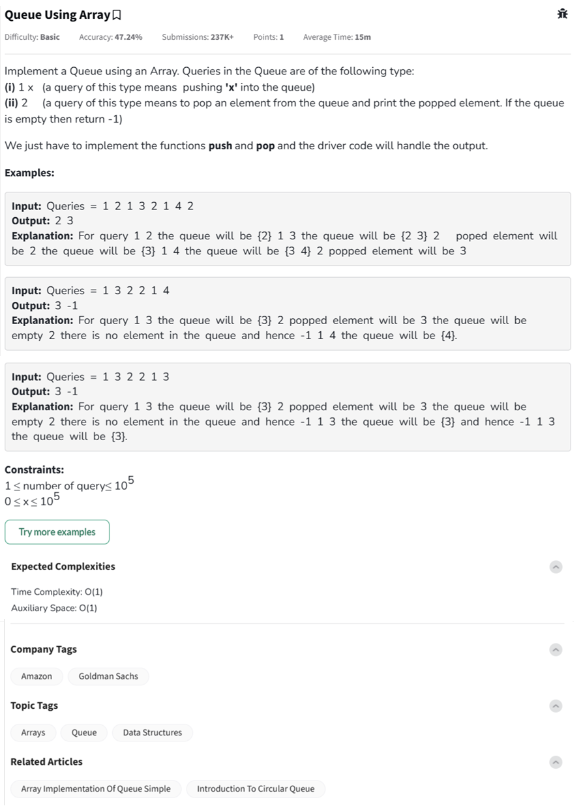

Question



---

## 🎯 **Your Goal**

You need to implement a **queue** using an array where:

### 🔧 Operations:
1. **`1 x`** — Push `x` into the queue.
2. **`2`** — Pop the front element from the queue.
   - If the queue is empty, return `-1`.

You don’t return or print during `push(x)`  
You **return the value** during `pop()`.

---

## 🧪 Let's Walk Through an Example

### ✅ Input:
```plaintext
Queries = [1 2, 1 3, 2, 1 4, 2]
```

We'll simulate each step:

### Initial state:
```
Queue: []
```

---

### 🔹 Step 1: `1 2` → Push 2

```
Queue: [2]
Output: -
```

---

### 🔹 Step 2: `1 3` → Push 3

```
Queue: [2, 3]
Output: -
```

---

### 🔹 Step 3: `2` → Pop
- Front element is `2`, pop it.

```
Queue: [3]
Output: 2 ✅
```

---

### 🔹 Step 4: `1 4` → Push 4

```
Queue: [3, 4]
Output: -
```

---

### 🔹 Step 5: `2` → Pop
- Front element is `3`, pop it.

```
Queue: [4]
Output: 3 ✅
```

---

### Final Output:
```
2 3
```

---

## 🧠 What If Queue Is Empty?

### Input:
```plaintext
1 3, 2, 2
```

Steps:
```
Push 3 → [3]
Pop → 3
Pop → Queue is empty → return -1
```

### Output:
```
3 -1
```

---

## 📌 Visual Simulation (Text-Based)

| Step | Operation | Queue        | Output |
|------|-----------|--------------|--------|
| 1    | 1 2       | [2]          | -      |
| 2    | 1 3       | [2, 3]       | -      |
| 3    | 2         | [3]          | 2      |
| 4    | 1 4       | [3, 4]       | -      |
| 5    | 2         | [4]          | 3      |

---
You're tackling the classic **“Queue Using Array”** problem — one of the best exercises for understanding queue operations!

---

## ✅ **Problem Summary**

You need to implement:
- `push(x)` → Pushes `x` into the queue  
- `pop()` → Removes front element from the queue and returns it. If empty, return `-1`.

You'll receive a list of queries of two types:
1. `1 x` — enqueue `x`
2. `2` — dequeue (pop and return front)

---

## 🧪 Example:

### Input:
```
Queries = [1, 2, 1, 3, 2, 1, 4, 2]
```

### Output:
```
2 3
```

---

## 🧠 Time & Space Complexity

| Operation | Time | Space |
|-----------|------|--------|
| push(x)   | O(1) | O(1)   |
| pop()     | O(1) | O(1)   |

---

## 🐍 Python Code (Queue Using Array)

```python
class MyQueue:
    def __init__(self):
        self.q = []
        self.front = 0  # pointer to the front index (to simulate queue)

    def push(self, x):
        self.q.append(x)

    def pop(self):
        if self.front == len(self.q):
            return -1
        val = self.q[self.front]
        self.front += 1
        return val
```

---

## 🧑‍💻 C++ Version (Efficient with Index Management)

```cpp
class MyQueue {
    int arr[100000];
    int frontIndex = 0;
    int rearIndex = 0;

public:
    void push(int x) {
        arr[rearIndex++] = x;
    }

    int pop() {
        if (frontIndex == rearIndex)
            return -1;
        return arr[frontIndex++];
    }
};
```

---

## 🌐 JavaScript Version

```javascript
class MyQueue {
    constructor() {
        this.q = [];
        this.front = 0;
    }

    push(x) {
        this.q.push(x);
    }

    pop() {
        if (this.front === this.q.length) return -1;
        return this.q[this.front++];
    }
}
```

---

## ✅ Efficient Notes:
- This array-based approach avoids shifting elements on every pop.
- `front` pointer simulates "removing" elements.

Would you like a visual walkthrough or animation showing the queue growing and shrinking in action?