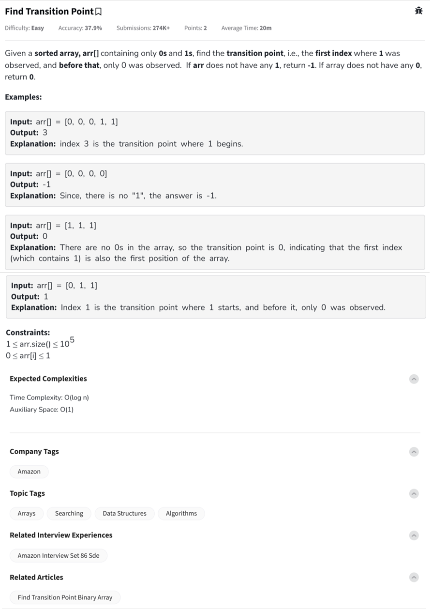

Question



---

Here's the **complete code** with **inline comments explaining the logic** for **Python, C++, and JavaScript**, using **binary search** to find the **first occurrence of `1`** in a sorted binary array:

---

### ✅ Python

```python
class Solution:
    def transitionPoint(self, arr, n):
        low = 0
        high = n - 1
        result = -1  # Default if 1 is not found

        while low <= high:
            mid = (low + high) // 2

            if arr[mid] == 1:
                result = mid         # potential first 1 found
                high = mid - 1       # search left half
            else:
                low = mid + 1        # search right half

        return result
```

---

### ✅ C++

```cpp
class Solution{
public:
    int transitionPoint(int arr[], int n) {
        int low = 0, high = n - 1;
        int result = -1; // If 1 not found

        while (low <= high) {
            int mid = (low + high) / 2;

            if (arr[mid] == 1) {
                result = mid;      // store index and go left
                high = mid - 1;
            } else {
                low = mid + 1;     // go right
            }
        }

        return result;
    }
};
```

---

### ✅ JavaScript

```javascript
class Solution {
    transitionPoint(arr, n) {
        let low = 0, high = n - 1;
        let result = -1;  // default if no 1 found

        while (low <= high) {
            let mid = Math.floor((low + high) / 2);

            if (arr[mid] === 1) {
                result = mid;     // save position, search left
                high = mid - 1;
            } else {
                low = mid + 1;    // search right
            }
        }

        return result;
    }
}
```

---

### 🔁 Dry Run (for `[0, 0, 0, 1, 1]`):

```
Initial: low = 0, high = 4
mid = 2 → arr[2] = 0 → search right

low = 3, high = 4
mid = 3 → arr[3] = 1 → result = 3 → search left

low = 3, high = 2 → stop → return result = 3
```

Here's the **complete code** with **inline comments explaining the logic** for **Python, C++, and JavaScript**, using **binary search** to find the **first occurrence of `1`** in a sorted binary array:

---

### ✅ Python

```python
class Solution:
    def transitionPoint(self, arr, n):
        low = 0
        high = n - 1
        result = -1  # Default if 1 is not found

        while low <= high:
            mid = (low + high) // 2

            if arr[mid] == 1:
                result = mid         # potential first 1 found
                high = mid - 1       # search left half
            else:
                low = mid + 1        # search right half

        return result
```

---

### ✅ C++

```cpp
class Solution{
public:
    int transitionPoint(int arr[], int n) {
        int low = 0, high = n - 1;
        int result = -1; // If 1 not found

        while (low <= high) {
            int mid = (low + high) / 2;

            if (arr[mid] == 1) {
                result = mid;      // store index and go left
                high = mid - 1;
            } else {
                low = mid + 1;     // go right
            }
        }

        return result;
    }
};
```

---

### ✅ JavaScript

```javascript
class Solution {
    transitionPoint(arr, n) {
        let low = 0, high = n - 1;
        let result = -1;  // default if no 1 found

        while (low <= high) {
            let mid = Math.floor((low + high) / 2);

            if (arr[mid] === 1) {
                result = mid;     // save position, search left
                high = mid - 1;
            } else {
                low = mid + 1;    // search right
            }
        }

        return result;
    }
}
```

---

### 🔁 Dry Run (for `[0, 0, 0, 1, 1]`):

```
Initial: low = 0, high = 4
mid = 2 → arr[2] = 0 → search right

low = 3, high = 4
mid = 3 → arr[3] = 1 → result = 3 → search left

low = 3, high = 2 → stop → return result = 3
```

